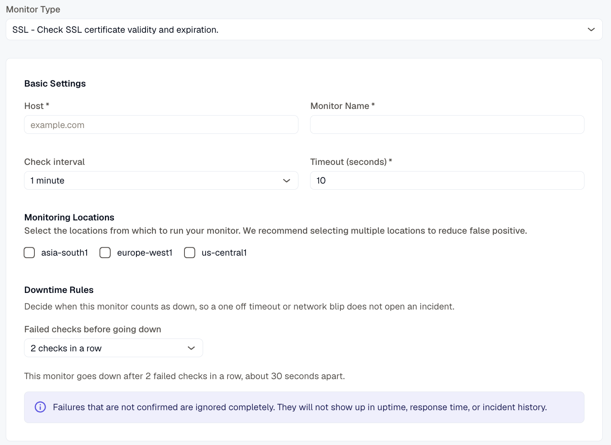

---

title: "SSL Certificate Validity Monitor"
description: "Documentation for SSL Certificate Validity Monitor - Check SSL Certificate Expiration and Validity"
sidebar:
  label: "SSL Monitor"
---
The SSL Certificate Validity Monitor enables you to track the status of SSL/TLS certificates for web hosts, ensuring they are valid and have not expired. This helps avoid outages caused by invalid or expired certificates.

## Creating a New SSL Certificate Validity Monitor

1. Navigate to **Synthetic monitoring > Monitors**.
2. Click **Add new**.
3. Select **SSL - Check SSL certificate validity and expiration** from the monitor type dropdown.

## Basic Settings

- **Host**
  Enter the hostname or domain of the site whose SSL certificate you want to monitor.
- **Monitor Name**
  Provide a clear, descriptive name for the monitor to easily identify it.
- **Check Interval**
  Define how often the monitor should check the SSL certificate status.
- **Timeout**
  Specify the maximum time allowed for the monitor to receive a response before marking the check as failed.
- **Monitoring Locations**
  Select one or multiple geographic locations from which the certificate check will be performed. This helps simulate monitoring from different network perspectives.

## Notification Settings

Configure notification channels where alerts will be sent if the monitor detects issues such as certificate expiration or invalid status. Choose one or more channels to receive notifications promptly.

## Assertions

Assertions validate specific aspects of the SSL/TLS certificate and connection:

- **Certificate Expiry (Days)**
  Checks the number of days remaining before the SSL/TLS certificate expires and triggers an alert if it falls below a defined threshold.
- **Common Name**
  Verifies that the certificate’s Common Name (CN) matches the domain being monitored.
- **Issuer**
  Confirms the identity of the Certificate Authority (CA) that issued the certificate.
- **TLS Version**
  Checks the versions of the TLS protocol that the server supports (e.g., TLS 1.2, TLS 1.3).
- **Cipher Suite**
  Validates which cryptographic algorithms are used by the server to secure the TLS connection.

## Metrics

Metrics available to be monitored in Dashboard section

| **Metric Name **                                             |** Type **|** Description **                                |** Labels**                                                  |
| ---------------------------------------------------------------- | ----------------- | --------------------------------------------------- | ---------------------------------------------------------------- |
| kloudmate\_synthetic\_check\_ssl\_cert\_expiry\_days   | Gauge   | Days until the SSL certificate expires.   | check\_id, check\_name, check\_type, target, workspace\_id  |

| kloudmate\_synthetic\_check\_connect\_time   | Gauge   | Time taken to establish a connection. Applicable to HTTP, TCP, UDP, WebSocket, and SSL checks.   | check\_id, check\_name, check\_type, target, workspace\_id, location |
| ------------------------------------------------------ | ----------------- | ---------------------------------------------------------------------------------------------------------- | -------------------------------------------------------------------- |

***

## Related Resources

[DNS Monitor - Verify DNS Resolution and Records](../dns-monitor-verify-dns-resolution-and-records/)

