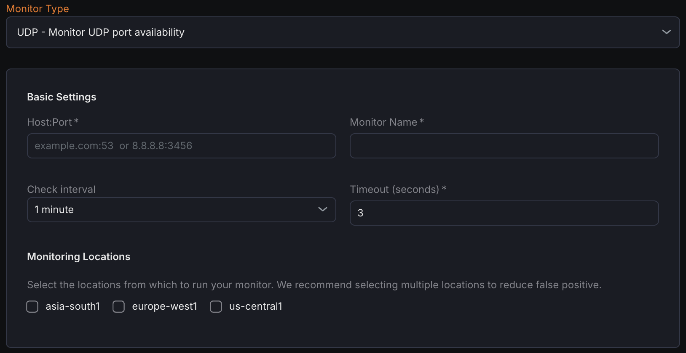

---

title: "UDP Monitor"
description: "Check UDP port availability with a synthetic monitor."
sidebar:
  label: "UDP Monitor"
---
The UDP Monitor checks the availability of a specific UDP host and port by sending UDP packets and optionally reading responses, helping verify that the UDP service is reachable and responsive.

## Creating a New UDP Monitor

1. Navigate to **Synthetic monitoring > Monitors**.
2. Click **Add new**.
3. Select **UDP port availability** from the monitor type dropdown.

## Basic Settings

- **Host\:Port**
  Enter the target UDP host and port in the format `hostname:port` that needs to be monitored.
- **Monitor Name**
  Provide a descriptive name for the UDP monitor.
- **Check Interval**
  Set the frequency at which the UDP port will be checked.
- **Timeout**
  Define the maximum time the monitor waits for a response before marking the check as failed.
- **Monitoring Locations**
  Select one or multiple locations from where the UDP checks will be performed.

## Notification Settings

Choose notification channels where alerts will be sent if the UDP monitor detects downtime or failure.

## UDP Configuration

- **Send Payload (optional)**
  Specify the data (bytes or text) that will be sent to the UDP port as a probe.
- **Read Size (Bytes)**
  Define how many bytes the monitor should read from the UDP server in response after sending the payload.
- **Read Timeout (ms)**
  Set the maximum time (in milliseconds) the monitor will wait for a response from the target after sending the payload.

## Assertions

Assertions define what aspects of UDP port availability and response are checked:

- **Connect Time (ms)**&#xA;Measures the duration from sending the UDP packet to receiving a response or timeout.
- **Time to First Byte (ms)**&#xA;Tracks the time from packet transmission until the first byte of response data arrives.
- **Total Time (ms)**&#xA;Captures the complete duration from the initial UDP packet send through the full response exchange.
- **Response Data**&#xA;Validates the actual data returned by the UDP server after sending the optional payload.

## Metrics

Metrics available to be monitored in Dashboard section

| **Metric Name**                                      | **Type**    | **Description**                                             | **Labels**                                                       |
| ------------------------------------------------------------- | -------------------- | -------------------------------------------------------------------- | -------------------------------------------------------------------------- |
| kloudmate\_synthetic\_check\_network\_write\_time   | Gauge      | Time taken to write to the connection (for TCP and UDP)    | check\_id, check\_name, check\_type, target, workspace\_id, location  |
| \_kloudmate\_synthetic\_chec\_network\_read\_time   | Gauge      | Time taken to read from the connection (for TCP and UDP)   | check\_id, check\_name, check\_type, target, workspace\_id, location  |

| kloudmate\_synthetic\_check\_connect\_time             | Gauge   | Time taken to establish a connection. Applicable to HTTP, TCP, UDP, WebSocket, and SSL checks.   | check\_id, check\_name, check\_type, target, workspace\_id, location       |
| ---------------------------------------------------------------- | ----------------- | ---------------------------------------------------------------------------------------------------------- | -------------------------------------------------------------------------- |
| \_kloudmate\_synthetic\_check\_time\_to\_first\_byte   | Gauge   | Time to the first byte. Applicable to HTTP, TCP, and UDP checks.                                 | check\_id, check\_name, check\_type, target, workspace\_id, location  |
| kloudmate\_synthetic\_check\_response\_size\_bytes     | Gauge   | The size of the response in bytes. Applicable to HTTP, TCP, and UDP checks.                      | check\_id, check\_name, check\_type, target, workspace\_id, location       |

***

## Related Resources

[gRPC Monitor - Check gRPC Service Health](../grpc-monitor/)

