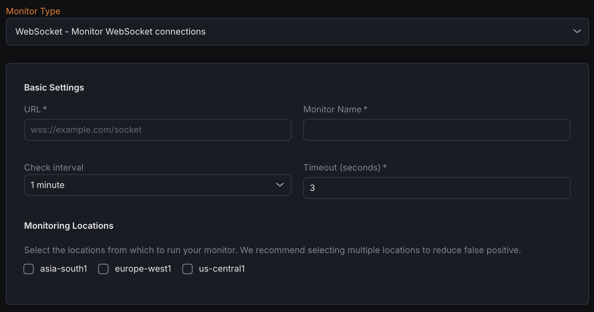

---

title: "WebSocket Monitor"
description: "Documentation for WebSocket Monitor - Monitor WebSocket Connections"
sidebar:
  label: "WebSocket Monitor"
---
The WebSocket Monitor verifies the availability and performance of WebSocket endpoints by establishing persistent connections, sending messages, and validating responses.

## Creating a New WebSocket Monitor

1. Navigate to **Synthetic monitoring > Monitors**.
2. Click **Add new**.
3. Select **WebSocket - Monitor WebSocket connections** from the monitor type dropdown.

## Basic Settings

- **URL**
  Enter the full WebSocket URL (e.g., `ws://example.com/socket` or `wss://example.com/socket`) to monitor.
- **Monitor Name**
  Provide a descriptive name for the WebSocket monitor.
- **Check Interval**
  Set the frequency at which the monitor attempts to establish and test the WebSocket connection.
- **Timeout**
  Define the maximum time allowed for the monitor to complete the connection and response validation.
- **Monitoring Locations**
  Choose one or more geographic locations from which the WebSocket checks will be executed.

## Notification Settings

Select notification channels to receive alerts when the WebSocket monitor detects connection failures or downtime.

## WebSocket Configuration

- **Path**
  Specify the URL path used during the WebSocket handshake (e.g., `/ws/chat`).
- **Header**
  Add custom HTTP headers sent during the initial WebSocket handshake request.
- **Subprotocols (comma-separated)**
  Define optional WebSocket subprotocols that establish higher-level communication rules (e.g., `chat,superchat`).
- **Messages to Send (one per line)**
  List messages to transmit after connection establishment, with one message per line.

## Assertions

Assertions validate key aspects of the WebSocket connection lifecycle:

- **Handshake Status**
  Confirms whether the initial WebSocket handshake succeeded or failed.
- **Connect Time (ms)**
  Measures the duration to complete the WebSocket handshake in milliseconds.
- **Time to First Message (ms)**
  Tracks the time from connection establishment to receiving the first incoming message.
- **Response Message**
  Validates the actual messages received from the WebSocket server.
- **Message Count**
  Counts the number of messages received during the monitoring session.
- **Close Code**
  Checks the WebSocket close code indicating the reason for connection closure.
- **Close Message**
  Examines the optional human-readable message accompanying the close code.

## Metrics

Metrics available to be monitored in Dashboard section

| **Metric Name **                                                    |** Type **   |** Description **                                             |** Labels**                                                 |
| ---------------------------------------------------------------------------- | -------------------- | --------------------------------------------------------------------- | -------------------------------------------------------------------- |
| kloudmate\_synthetic\_check\_websocket\_time\_to\_first\_message   | Gauge      | Time from connection until the first message is received.   | check\_id, check\_name, check\_type, target, workspace\_id, location |

| kloudmate\_synthetic\_check\_connect\_time   | Gauge   | Time taken to establish a connection. Applicable to HTTP, TCP, UDP, WebSocket, and SSL checks.   | check\_id, check\_name, check\_type, target, workspace\_id, location |
| ------------------------------------------------------ | ----------------- | ---------------------------------------------------------------------------------------------------------- | -------------------------------------------------------------------- |

***

## Related Resources

[ICMP Monitor - Ping Test for Basic Connectivity](../icmp-monitor-ping-test-for-basic-connectivity/)

