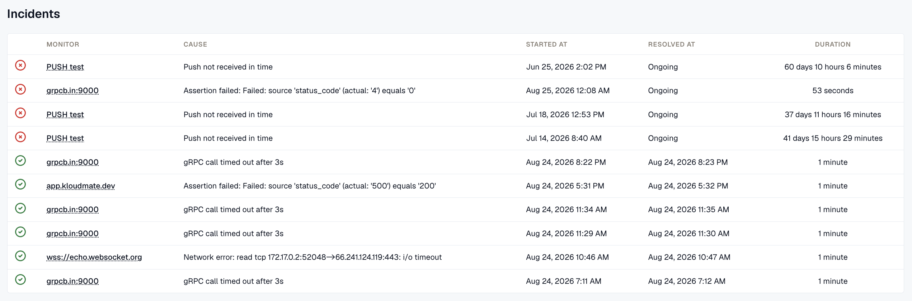

Open **Synthetic Monitoring → Incidents** to review downtime incidents from all of your synthetic monitors in one place.

**The Incidents Overview Table**

The tab displays a table summarizing all incidents:

- **Monitor**
  Identifies the specific monitor where the incident originated.
- **Cause**
  Details the root cause of the incident detected in that monitor.
- **Started at**
  Timestamp when the incident was first detected.
- **Resolved at**
  Timestamp when the incident was resolved, or indicates if still ongoing.
- **Duration** Total time period the incident remained active.

***

## Related Resources

[Maintenance Windows](../maintenance-windows/)

