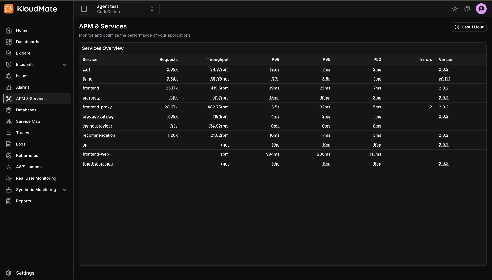
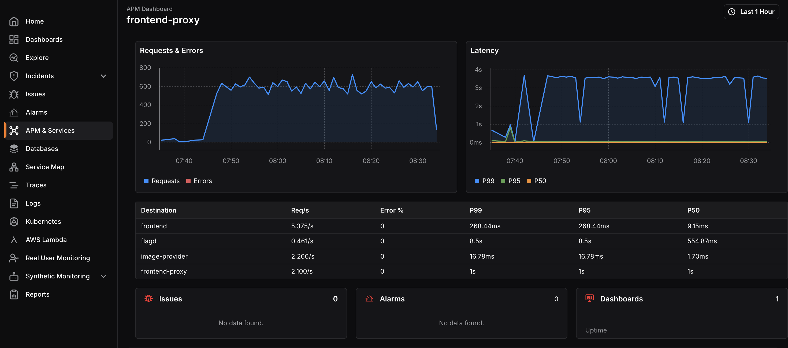
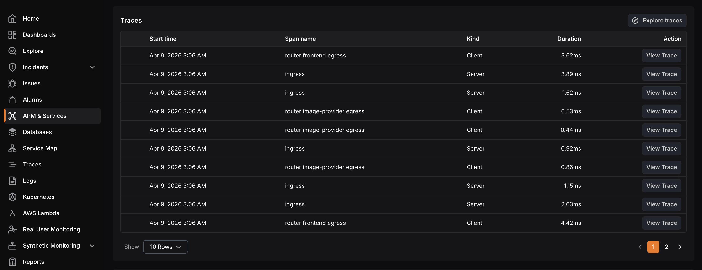

**APM and Services** is a dedicated area for quickly analyzing application and service performance in terms of requests, errors, latency, and throughput.

## Services Overview

The **Services Overview** page lists all instrumented applications and services in a tabular view, making it easy to compare their health at a glance. 

Each row represents one service and includes the following details:

- **Service:** The name of the application or service.
- **Requests:** The total number of requests handled by the service during the selected time range.
- **Throughput:** The rate of incoming requests, such as requests per minute, which indicates the overall load on the service.
- **P99, P95, and P50 latency:** Latency percentiles that show how long requests take to complete.
  •  **P99:** Latency at the 99th percentile, showing worst-case performance for most users.
  •  **P95:** Latency at the 95th percentile.
  •  **P50:** Median latency, representing a typical request.
- **Error rate:** The percentage of failed requests, which helps identify unstable services quickly.
- **Version**: The reported version of the deployed application or service, which is useful for correlating performance with releases.

## Service APM Dashboard

Clicking any service in the Services Overview opens its APM dashboard, which is a preconfigured view focused on that specific service.

The dashboard includes:

- **Requests, errors, and latency over time:**Timeline charts that help identify traffic spikes, error bursts, and latency regressions.
- **Destinations table:** A breakdown of downstream dependencies that the service communicates with, including destination name, requests per second, error percentage, and latency metrics between the service and each destination.
- **Related issues, alarms, and dashboards:** Panels that display existing issues and alarms for the service, along with quick links to additional dashboards for deeper analysis.

## Traces and Logs

From the APM dashboard, you can inspect related traces and logs for a selected service.

**Traces table:** Displays recent traces with details such as start time, span name, kind, duration, and an action to view the full trace for end-to-end request analysis.

**Logs table:** Lists recent logs with time, severity, and message, along with actions to explore logs in detail and correlate them with traces and issues for faster root-cause investigation.
