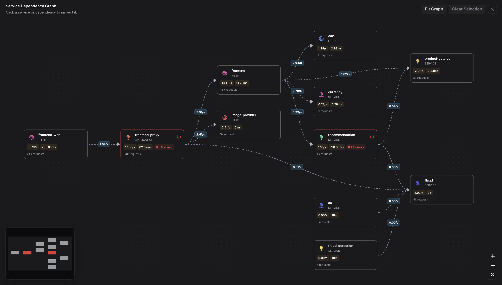
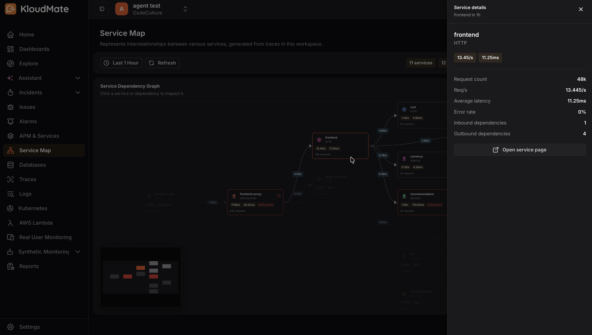
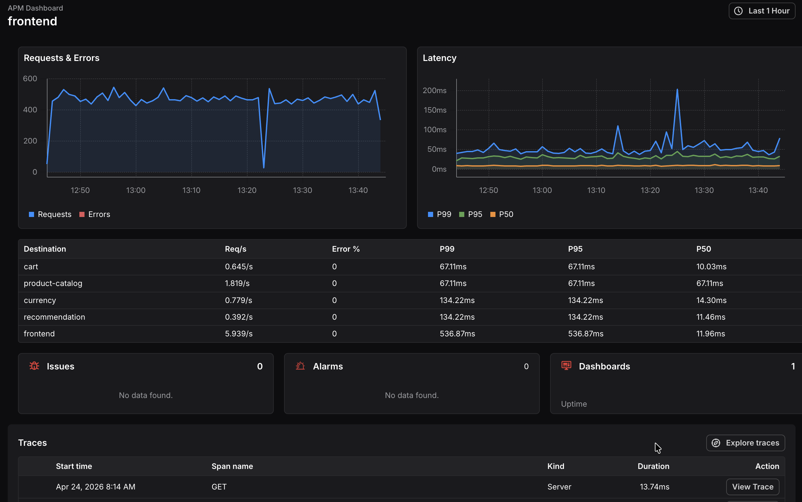

The [Service Map](https://app.kloudmate.com/service-map) is a visual representation of the relationships and interdependencies between all the services in your workspace. It is automatically generated from traces captured across your workspace, giving you a holistic view of your entire architecture in one place.

You can use the Service Map to understand the topology, dependencies, and operational health of your application services at a glance.

***

## Overview

Click **Service Map** in the left navigation to open the map. 

At the top of the page, a summary bar shows the total number of **services**, **dependencies**, **services with errors**, and **erroring edges** in the selected time range.

Use the **time range** selector to adjust the observation window, and click **Refresh** to reload the map with the latest data.

The main area displays the **Service Dependency Graph**. Each service is represented as a node showing its **name**, **protocol**, **request rate**, and **average latency**. The directed edges between nodes represent the call flow and dependencies between services. A minimap in the bottom-left corner gives you a bird’s-eye view of the full graph, which is useful when working with large architectures.

Use the zoom controls on the bottom-right to **zoom in **and **out**, or click the **expand** icon to view the graph in full screen.

## Inspecting a Service

Click any service node on the graph to open the Service details panel on the right.

Click **Open service page** at the bottom of the panel to navigate to the full **APM dashboard** for that service, where you can explore request and error trends, latency percentiles, traces, and linked issues, alarms, and dashboards in detail.

## Inspecting a Dependency

Click any edge (the line between two service nodes) to open the Dependency details panel on the right.

Use **Open source **or **Open target **at the bottom of the panel to navigate directly to the APM dashboard of either service involved in the dependency.

***

## Identifying Issues

Nodes and edges with errors are highlighted in red on the graph, making it easy to spot problematic services and dependencies at a glance. Click on any highlighted node or edge to open its details panel and review the error rate and latency metrics.​​​​​​​​​​​​​​​​
