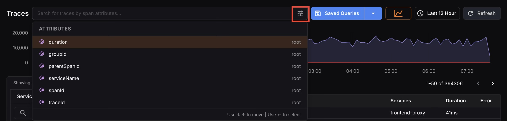
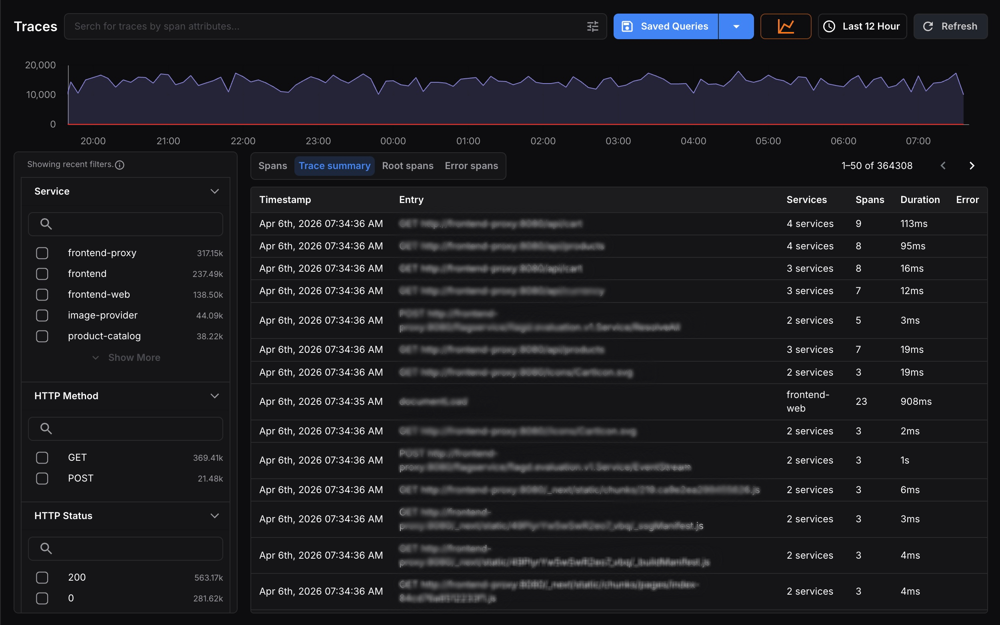
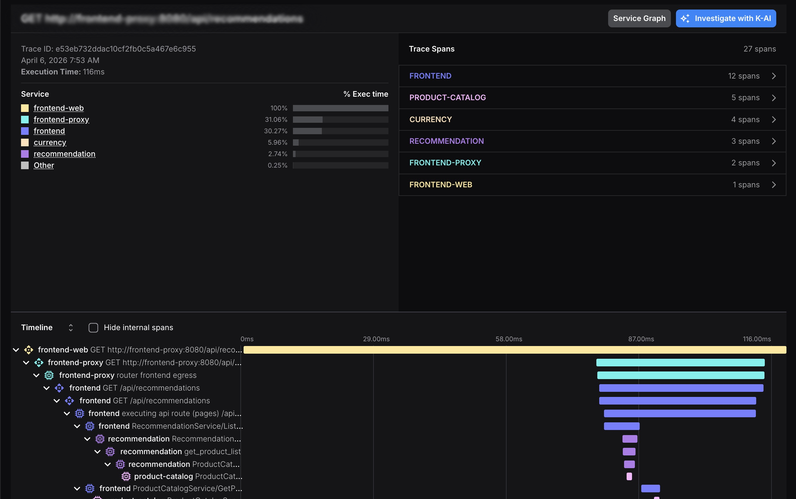

The [Traces](https://app.kloudmate.com/traces) section in KloudMate gives you end-to-end visibility into how requests travel across your services. You can explore trace data, including spans, events, and attributes, to detect errors, identify bottlenecks, and pinpoint issues at any point in a request's lifecycle.

**Here's what you can do in the Traces section:**

- Get a complete overview of all captured traces across your services.
- Search and filter traces using span attributes, HTTP method, status, severity, and more.
- Save and reuse frequently used search queries.
- Analyze individual spans across four focused result views.
- Drill into trace details including events, attributes, timeline, and raw data.
- Correlate logs and examine service-level interactions.

## Traces Section Walkthrough

Click on **Traces** in the left navigation menu to open the Traces section.

At the top of the page, you'll see a **span volume graph** that visualizes trace activity over the selected time range. The x-axis represents time and the y-axis shows the number of spans captured. This graph gives you a quick pulse-check on traffic patterns and helps spot anomalies before you dive into individual traces.

<hint type="info">
  [Click here](../getting-started/sending-data-to-kloudmate/) to learn more about how to send data to KloudMate.
</hint>

## Searching and Filtering

### Search Bar

Search across traces using span attributes. Click the **search bar** to see a list of available attributes.

Click the **filter** icon on the right to open the full attribute picker. Active filters appear as tags in the search bar and can be removed individually.

### Sidebar Filters

Use the left sidebar to filter results by:

- **Service**-**HTTP Method**-**HTTP Status**-**Severity**-**Database Name**

Each filter section includes a search box for quick lookup. When filters are active, a "Showing recent filters" notice appears at the top of the sidebar.

## Saved Queries

Click **Saved Queries**to view and apply any previously saved searches. To save a new query, click the dropdown arrow next to the Saved Queries button and select**Add New**. This saves your current search and filter configuration so you can reuse it anytime.

## Traces Result Views

### Spans

The **Spans**tab is the default view. It lists every individual span captured within the selected time range and active filters. Each row displays the**Timestamp**,**Span Name**,**Services**,**Duration**, and**Error** columns, giving you the most granular level of detail across your trace data.

This view is best for finding a specific operation, debugging a particular service, or scanning for anomalies across high-volume traffic.

### Trace Summary

The **Trace Summary**tab groups spans into complete traces, giving you a higher-level view of end-to-end request journeys rather than individual operations. Each row represents a single trace, showing its**entry point**,**number of services**,**spans involved**,**total duration**, and**any errors**.

Use this view to compare traces side by side, identify which requests are slowest, and understand overall request complexity across your services.

### Root Spans

The **Root Spans** tab shows only the root span from each trace. This makes it easier to compare top-level requests without the noise of child spans.

### Services

The **Services** tab summarizes traffic by service so you can identify hotspots, dependency trends, and the applications generating the most trace volume.

