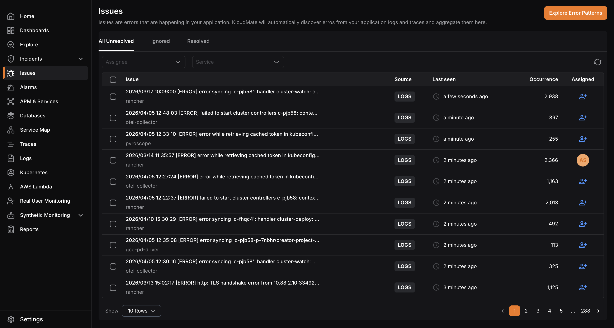
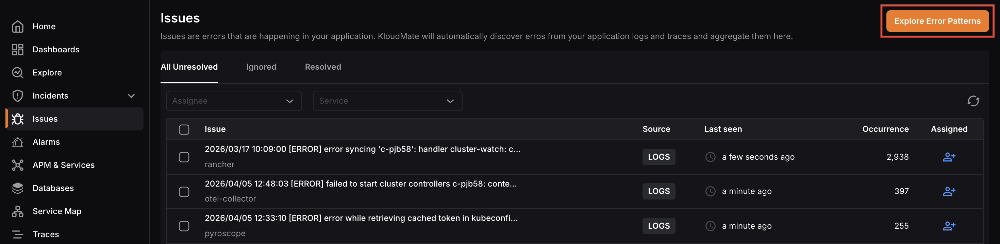
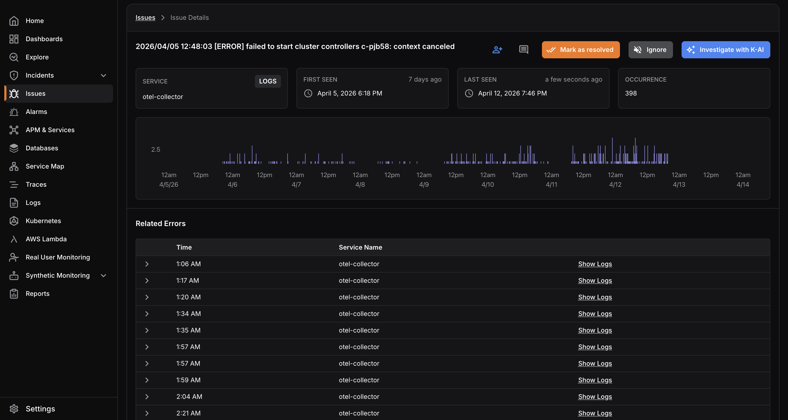
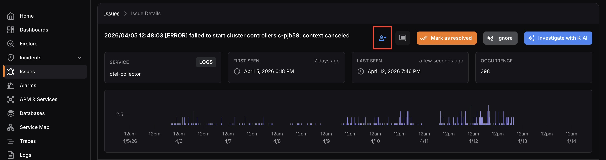
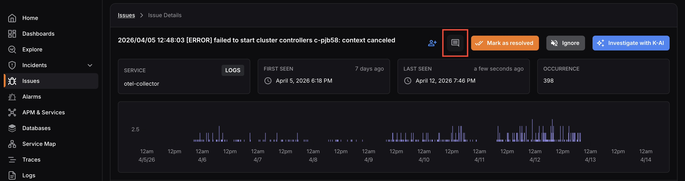
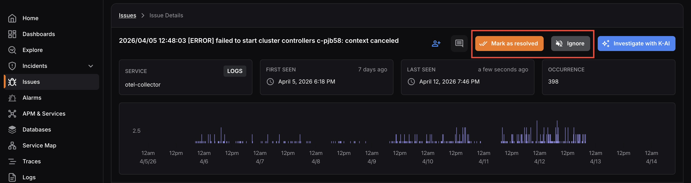

KloudMate automatically discovers errors from your application logs and traces and aggregates them in the Issues section. This gives you a centralised view of all errors and warnings detected across your services, so you can track, investigate, and resolve them efficiently.

To navigate to the Issues screen, click **Issues** in the left navigation menu.

## Issues Dashboard

The **Issues** screen displays all detected issues in a list. 

Each issue shows the source, last seen time, occurrence count, and assigned user. 

Use the **Assignee** and **Service** filters to narrow down the list. 

Issues are organised across three tabs; **All Unresolved**, **Ignored**, and **Resolved**, so you can focus on what’s active or review previously handled issues.

Click the **Explore Error Patterns** button at the top right to identify recurring error patterns across your services.

## Issue Details

Click on any issue to open its detail view. 

This screen shows the service it belongs to, the source, when it was first and last seen, and the total occurrence count. An occurrence frequency chart gives you a visual timeline of how often the issue has been happening over time.

The **Related Errors** section lists individual occurrences of the issue with timestamps, service names, and direct links to the associated logs for deeper investigation.

From this screen you can:

- **Assign** the issue to a team member using the assign icon

- **Add comments** using the comment icon: you can mention other users in comments, and all participating users receive notifications for any updates on the issue

- **Mark as Resolved: **removes the issue from the Unresolved list
- **Ignore:** mutes future notifications for this issue if it reoccurs

- **Investigate with K-AI:** automatically analyses the issue and provides a concise summary, probable root cause, and recommended actions for faster resolution

Issues can also be assigned to multiple users. Assigned users are notified when an issue is assigned to them, and all participating users receive updates for any subsequent activity on the issue.

## Issue Statuses

- **Unresolved:** An issue that has been detected and is yet to be reviewed or addressed.
- **Resolved:** An issue that has been reviewed and marked as resolved. It will no longer appear in the Unresolved list.
- **Ignored: **An issue that has been intentionally muted. No notifications will be sent if the same issue reoccurs in the future.

You can mark issues as resolved or ignored either from the issue details page, or by selecting multiple issues from the main list and applying the action collectively.

***

## Notification Preferences

Users can configure a notification policy to receive alerts for:

- **New Issues: ** ssues detected for the first time
- **New and Regression Issues:** Issues detected for the first time, as well as issues that had previously occurred and have reappeared

***

## User Permissions

Access to issue actions is determined by the user’s assigned role:

- **Owner and Developer:** Can mark issues as resolved or ignored, assign issues to team members, and leave comments.
- **Viewer:** Can assign issues to team members and leave comments, but cannot mark issues as resolved or ignored.

***

## **Related Resources**

[Setting up notifications](https://docs.kloudmate.com/setting-up-notifications)

