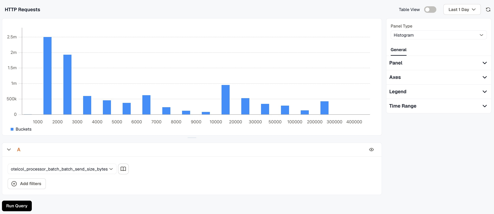
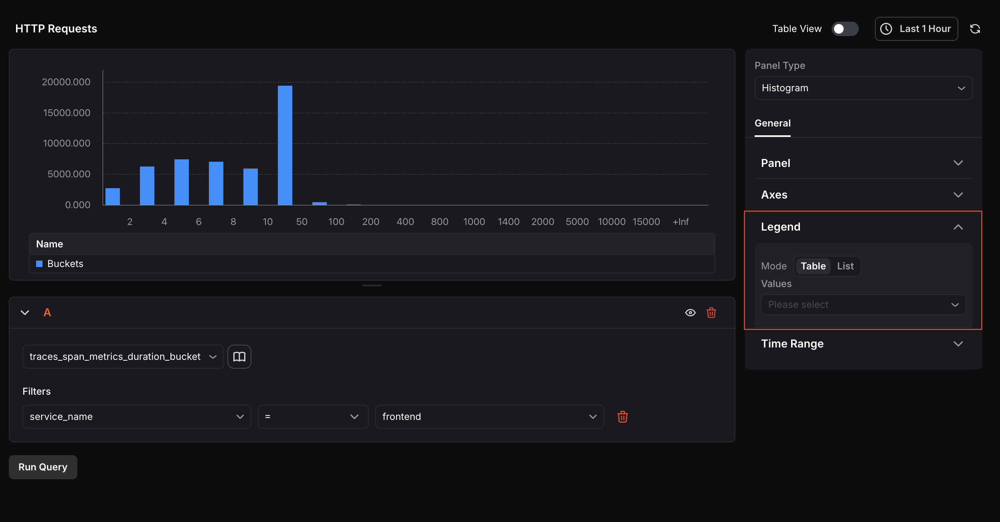

The Histogram Panel displays the distribution of numerical data over a selected time range. It groups values into buckets and counts how many values fall into each one. Each bar represents a bucket, the height reflects the count of values within that range, and the x-axis represents the bucket ranges themselves.

The Histogram Panel is useful for understanding how your data is spread across a range of values. You can use it to visualize request durations, error rates, latency distributions, or any other numerical signal. By switching the time range, you can observe how the distribution shifts after events like a deployment or a traffic spike.

When the panel type is set to Histogram, the following settings are available under the **General** tab:

### Panel
- **Name:** Enter a name for your panel. This appears as the panel title on the dashboard.
- **Description:** Enter a description to provide additional context about what the panel displays.

### Axes
The Axes section provides controls to adjust how the distribution is visualized after data is fetched.

- **Bucket Count (default: 30):** Controls how many buckets the data is grouped into. Reducing the bucket count gives a more aggregated view; increasing it reveals finer granularity.
- **Bucket Offset:** Shifts all bucket ranges by a fixed value. For example, an offset of +10 transforms a bucket range of \[x, y] to \[x+10, y+10]. This is useful when you want to align bucket boundaries with a specific baseline.
- **Min / Max:** Constrains the visible range by discarding buckets that fall outside the specified bounds. Use this to focus on the meaningful portion of the distribution and filter out extreme values or noise.

The goal of these controls is to improve readability and make the distribution easier to interpret depending on the context and characteristics of your data.

### Legend
Choose between **Table ** or ** List ** mode to control how the legend is displayed. Use the ** Values** selector to choose which aggregate values (such as Min, Max, or Mean) appear alongside each series label. Leave Values empty to display labels only.

### Time Range
Configure time range behavior for this panel independently from the dashboard.

- **Override Dashboard Time Range:** Individual panels can use their own time range configuration. Enable this to override the time range set at the dashboard level.
- **Time Shift:** Shift the panel’s start and end time by a specified time shift expression. Use the minus (`-`) operator to subtract time, with the same units supported by the dashboard time range expressions. 

Refer to [Time Range Expressions and Settings](../time-range-expressions-and-settings/) for supported units and syntax.

