import { Image } from 'astro:assets';
import panelTypeDropdown from './images/adding-a-panel-panel-type.png';
import overridesDropdown from './images/adding-a-panel-overrides.png';
import generalSettings from './images/adding-a-panel-general-settings.png';

Panels are the individual widgets on a dashboard. Each panel visualizes a specific metric or query result. Adding panels lets you build up a complete view of the metrics you care about in one place.

From your dashboard, click **Add** at the top right. A menu opens with three options: **Add panel**, **Add section**, and **Import**.

- **Add panel** opens the panel editor so you can build a new panel from scratch.
- **Add section** groups panels under a collapsible heading.
- **Import** reuses a panel from a template or an existing dashboard instead of building one from scratch.

## Add a Panel

1. Click **Add panel**. The panel editor opens with a query editor at the bottom.

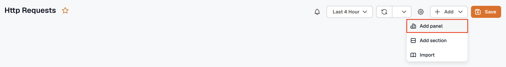

2. Configure your query in the query editor. Queries define what data the panel displays.

- Select a Data Source, **OpenTelemetry** or **aws/demo** (available if an AWS account is connected).

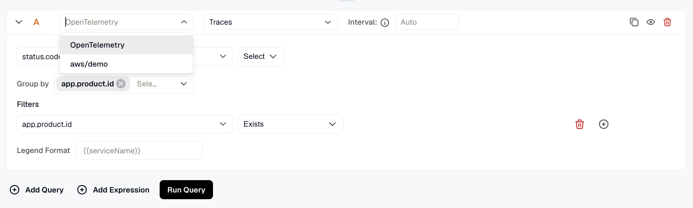

- For OpenTelemetry, select the dataset (**Traces**, **Metrics**, **Logs**, etc.) and configure the metric, aggregation, group by, filters, and legend format using the Query Builder tab. Switch to the **PromQL** tab to write [Prometheus queries](https://prometheus.io/docs/prometheus/latest/querying/basics/) directly.
- Add multiple queries using **Add Query** when you want to compare or combine multiple metrics in the same panel.

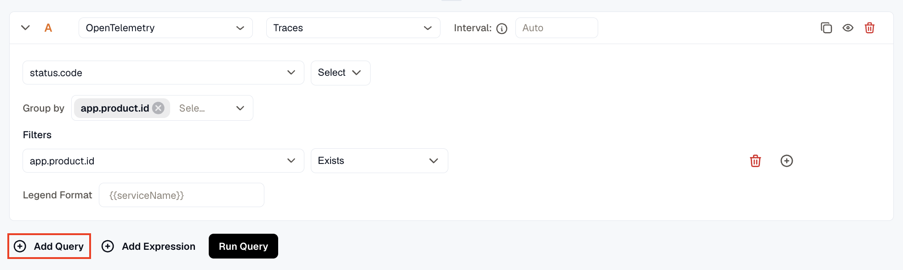

- Add expressions using **Add Expression** to apply math, reduce, or condition logic across query results.

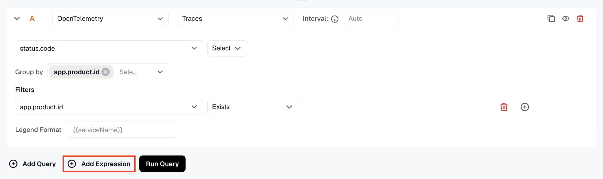

For more on setting up queries, see [Creating Alerts](../../../alerts/create-alerts/). For expressions, see [Alert Expressions](../../../alerts/expressions/).

3. Click **Run Query** to execute the query and preview the result in the visualization area. Running the query lets you verify the data looks correct before saving the panel.

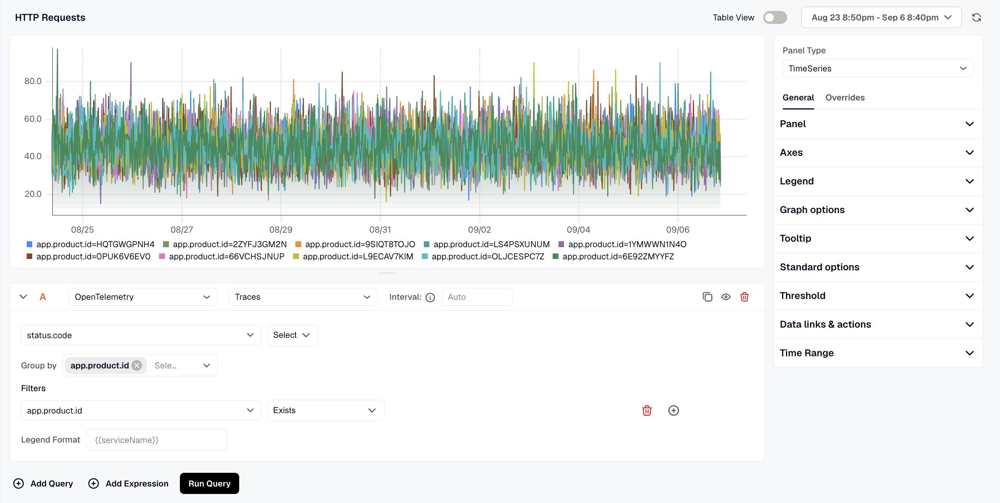

4. Select a **Panel Type** from the dropdown on the right to control how the data is visualized.

Choosing the right type makes data easier to interpret, for example, use TimeSeries for trends over time or Stats for a single current value.

*Available types are:* **TimeSeries**, **Stats**, **Table**, **Pie Chart**, **Bar Chart**, **Histogram**, **Logs List**, **Spans List**, **Alerts List**, **Issues List**, and **Text**.

<Image src={panelTypeDropdown} alt="Panel Type dropdown" width={291} densities={[1, 2]} />

5. In the right-side settings panel under **General** > **Panel**, enter a Name and Description so the panel is easy to identify on the dashboard. You can also add Links using **Add link** to connect the panel to related resources.

Under **Repeat options**, set **Repeat by variable** to render one copy of this panel for each value of the selected variable. Only the first 20 values are used, and the copies show on the dashboard, not in the editor.

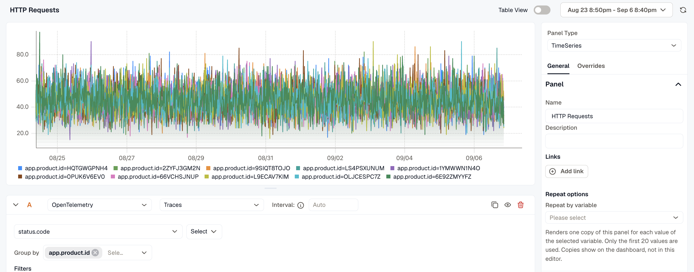

6. Customize the panel appearance using the General and Overrides tabs on the right:

- **General:** Configure Panel name, Axes, Legend, Graph options, Tooltip, Standard options, Threshold, Data links & actions, and Time Range.

<Image src={generalSettings} alt="General settings panel" width={289} densities={[1, 2]} />

- **Overrides:** Click **Add Field Override** to apply custom display settings to specific fields, by series name, a matching regex, or a query. Useful when different data series need different formatting.

<Image src={overridesDropdown} alt="Overrides field override dropdown" width={294} densities={[1, 2]} />

7. Toggle **Table View** at the top of the panel editor to switch between the visual chart and a raw data table showing timestamps and values. This is helpful for inspecting exact data points.

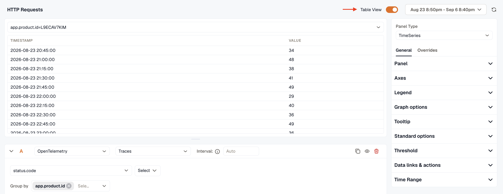

8. Use the time range picker at the top to set the time window for this panel.

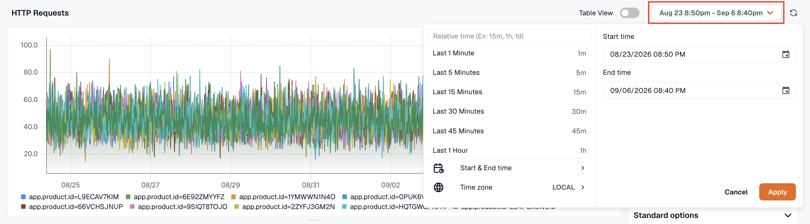

9. Click **Save & Close** to save the panel and return to the dashboard, or **Save** to save without exiting the editor.

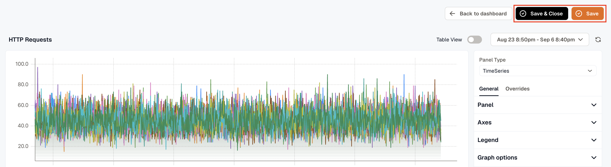

***

## Add a Section

Select **Add section** from the **Add** menu to group related panels under a collapsible heading. This keeps a busy dashboard organized, for example, separating infrastructure panels from application panels.

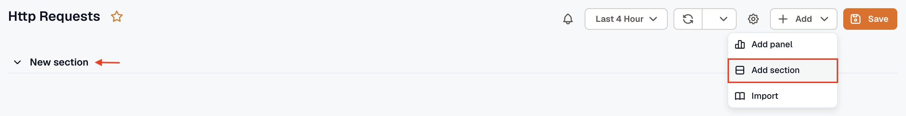

A new section appears on the dashboard with an editable name. Add panels underneath it the same way you'd add any other panel.

***

## Import a Panel

Select **Import** from the **Add** menu to add a pre-built panel to your dashboard without building it from scratch. The Import Panel dialog offers two tabs:

**Import from Templates:** Select a template from the dropdown to import a panel from a pre-built KloudMate template.

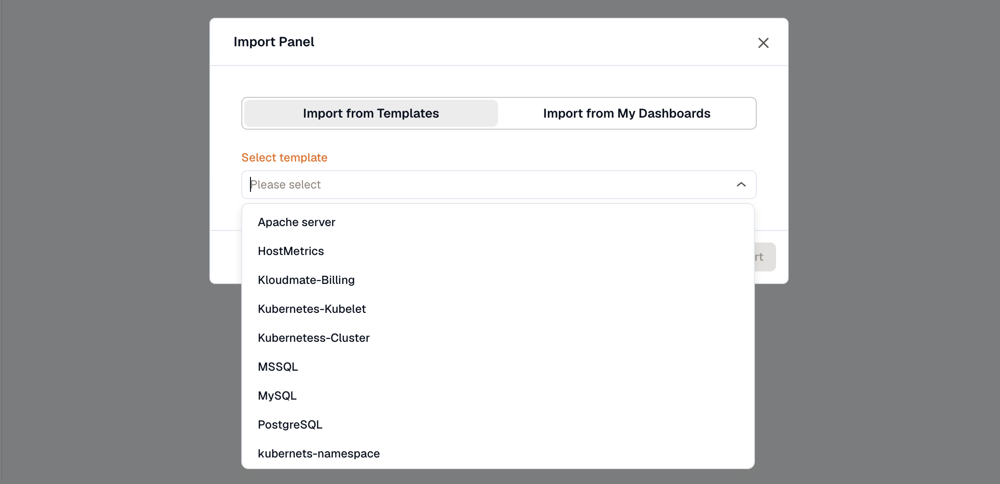

**Import from My Dashboards:** Select an existing dashboard from the dropdown to reuse a panel you've already built. This saves time when the same metric needs to appear across multiple dashboards.

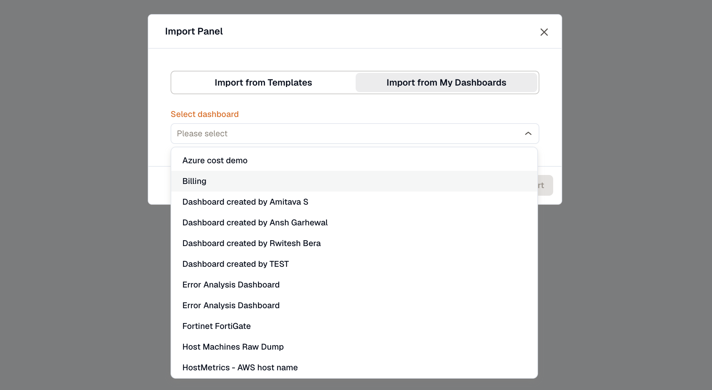

Once imported, you can **edit**, **delete**, or **duplicate** the panel using the panel's more options menu.
