Panels are the individual widgets on a dashboard. Each panel visualizes a specific metric or query result. Adding panels lets you build up a complete view of the metrics you care about in one place.

From your dashboard, click **Add Panel**. A dialog appears with two options:

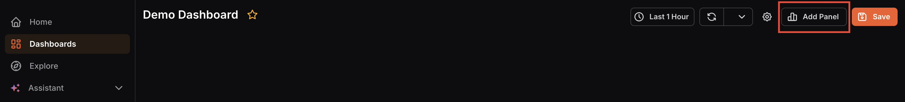

- **Create from Scratch:** Build a new panel with a custom query and visualization.
- **Import from Library:** Reuse a panel from a saved template or an existing dashboard to avoid rebuilding common visualizations.

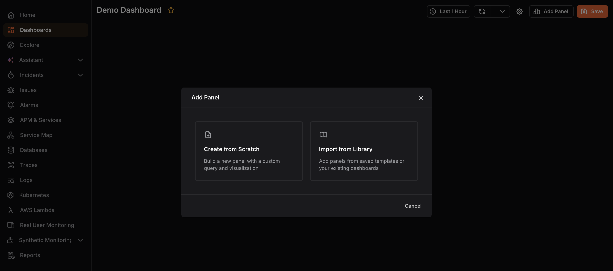

## Create from Scratch

1. Select **Create from Scratch.**

2. Configure your query in the query editor at the bottom. Queries define what data the panel displays.

- Select a Data Source, **OpenTelemetry** or **aws/dev** (available if an AWS account is connected).

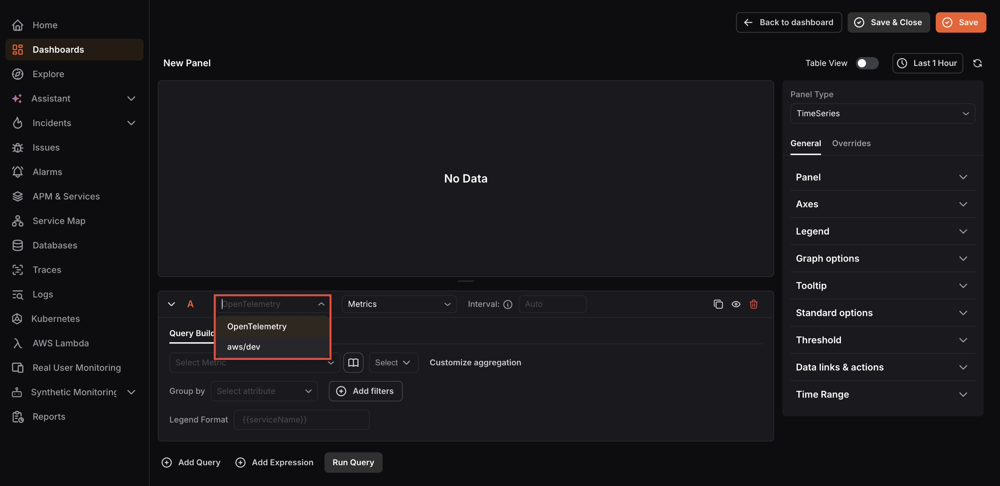

- For OpenTelemetry, select the dataset (**Traces** , **Metrics** , **Logs** , etc.) and **configure the metric** , **aggregation** , **Group by** , **filters** , and **Legend Format** using the Query Builder tab. Switch to the **PromQL** tab to write [Prometheus queries](https://prometheus.io/docs/prometheus/latest/querying/basics/) directly.
- Add multiple queries using **Add Query** when you want to compare or combine multiple metrics in the same panel.

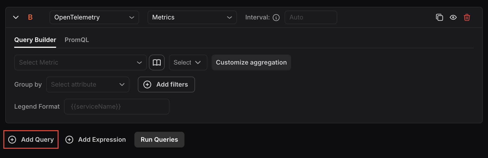

- Add expressions using **Add Expression** to apply math, reduce, or condition logic across query results.

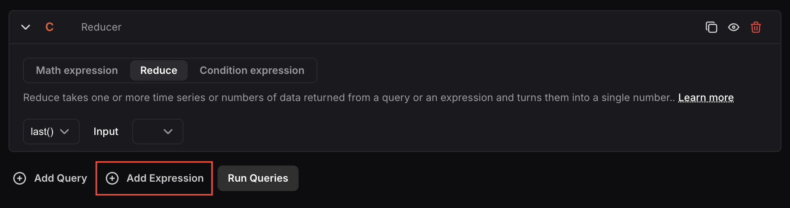

For more information on setting up queries, see [Creating Alerts](../../../alerts/create-alerts/). For expressions, see [Alert Expressions](../../../alerts/expressions/).

3. Click **Run Query** to execute the query and preview the result in the visualization area. Running the query lets you verify the data looks correct before saving the panel.

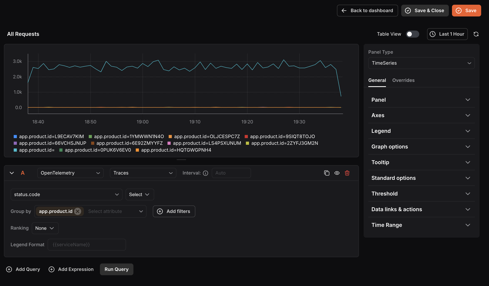

4. Select a **Panel Type** from the dropdown on the right to control how the data is visualized.

Choosing the right type makes data easier to interpret, for example, use TimeSeries for trends over time or Stats for a single current value. 

*Available types are:* **TimeSeries** , **Stats** , **Table** , **Pie Chart** , **Bar Chart** , **Histogram** , **Logs List** , **Spans List** , **Alerts List** , **Issues List** , and **Text**.

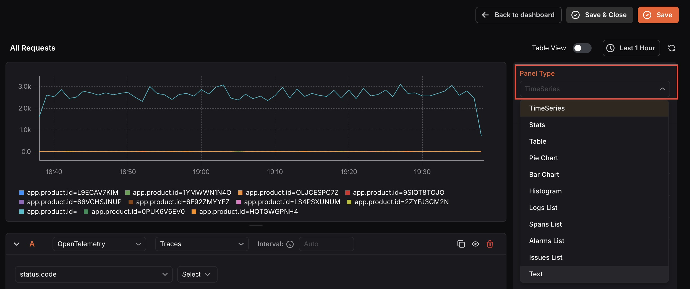

5. In the right-side settings panel under **General** > **Panel**, enter a Name and Description so the panel is easy to identify on the dashboard. You can also add Links using Add link to connect the panel to related resources.

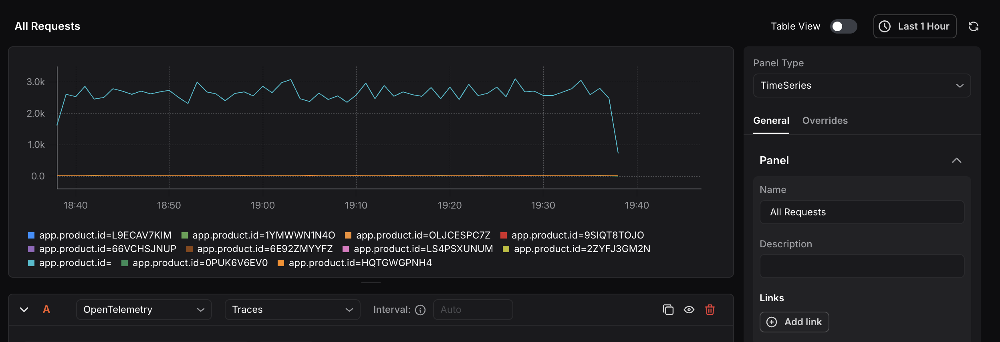

6. Customize the panel appearance using the General and Overrides tabs on the right:

- **General:** Configure Panel name, Axes, Legend, Graph options, Tooltip, Standard options, Threshold, Data links & actions, and Time Range.
- **Overrides:** Click **Add Field Override** to apply custom display settings to specific fields, useful when different data series need different formatting.

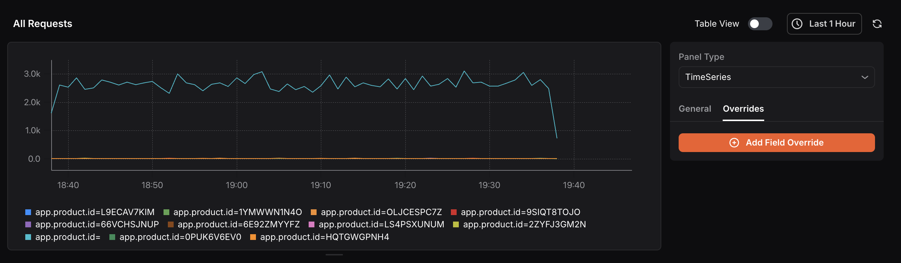

7. Toggle **Table View** at the top of the panel editor to switch between the visual chart and a raw data table showing timestamps and values. This is helpful for inspecting exact data points.

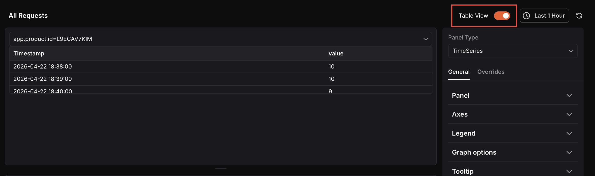

8. Use the time range picker at the top to set the time window for this panel.

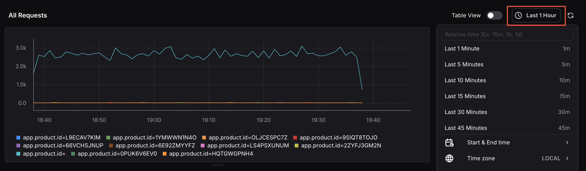

9. Click **Save & Close** to save the panel and return to the dashboard, or **Save** to save without exiting the editor. 

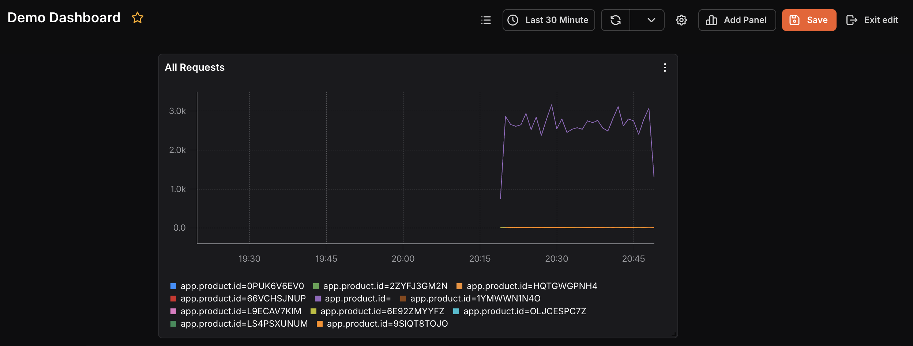

***

## Import from Library

Select Import from Library to add a pre-built panel to your dashboard without building it from scratch. The Import Panel dialog offers two options:

**Import from Templates:** Select a template from the dropdown to import a panel from a pre-built KloudMate template.

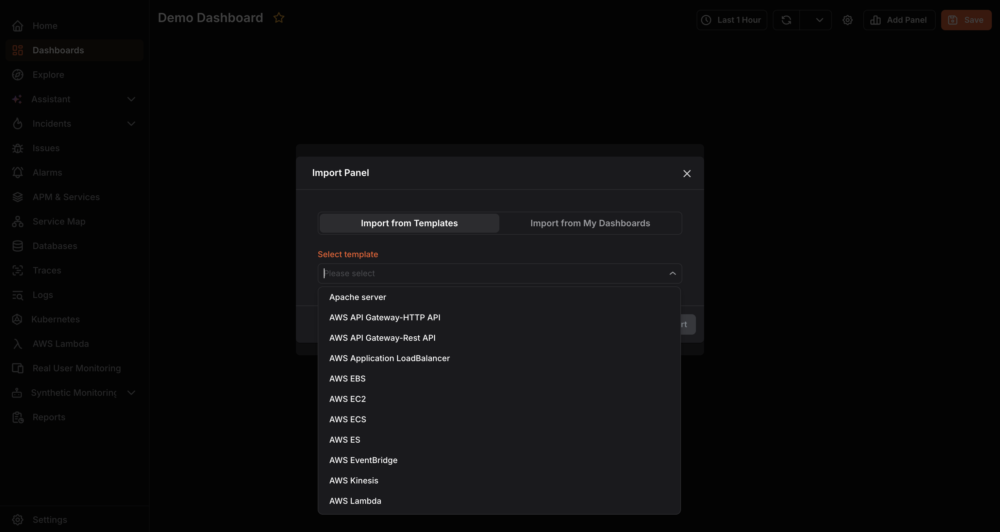

**Import from My Dashboards:** Select an existing dashboard from the dropdown to reuse a panel you have already built. This saves time when the same metric needs to appear across multiple dashboards.

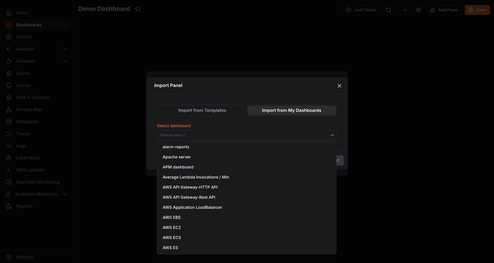

Once imported, you can **edit** , **delete** , or **duplicate** the panel using the panel’s more options menu.
