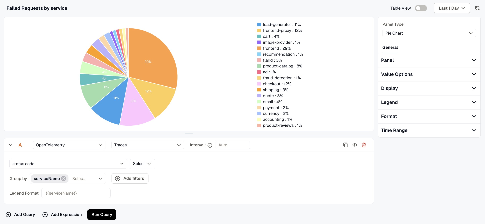
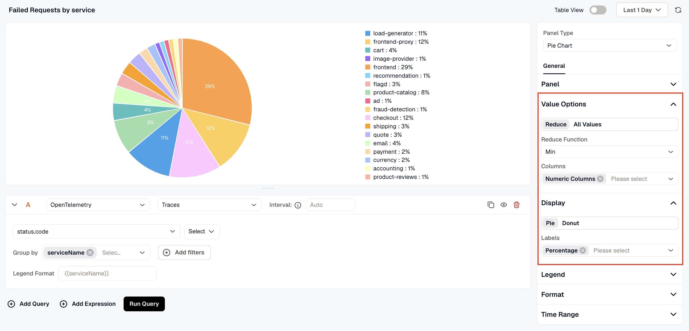

The Pie Chart Panel displays data as a pie or donut chart, making it easy to visualize the proportional breakdown of values across categories. It includes a query box to define the data you want to visualize, and a set of settings to customize how that data is presented.

When the panel type is set to Pie Chart, the following settings are available under the **General** tab:

### Panel

- **Name:** Enter a name for your panel. This appears as the panel title on the dashboard.
- **Description:** Enter a description to provide additional context about what the panel displays.

### **Value Options:**

Configure how values from your query are calculated and represented in the chart.

- **Reduce**: Aggregates all data points for each series into a single value using a Reduce Function (such as Min, Max, Mean, or Total). Use the Columns option to specify which columns are included in the calculation.
- **All Values**: Displays every individual data point in the chart without aggregation.

### Display

Choose between **Pie** and **Donut** as the chart style. Use the **Labels** setting to control what is shown on the chart slices, including Value, Percentage, and Name.

### Legend

Toggle the legend on or off using the **Show legend** option. When enabled, choose between **List** or **Table** mode, set the placement to **Right** or **Bottom** , and use the **Legend Values** dropdown to select what is shown alongside each legend entry, such as Percentage.

### **Format:**

Use the Format dropdown to choose how values are displayed. Available options include Number, Bytes (SI), Bytes (IEC), Percentage, Duration (Milliseconds), Duration (Nanoseconds), and Unformatted. You can also set the maximum number of decimal places, multiply values by a number, and add a prefix or suffix.

### **Time Range:**

Configure time range behavior for this panel independently from the dashboard.

- **Override Dashboard Time Range:** Individual panels can use their own time range configuration. Enable this to override the time range set at the dashboard level.
- **Time Shift:** Shift the panel’s start and end time by a specified time shift expression. Use the minus (`-`) operator to subtract time, with the same units supported by the dashboard time range expressions. 

Refer to [Time Range Expressions and Settings](../time-range-expressions-and-settings/) for supported units and syntax.
