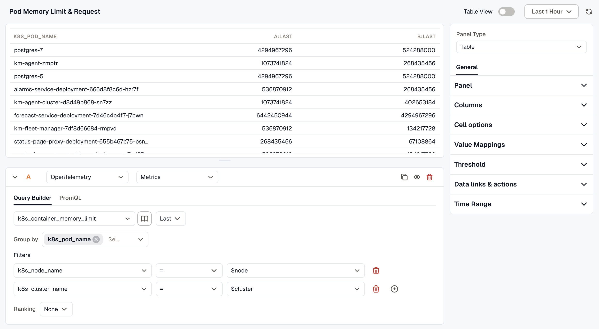
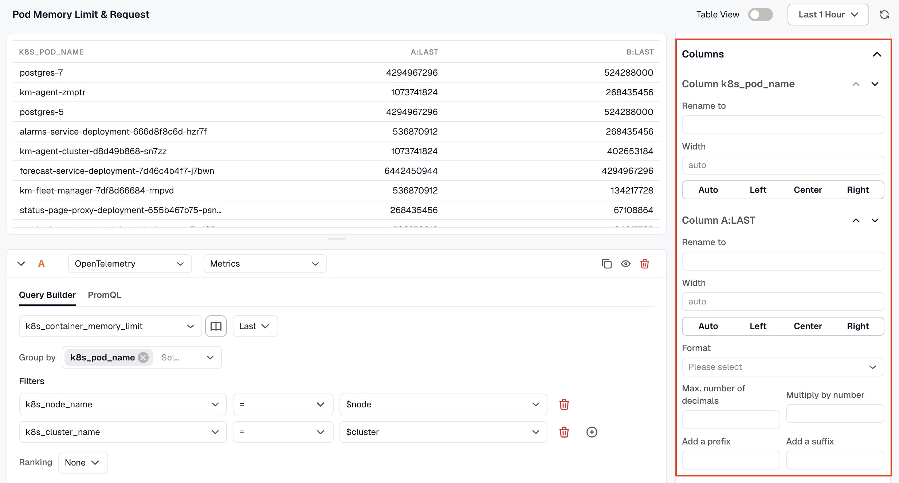
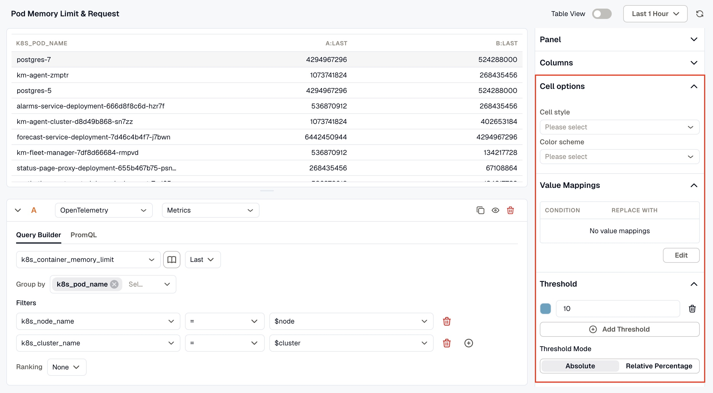

The Table Panel displays your data in a structured table format, making it easy to read and compare values across rows. It includes a query box to define the data and settings to control how columns and values are presented.

When the panel type is set to Table, the following settings are available under the **General tab**:

### Panel

- **Name:** Enter a name for your panel. This appears as the panel title on the dashboard.
- **Description:** Enter a description to provide additional context about what the panel displays.
- **Links:** Click **Add link** to connect the panel to related resources, such as a runbook or an external dashboard.
- **Repeat options:** Set **Repeat by variable** to render one copy of this panel for each value of the selected variable. Only the first 20 values are used, and the copies show on the dashboard, not in this editor.

### Columns
Configure the appearance and formatting of each column in the table individually. Each column detected from your query result appears here and can be expanded to access its settings.

- **Rename to:** Enter a custom display name for the column heading.
- **Width:** Set a fixed width for the column or leave it as Auto to size automatically.
- **Format:** Choose how the column values are formatted.
- You can also set the maximum number of decimal places, multiply values by a number, and add a prefix or suffix to the displayed values.

### Cell options
Control the visual style applied to table cells.

- **Cell style:** Choose a display style for the cells.
- **Color scheme:** Apply a color scheme to the cells for visual emphasis.

### Value Mappings
Map specific data values to custom display text and colors based on defined conditions. When a value meets a condition, it is replaced with the mapped text and displayed in the mapped color. Click Edit to add or modify mappings.

### Threshold
Add thresholds to highlight values that cross important boundaries.

- Click **Add Threshold** to define a threshold value and assign a color to it.
- **Threshold Mode:** Choose between Absolute Value (based on the actual data value) or Relative Percentage (based on a percentage of the range).

### Data links & actions
Add URL links that users can access from within the panel.

### Time Range
Configure time range behavior for this panel independently from the dashboard.

- **Override Dashboard Time Range:** Individual panels can use their own time range configuration. Enable this to override the time range set at the dashboard level.
- **Time Shift:** Shift the panel’s start and end time by a specified time shift expression. Use the minus (`-`) operator to subtract time, with the same units supported by the dashboard time range expressions. 

Refer to [Time Range Expressions and Settings](../time-range-expressions-and-settings/) for supported units and syntax.

:::info
At the query level, the Table panel also includes **Order By** to sort results by a selected field in ascending or descending order, and **Limit** to restrict the number of rows displayed.
:::
