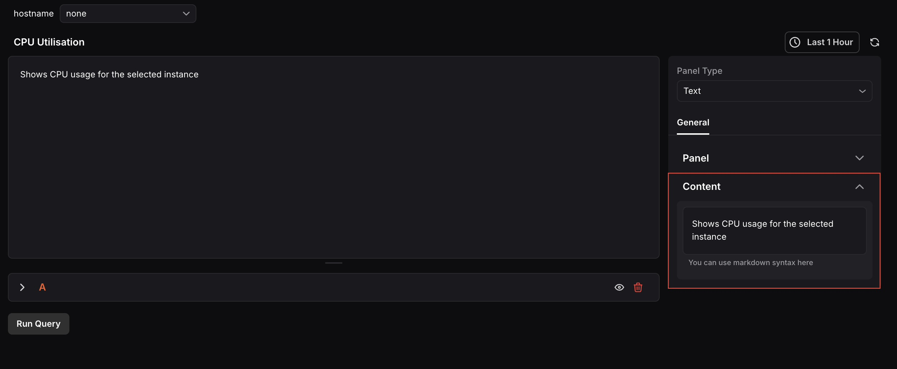

The Text Panel lets you add custom text, descriptions, or notes directly to your dashboard. This is useful when you want to provide context, explain metrics, highlight key observations, or include instructions for dashboard viewers.

When the panel type is set to Text, the following settings are available under the **General** tab:

### Panel
- **Name:** Enter a name for your panel. This appears as the panel title on the dashboard.
- **Description:** Enter a description to provide additional context about what the panel displays.

### Content
Use the text editor to enter the content you want to display in the panel. Markdown syntax is supported, allowing you to format your content with headers, lists, links, and more.
