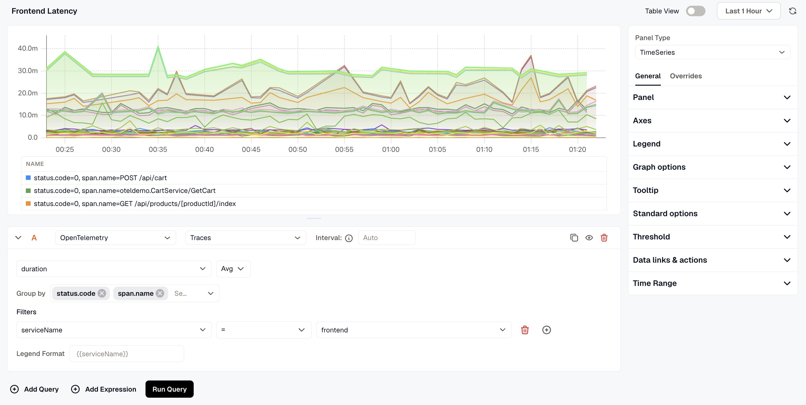
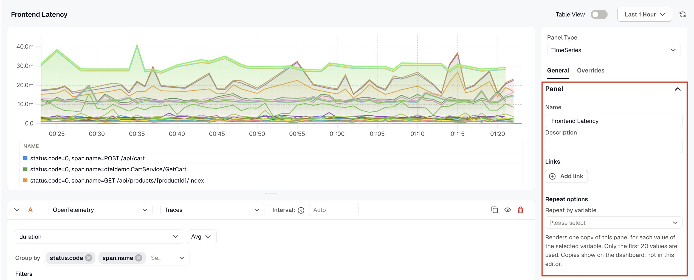
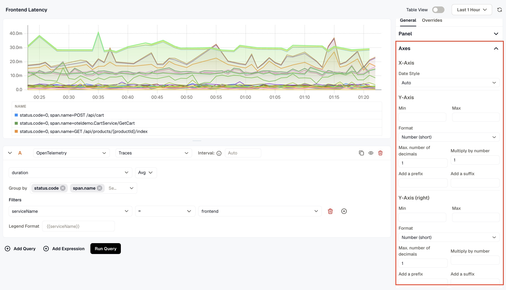
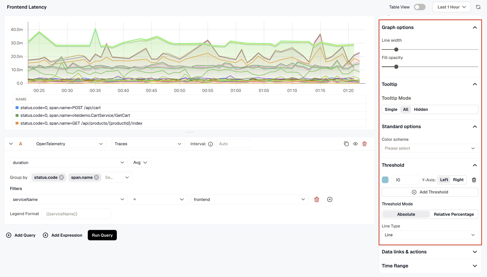
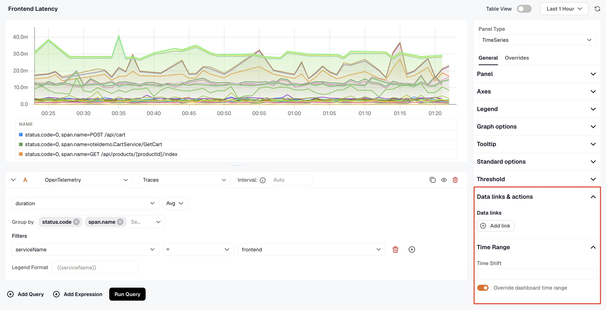

The TimeSeries Panel displays your data as a time-based graph. It includes a query box to define the data you want to visualize, and a set of settings to customize how that data is presented.

When the panel type is set to TimeSeries, the following settings are available under the **General tab**:

### Panel
- **Name:** Enter a name for your panel. This appears as the panel title on the dashboard.
- **Description:** Enter a description to provide additional context about what the panel displays.
- **Links:** Click **Add link** to connect the panel to related resources, such as a runbook or an external dashboard.
- **Repeat options:** Set **Repeat by variable** to render one copy of this panel for each value of the selected variable. Only the first 20 values are used, and the copies show on the dashboard, not in this editor.

### Axes
Configure how data is represented on each axis of the graph.

- **X-Axis:** Use the Date Style dropdown to choose from various date formats for the horizontal axis of the graph. The default is Auto.
- **Y-Axis:** Set a Min and Max value to control the visible range of the vertical axis. Use the Format dropdown to choose the unit of data displayed, such as Number, Percentage, or Duration. You can also set the maximum number of decimal places, multiply values by a number, and add a prefix or suffix to the displayed values.
- **Y-Axis (Right):** You can add a second Y-axis on the right side of the graph and configure it with the same options as the left Y-axis.

### Legend
Choose between Table or List mode to control how query results are displayed. Use the Values selector to pick aggregate functions such as Min, Max, or Total to show alongside each legend entry.

### Graph options
Adjust the visual appearance of the graph using Line width and Fill opacity controls.

### Tooltip
Choose what information appears when hovering over the graph.

### Standard options
Set a Color scheme to apply a consistent color palette across all series in the panel.

### Threshold
Add one or more threshold lines on the graph to visually mark important value boundaries.

- Click **Add Threshold** to define a threshold value, assign it to the left or right Y-axis, and give it a color.
- **Threshold Mode:** Choose between Absolute Value (based on the actual data value) or Relative Percentage (based on a percentage of the data range).
- **Line Type:** Choose how the threshold line is rendered on the graph.

### Data links & actions
Add URL links that users can access by interacting with the panel data points.

### Time Range
Configure time range behavior for this panel independently from the dashboard.

- **Override Dashboard Time Range:** Individual panels can use their own time range configuration. Enable this to override the time range set at the dashboard level.
- **Time Shift:** Shift the panel’s start and end time by a specified time shift expression. Use the minus (`-`) operator to subtract time, with the same units supported by the dashboard time range expressions. 

Refer to [Time Range Expressions and Settings](../time-range-expressions-and-settings/) for supported units and syntax.
