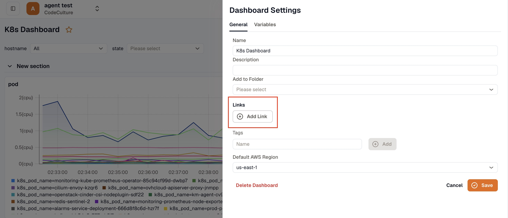
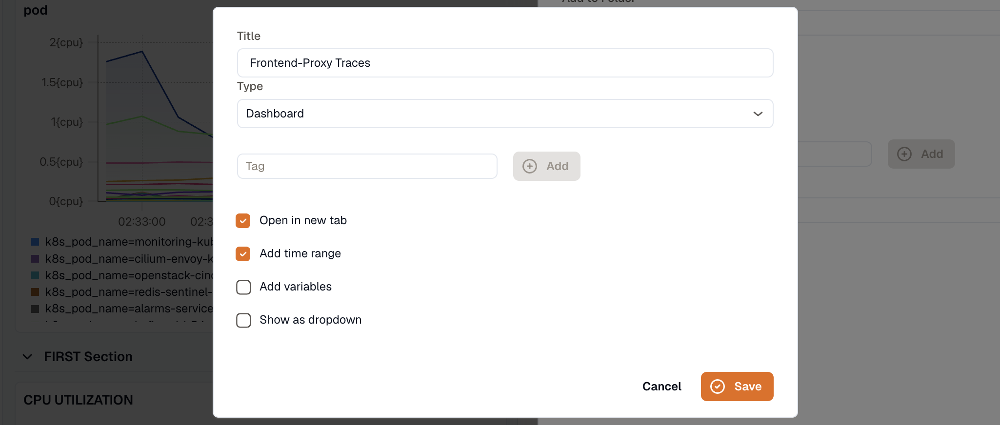
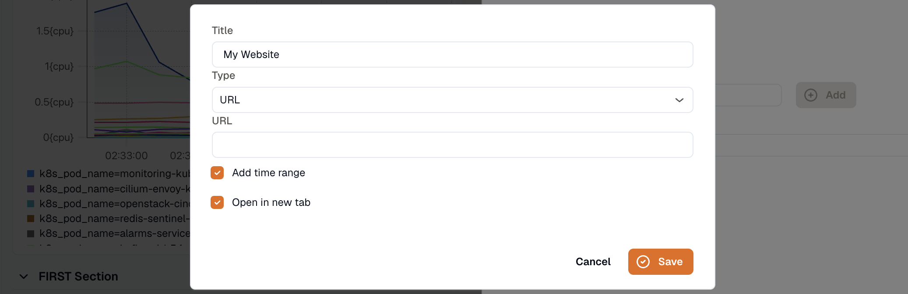
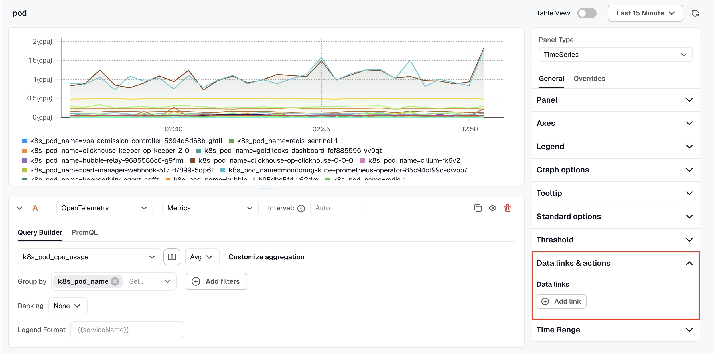
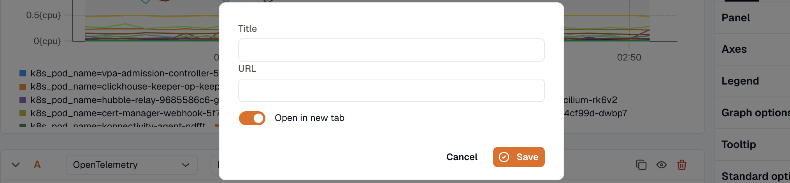

KloudMate dashboards support two kinds of links: internal links to other dashboards, and external URLs. Use either to jump straight to a related view instead of hunting for it.

## Add a Dashboard Link

1. Navigate to the dashboard where the link will be added.

2. Open **Dashboard Settings** and click the **General** tab.

   

3. Click **Add Link**.

   

4. Enter a **Title** for your link.

5. Select **Dashboard** as the link type.

6. Optionally, add a **Tag** to reference the target dashboard.

7. Select from the available options:

   - **Open in new tab:** Opens the linked dashboard in a separate browser tab.
   - **Add time range:** Transfers the time range selected in the main dashboard to the linked dashboard.
   - **Add variables:** Transfers variables from the main dashboard to the linked dashboard if the same variables are available.
   - **Show as dropdown:** Displays multiple dashboard links as a dropdown, useful when several links are added to the same dashboard.

8. Click **Save**.

Once saved, the link appears as a button in the top-right corner of the dashboard.

***

## Add a URL Link to a Dashboard

1. Follow steps 1–4 from [Add a Dashboard Link](#add-a-dashboard-link).

   

2. Select **URL** as the link type.

3. Enter the destination in the **URL** field.

4. Select from the available options:

   - **Add time range:** Transfers the dashboard's selected time range to the linked URL if that URL supports time range filtering.
   - **Open in new tab:** Opens the URL in a new browser tab.

5. Click **Save**.

***

## Add a Data Link to a Panel

1. Navigate to the dashboard containing the panel and open it for editing.

2. In the right-hand panel settings, scroll down to **Data links & actions**.

   

3. Under **Data links**, click **Add link**.

4. Enter a **Title** and the **URL** for the link.

5. Toggle **Open in new tab** if needed.

   

6. Click **Save**.
