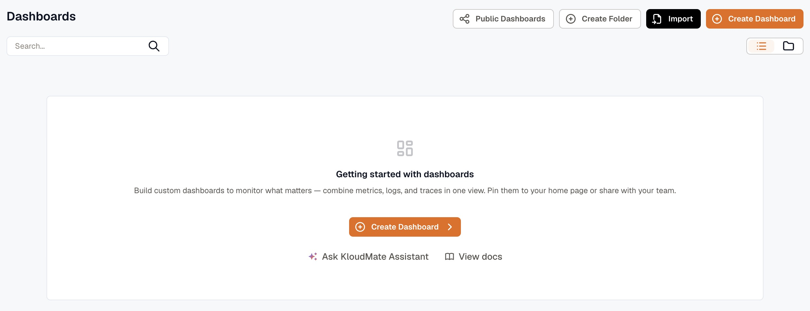
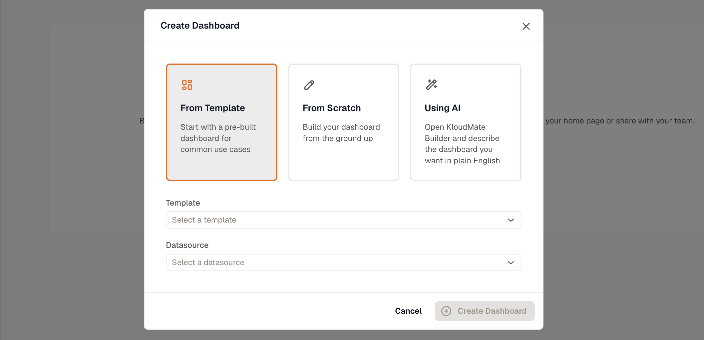
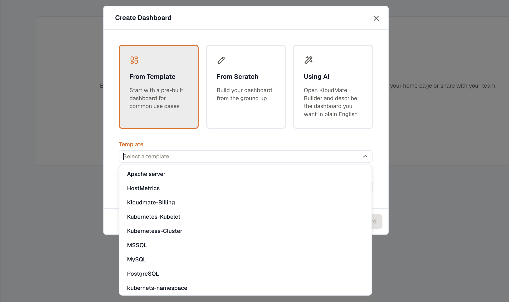
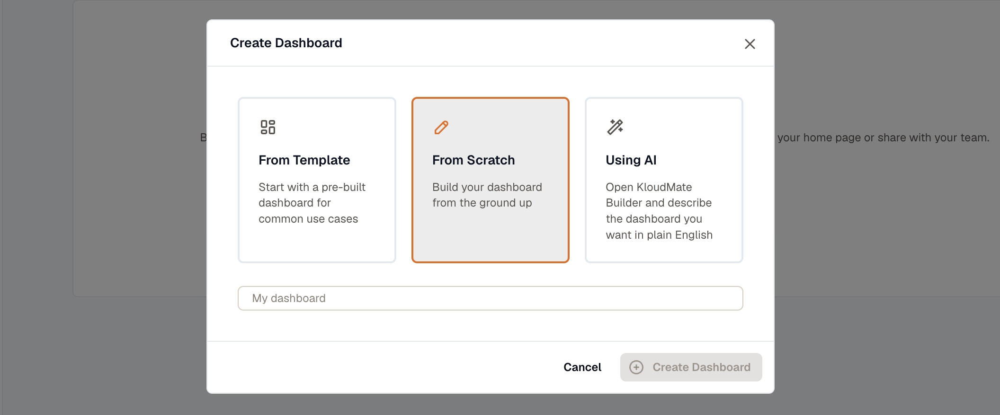

---

title: "Create a Dashboard"
description: "Learn how to create a custom metrics dashboard from scratch or using a template."
sidebar:
  order: 2
---
Creating a dashboard lets you build a personalized view of the metrics that matter most to your application. You can start from a pre-built template for common services or build one from scratch with custom queries.

1. From the Dashboards screen, click **Create Dashboard**.

2. Choose how you want to create the dashboard:

### From Template

Use a pre-built dashboard for common use cases. This is the fastest way to get started if you are monitoring a known service.

Select a **Template ** from the dropdown. Then select a ** Datasource** and click Create Dashboard.

### From Scratch

Build a fully custom dashboard. Enter a **Dashboard Name ** and click ** Create Dashboard**. You will be taken to an empty dashboard where you can start adding panels.

