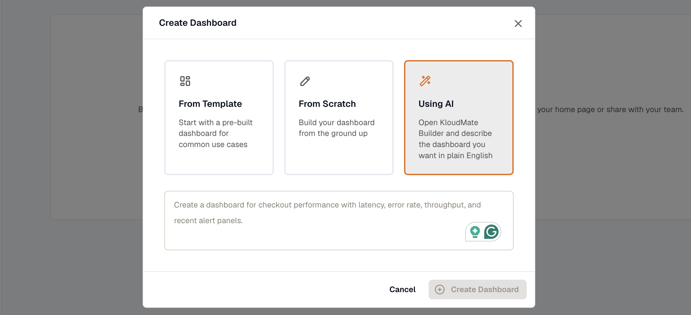

Creating a dashboard lets you build a personalized view of the metrics that matter most to your application. Start from a pre-built template, build one from scratch with custom queries, or describe what you want and let AI build the first draft.

1. From the Dashboards screen, click **Create Dashboard**.

2. Choose how you want to create the dashboard: **From Template**, **From Scratch**, or **Using AI**.

### From Template

Use a pre-built dashboard for common use cases. This is the fastest way to get started if you're monitoring a known service, such as a web server, a database, or a Kubernetes cluster.

Select a **Template** from the dropdown.

Then select a **Datasource** and click **Create Dashboard**.

### From Scratch

Build a fully custom dashboard. Enter a **Dashboard Name** and click **Create Dashboard**. You land on an empty dashboard where you can start adding panels.

### Using AI

Describe the dashboard you want in plain English and let the KloudMate Builder generate the panels for you. For example: *"Create a dashboard for checkout performance with latency, error rate, throughput, and recent alert panels."*

Click **Create Dashboard**. The KloudMate Builder opens with a dashboard already built from your description, ready to review and adjust.
