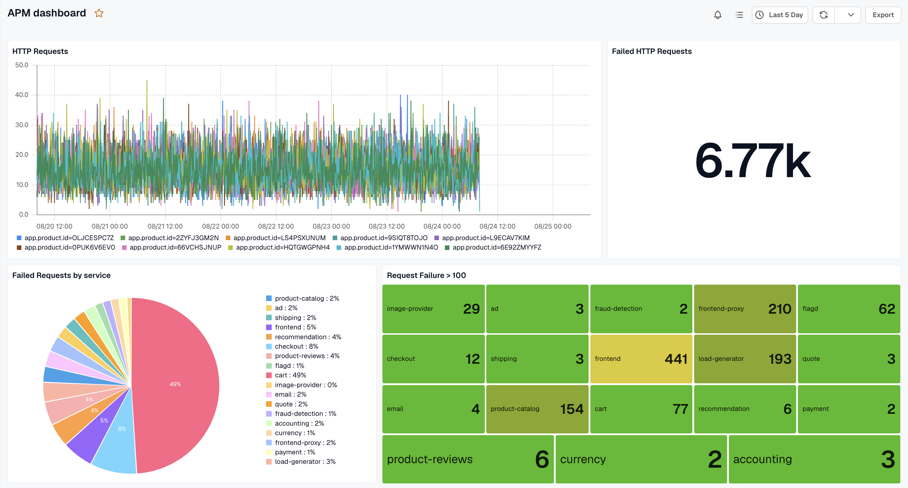
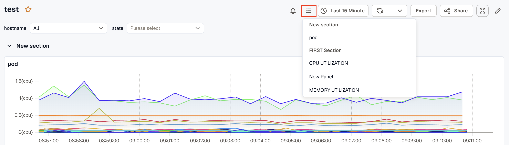
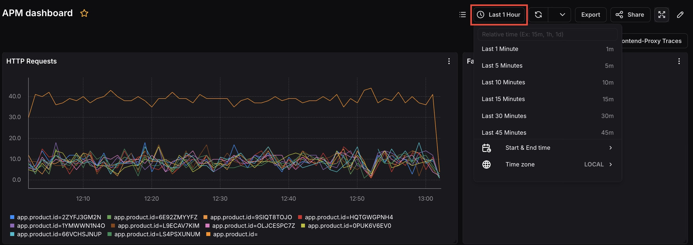
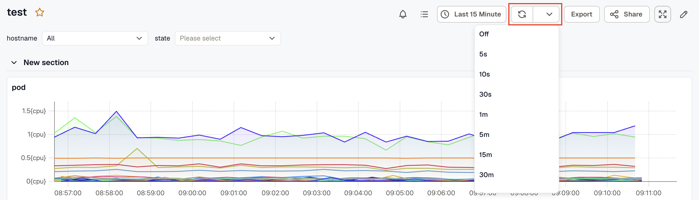
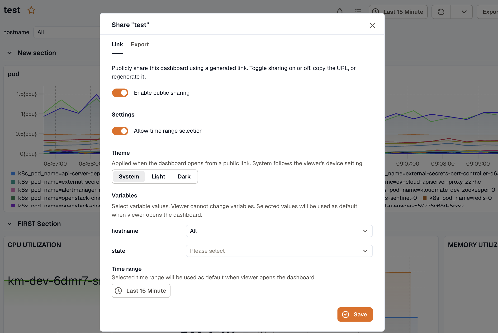
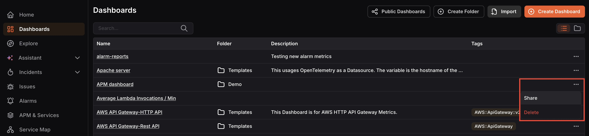

---

title: "Dashboard Details"
description: "Understand the dashboard details view, toolbar controls, and sharing options."
sidebar:
  order: 3
---
Opening a dashboard takes you to the Dashboard Details view where all your panels are displayed together. This is your live monitoring view, all panels update based on the selected time range and refresh settings.

## Toolbar

The toolbar at the top provides the following controls:

- **Panel list:** Opens a dropdown listing all panels on the dashboard, letting you quickly jump to a specific panel without scrolling.

- **Time range picker:** Sets the time window applied to all panels. Choose a relative option or use Start & End time to set a custom range. You can also set the Timezone.

- **Refresh icon:** Manually refreshes all panels to pull the latest data.
- **Refresh interval dropdown:** Sets an automatic refresh interval so the dashboard stays current. 

- **Export:** Exports the dashboard.
- **Share:** Opens the Share Dashboard dialog to generate a public link.
- **Fullscreen:** Expands the dashboard to fullscreen view.
- **Edit:** Enters edit mode to modify the dashboard and its panels.

## Viewing Alarms in Dashboards

KloudMate integrates alarms directly into your dashboard visualizations, providing immediate context on system health alongside your metrics.

- **Panel Alarm Indicators:** If a panel is linked to an alarm and the alarm is currently **Firing**, a status indicator will appear on the panel header.
- **Alarms Drawer:** Clicking on an alarm indicator opens the Alarms Drawer without leaving the dashboard context. This drawer displays information for alarms in the **Firing** state:
  - The current evaluation state of the alarm.
  - The conditions that triggered it.

## Sharing a Dashboard

Click the **Share** button to open the Share Dashboard dialog. Sharing generates a public link that anyone can use to view the dashboard without logging in to KloudMate.

- **Enable public sharing:** Toggle this on to activate the public link.
- **Allow time range selection:** Toggle this on to let viewers change the time range when viewing the shared dashboard.
- **Time range:** Sets the default time range viewers will see when they open the shared link.

Click **Save** to apply the settings. The shared link can be managed from the **Public Dashboards** page.

## Sharing a Dashboard Across Workspaces

You can replicate a dashboard in another workspace by exporting it as JSON. This saves time when the same dashboard layout is needed across multiple workspaces.

To share:

1. Open the dashboard and click the more options icon, then select **Share**. This copies the dashboard as a JSON to your clipboard.

2. Navigate to the Dashboards section in the target workspace, click **Import** , paste the copied JSON, and click **Submit**. The dashboard will be recreated as a replica in the new workspace.
