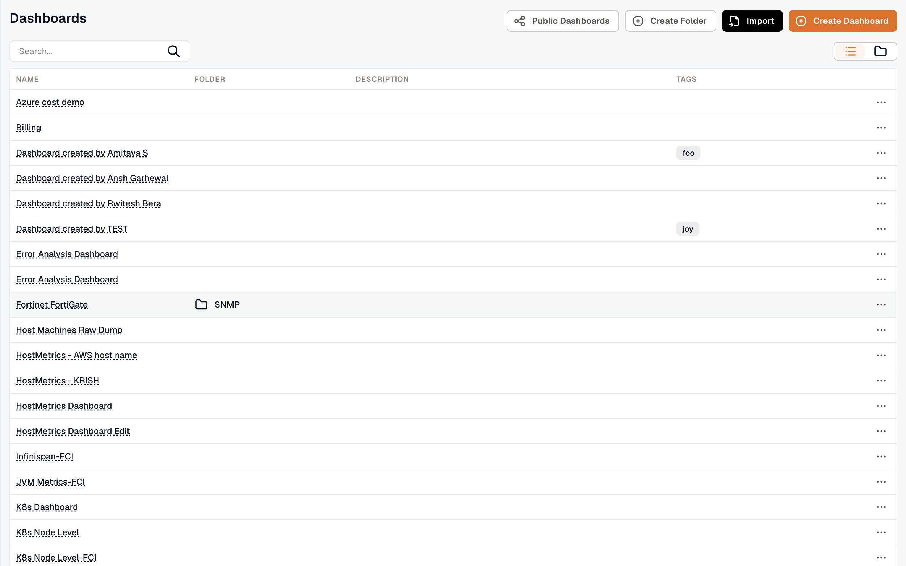
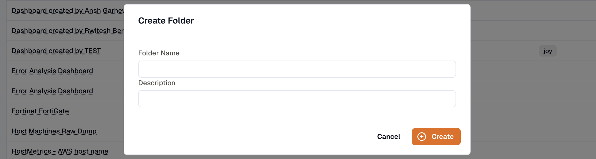
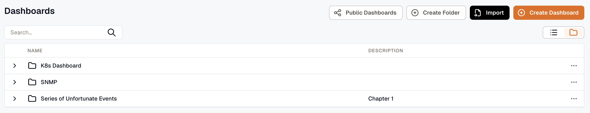
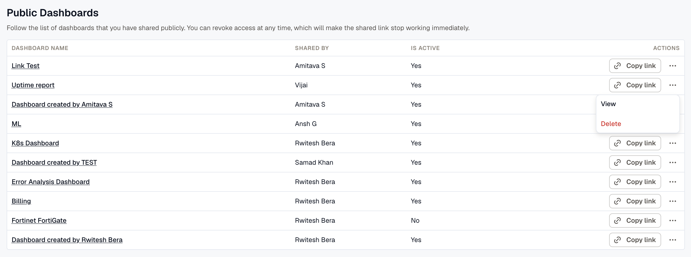
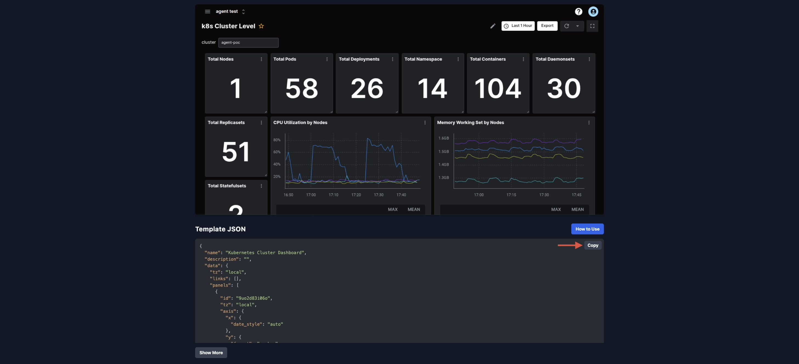
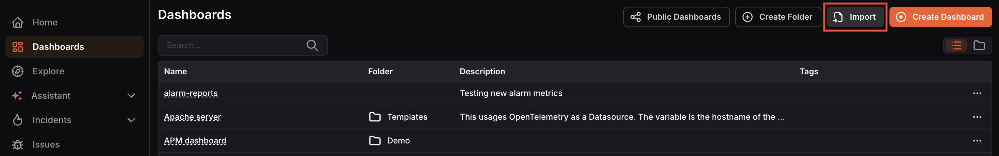
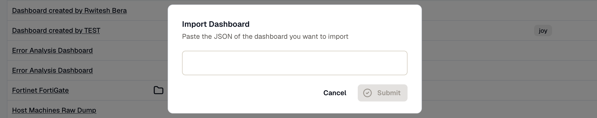

KPI metrics come in all shapes and sizes and are often specific to businesses and applications. Pre-defined default metrics cannot always capture what matters most to your team. KloudMate’s custom metric dashboards let you cut through the noise and focus on only the metrics relevant to your application and business.

Navigate to **Dashboards** from the left navigation menu to view all your existing dashboards and folders.

The Dashboards screen lists all dashboards and folders by name and description. You can search for a specific dashboard using the search bar. Use the view toggle at the top-right to switch between list and grid view.

From the more options (⋯) icon on any dashboard or folder, you can **edit ** or ** delete** it.

### User Permissions

| **Role **      | ** Permissions**                                |
| ------------- | ---------------------------------------------- |
| **Owner**     | Create, edit, or delete dashboards and folders |
| **Developer** | Create, edit, or delete dashboards and folders |
| **Viewer**    | View dashboards and folders only |

## Dashboard Folders

Folders help you organize related dashboards in one place, making it easier to navigate and manage dashboards across teams or services.

1. Click **Create Folder** at the top of the Dashboards screen.

2. Enter a **Folder Name ** and an optional ** Description **, then click ** Create**. 

The folder will appear in the Dashboards list. Click the arrow to expand it and view the dashboards inside.

:::info
Creating a folder is not mandatory. Standalone dashboards do not need to be added to a folder.
:::

***

### Public Dashboards

Sharing a dashboard publicly lets you give read-only access to people outside your workspace, for example, stakeholders or external teams, without requiring them to log in to KloudMate.

Click **Public Dashboards** at the top of the Dashboards screen to view all dashboards you have shared publicly. 

The list shows the dashboard name, who shared it, and whether the link is currently active.

From this screen you can:

- **Copy link:** Copy the shareable URL to send to others.
- **View:** Open the public dashboard to preview what others will see.
- **Delete:** Revoke access. Deleting the link will make it stop working immediately.

***

## Importing a Dashboard

KloudMate provides standard monitoring dashboards as reusable templates on the KloudMate Dashboard Templates site. Importing a template lets you instantly set up a fully configured dashboard for common infrastructure like Kubernetes, databases, or servers, without having to build it from scratch.

1. Open the [KloudMate Dashboard Templates](https://templates.kloudmate.com/) site and find the template you want to use (e.g., Kubernetes Cluster Dashboard). The page shows a dashboard preview followed by a Template JSON section.

2. Click the **Copy** button next to the Template JSON block to copy the full JSON definition.

3. In KloudMate, click the **Import** button at the top-right of the Dashboards screen.

4. Paste the copied JSON into the Import Dashboard dialog and click **Submit**.

The dashboard will appear in your Dashboards list, ready to open and use with your data.
