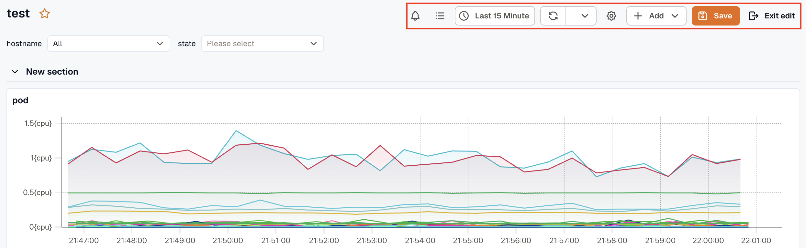
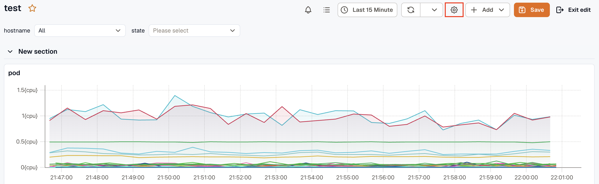
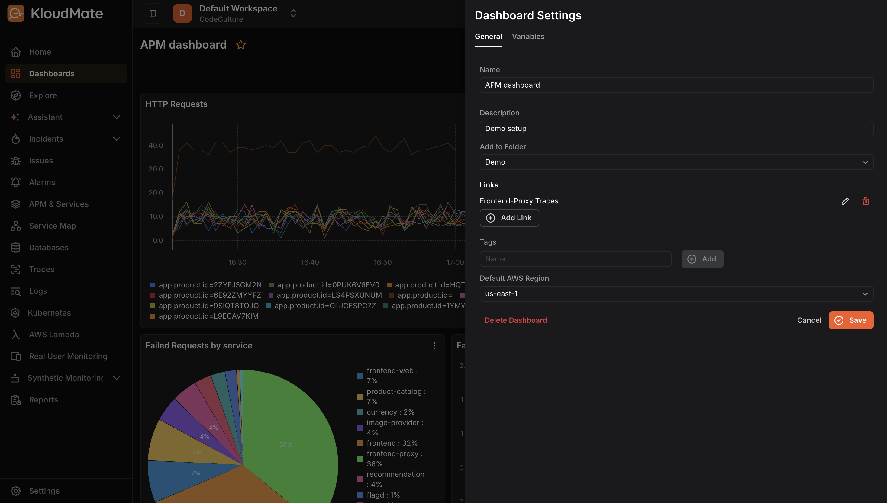
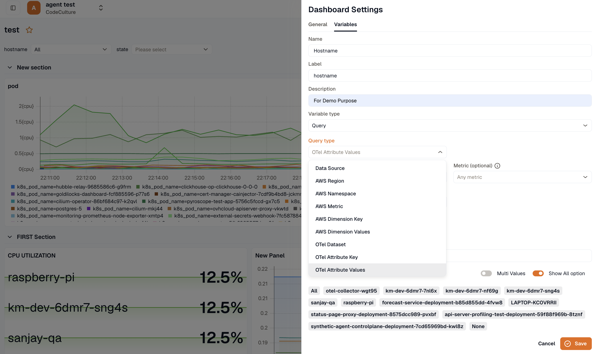

## Entering Edit Mode

To make any changes to a dashboard, including editing panels, updating settings, or reorganizing layout, click the **Edit** icon at the top-right corner of the dashboard. This switches the toolbar to edit mode, showing Settings, Add Panel, Save, and Exit edit.

Click **Exit edit** to return to view mode without saving, or **Save** to save your changes.

## Dashboard Settings

Click the **Settings** icon in the toolbar while in edit mode to open the Dashboard Settings panel. From here you can:

### General tab

- **Name:** Update the dashboard name.
- **Description:** Add or edit a description.
- **Add to Folder:** Move the dashboard into a folder to keep it organized with related dashboards.
- **Links:** Add external links that appear as quick-access buttons on the dashboard (e.g., a link to a related service’s traces page). Click **Add Link** to add one.
- **Tags:** Add tags to make the dashboard easier to search and categorize.
- **Default AWS Region:** Set the default AWS region for the dashboard.
- **Delete Dashboard:** Permanently delete the dashboard.

Click **Save** to apply changes or **Cancel** to discard them.

### Variables tab
You can add and manage variables in your dashboards. Variables are placeholders for values that help you create dynamic dashboards by avoiding hard-coded values within queries.

1. Click the **Variables** tab in Dashboard Settings.

2. Enter a **Name** , **Label** , and **Description** for the variable.

3. Select the **Variable Type**:

- **Query:** Dynamically populates values based on a query. When selected, an additional Query Type dropdown appears. Select the appropriate query type from the available options.
- **Constant:** Sets a fixed value that remains unchanged across the dashboard.

4. Click **Save**.

Once the variable has been added, you can use it by selecting the created variable in the panel query box and saving the new query.
