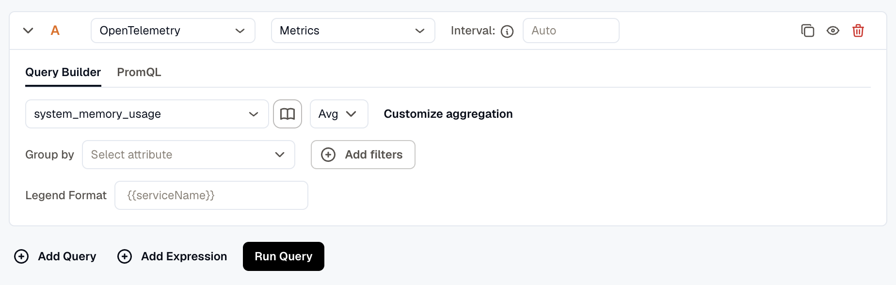
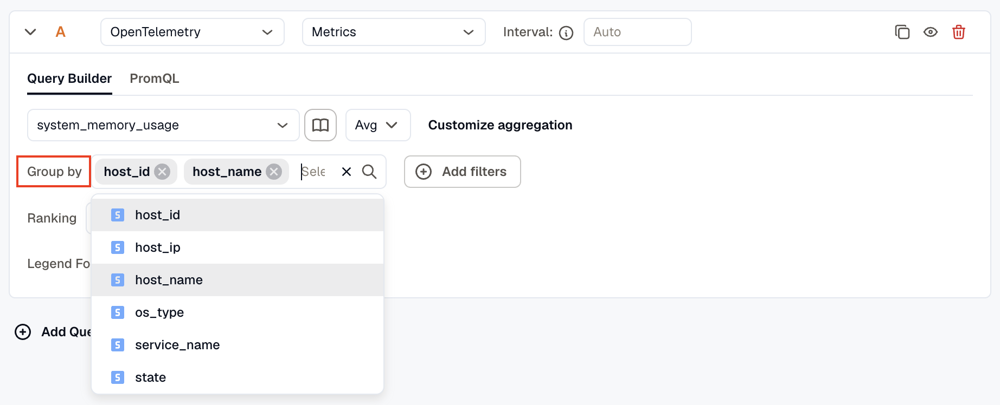
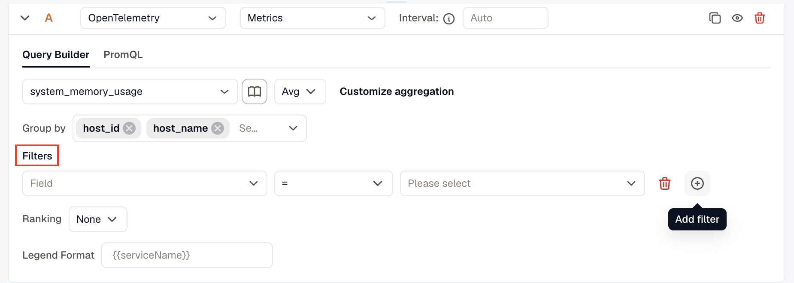
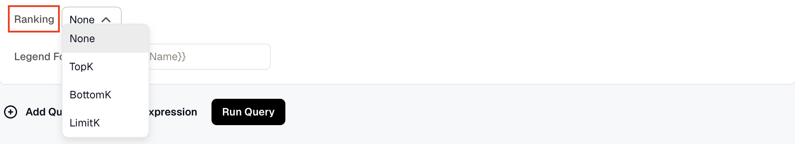
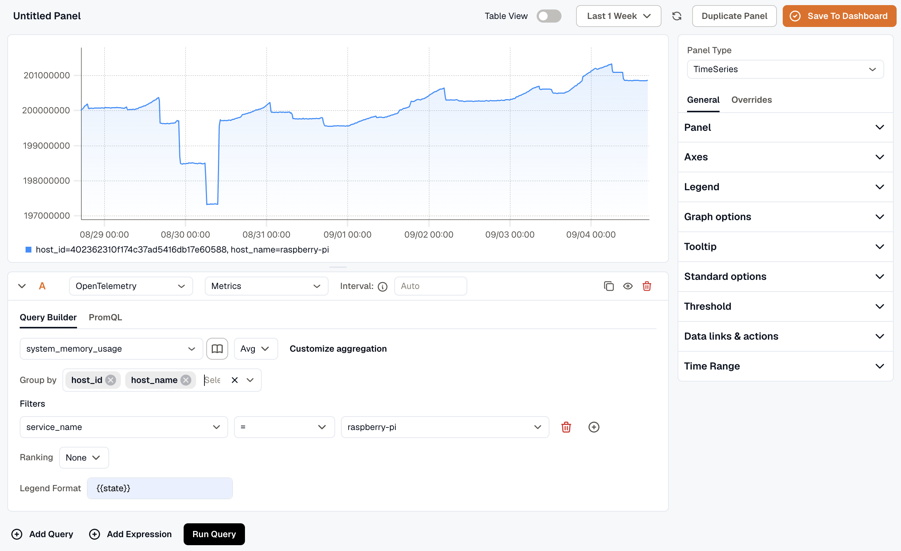
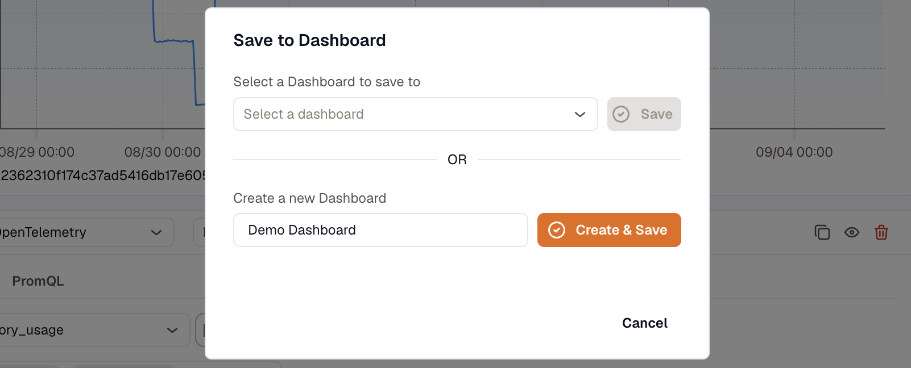

import { Image } from 'astro:assets';
import explorePanelType from './images/explore-panel-type.png';
import exploreGeneral from './images/explore-general.png';
import exploreOverrides from './images/explore-overrides.png';

Explore is the ad hoc query workspace in KloudMate. Build and validate a query — metrics, logs, or traces — before you commit it to a dashboard.

This walkthrough focuses on metrics.

## Explore Walkthrough

1. **Navigate to Explore**
   Open the Explore section from the left-hand navigation menu. A new untitled panel opens immediately.

2. **Configure the Visualization**
   Use the **Panel Type** dropdown to choose how results are displayed: `TimeSeries`, `Stats`, `Table`, `Pie Chart`, `Bar Chart`, `Histogram`, `Logs List`, `Spans List`, `Alerts List`, `Issues List`, or `Text`.

   <Image src={explorePanelType} alt="Panel Type options" width={319} densities={[1, 2]} />

   Below it, the settings panel splits into tabs:

   - **General** controls panel appearance and behavior — axes, legend, graph options, thresholds.
   - **Overrides** applies a field-level customization to one series, by name, a matching regex, or a query.

   <Image src={exploreGeneral} alt="General Settings" width={317} densities={[1, 2]} />

   <Image src={exploreOverrides} alt="Overrides Settings" width={323} densities={[1, 2]} />

3. **Choose the Data Source and Signal Type**
   At the top of the query editor, select the data source and set the signal type to `Metrics`. Keep the query interval on `Auto` unless you need a specific rollup interval.

4. **Build the Query**
   In the Query Builder, select a metric name and choose an aggregation function such as `Avg`, `Sum`, `Min`, or `Max`.

   

   - Click **Customize aggregation** to access advanced temporal and spatial aggregation controls. See [Metrics Aggregations](./metrics-aggregations/) for details.
   - Use **Group by** to break down the metric by one or more attributes, such as `host_id` or `host_name`.

   

   - Use **Add filters** to narrow the results by attributes. Each filter needs a field, an operator, and a value, for example `service_name = raspberry-pi`.

   

   - Use **Ranking** to control how series are ordered.

   

   - Use **Legend Format** to customize series labels.
   - Switch to the **PromQL** tab to write a raw query expression instead. Its search bar makes it easy to jump to a keyword in a long query.

5. **Add Queries and Expressions**
   Use **Add Query** to compare multiple metric series in one panel.

   Use **Add Expression** to derive values from existing queries, including math, reduce, and condition expressions. See [Alert Expressions](../../alerts/expressions/) for the full expression syntax.

6. **Run the Query**
   Click **Run Query** to execute the query and render the result.

   

7. **Save to a Dashboard**
   When the query looks right, use **Save to Dashboard** to add the panel to an existing dashboard or create a new one.

   

## Related

- [Metrics Aggregations](./metrics-aggregations/)
- [Create a Dashboard](../../visualize-data/dashboards/create-a-dashboard/)
