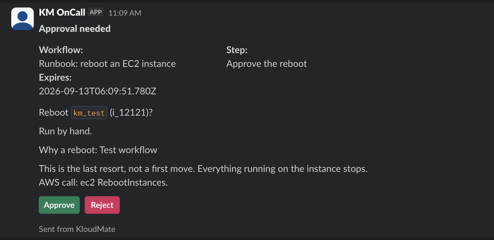

**Approval** and **Collect Input** put a person in the middle of a run. Approval asks for a yes or no; Collect Input shows a form and hands the submitted values back to the workflow.

Put an approval in front of anything that changes a resource. Nothing else gates a destructive step: a run will restart an instance or delete a file without asking unless an approval stops it.

While a run is paused it holds no capacity, so waiting a day for a decision costs nothing.

## Approval

| Field | What it takes |
|---|---|
| **Approvers** | Workspace members who can approve, up to 10. The first to respond decides. |
| **Also post to** | A Slack or Teams channel to post the request into, as well as emailing it. |
| **Message** | What approvers see with the request. Templates resolve, so you can say which host and which command. |
| **Timeout** | How long to wait, `24h` by default and `7d` at most. |
| **On timeout** | Fail the run, or continue. |

`{{ steps.<id>.output.approved }}` reads the decision, and `{{ steps.<id>.output.decidedBy }}` carries the person as an object with `id`, `name`, `email`, and `timezone`, so a later Slack message can name them.

### Rejected and timed out

**Rejected isn't a failure.** The run ends as `rejected`, downstream steps are skipped, and nothing is retried. Run history shows it as declined rather than failed.

**Timed out** gives the step `approved: null` and then follows **On timeout**. With **Continue**, a later branch can check `{{ steps.<id>.output.approved }}` and take a fallback path.

## Collect Input

Takes the same fields as an approval, plus the form.

**Fields** holds between 1 and 20 entries, each with a name and a type of string, number, boolean, or enum. An enum field needs at least one option and can allow more than one choice. Mark a field required, or leave it optional and give it a default.

**Assignees** are the workspace members who get the form, and the first to submit resolves it.

Later steps read `{{ steps.<id>.output.fields.<name> }}` for the values and `{{ steps.<id>.output.submittedBy }}` for who submitted them.

## How a request reaches people

**Every request is emailed.** Each named person gets their own link, and the deadline is shown in their own timezone. Responding needs no KloudMate session; the signed link is the authorization.

**A channel post is in addition to the email, not a replacement.** When you set **Also post to**, the request is also posted to that one channel. A misconfigured channel never silences the email.

**Slack posts carry Approve and Reject buttons.** Pressing one decides the request in place and replaces the message with who decided what, so the outcome sits where the request was. If a press is refused, the message is replaced with the reason.

A collect-input post carries a notice to check email instead.

:::note
The channel post itself carries no decision link. **Approve** and **Reject** work only for an active workspace member on the approver list.
:::

## Rules that catch people out

- **A step that names nobody won't publish.** Only a named person holds a link or a button that resolves the request, so a step with an empty approver or assignee list would sit there until it timed out.
- **Someone who has left can't decide.** They drop out of the recipient list when the request goes out, and membership is checked again at decision time, so a signed link that outlives someone's access stops working.
- **The first response wins.** Every other link stops working once one person has answered.
- **Neither step can go inside a loop.** Publishing rejects it.

## Related

- [Control flow](../control-flow/) for the other structural steps.
- [Notification channels](../../platform/settings/notification-channels/) for setting up the Slack or Teams channel a request posts into.
- [Connections](/platform/settings/connections/) for the Slack install that makes the buttons work.
