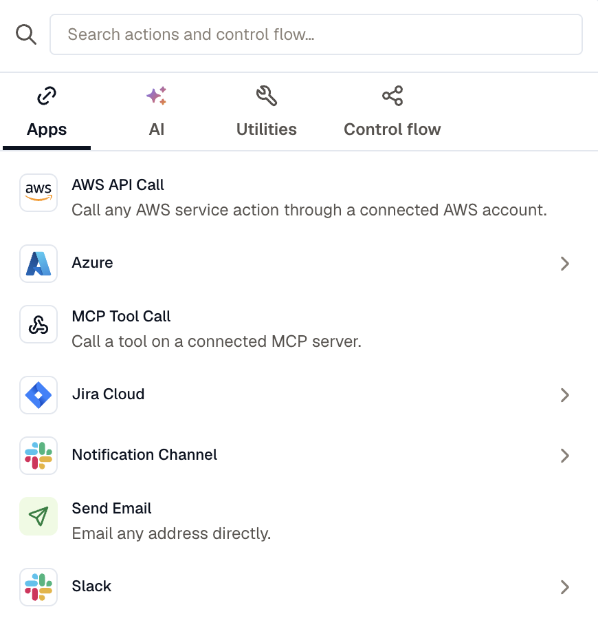
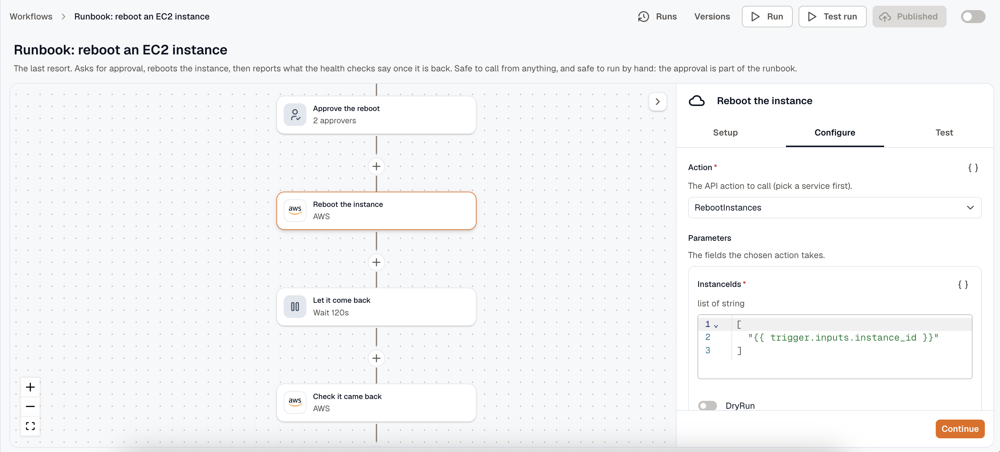
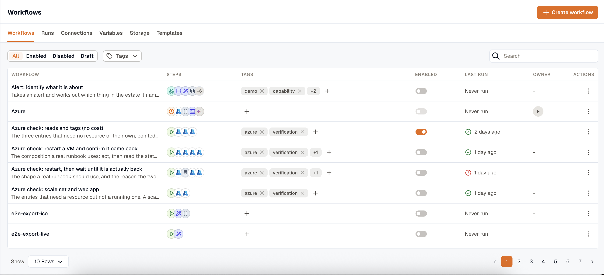

Build a workflow by picking a trigger, then adding steps under it. Everything you edit stays in a draft, and a trigger starts runs only from the published version.

## Create a workflow

Open **Workflows** and click **Create workflow**. Name it, then pick a trigger; nothing else is available until you do. See [Triggers](../triggers/).

Renaming a workflow or editing its description doesn't count as a draft change, so neither puts it into an unpublished state.

## Add steps

Click the **+** between any two nodes to open the palette. Actions are grouped under **Apps**, **AI**, and **Utilities**, with control flow on its own tab. Search spans all of them, so typing `reaction` finds the Slack action without opening Slack first.

Inside a control-flow block the palette narrows to what that block accepts. A **Wait until** check block takes actions and branches only.

## Configure a step

Which tabs a step's panel has depends on the step.

**Setup** appears when the step binds a connection, or when one of its fields feeds another field's option list. On an AWS step that's the connection and the service: pick them here, and **Configure** then offers that operation's real parameters. A step with neither, such as Transform or Run Code, opens straight on Configure.

**Configure** holds the rest of the fields. They're generated from the action itself, so an MCP step shows the chosen tool's own arguments rather than a generic JSON box.

**Test** runs the step against real data. It's absent while you're viewing a published workflow, since a test performs the action for real; click **Edit** to get it back. See [Test a workflow](../test-a-workflow/).

### Template a field

Text, JSON, and condition fields take `{{ }}` references directly, with a picker for the trigger payload, an earlier step's output, and workspace variables. A dropdown offers its list instead, so switch it into variable mode with the braces button beside it to template the value. See [Templating and variables](../templating/).

### Rename a step

Edit the name at the top of the panel. That changes the display name only. A step's id is generated when you add it and never changes, so existing `{{ steps.<id>.output }}` references keep resolving. Take references from the variable picker rather than typing them: it lists steps under their names and inserts the right id.

### Step settings

Action steps carry a collapsible **Settings** section under their fields. Control-flow steps have none, because their timing and failure fields are ordinary inputs: a wait has a duration, an approval has a timeout.

| Setting | Default | What it does |
|---|---|---|
| **On failure** | Stop the workflow | **Go to the next step** records the error under `steps.<id>.error` and carries on. |
| **Retry attempts** | 3, or 1 for the AI actions | At most 5. Not offered on an action that changes external state: those run once, so a failed write is never silently repeated. |
| **Timeout** | 60s | How long one attempt may run, up to 15m. |

Leaving **Retry attempts** alone gives you the default above, and selecting **No retries** does the same thing, so a read-only action can't be set to zero from the builder.

## Draft, publish, enable

Editing touches only the draft. **Publish** is enabled while the draft differs from the live version, and **Discard changes** reverts the draft to the last published version.

Publishing validates the whole workflow and writes an immutable version. When it fails, the errors are listed against the steps and fields that caused them.

Publishing isn't enough on its own. A scheduled, webhook, form, or app-event workflow doesn't fire until you also turn on the enable switch. Switching it off stops all four without deleting anything.

A run always executes the version it started on, so publishing while a run is in flight never changes what that run does.

:::note
You can't enable a workflow before publishing it, and you can't delete one until it's disabled with no runs in flight.
:::

## Versions

Click **Versions** to see every published version, who published it, and when.

- **Make live** points the workflow at an earlier version without touching your draft. If that version no longer validates, for example because a connection it binds was deleted, the reasons are listed.
- **Restore to draft** copies an old version into the draft so you can edit it and publish again.

Old versions are pruned after 30 days, though the newest 20 per workflow and the live one are always kept. See [Limits](../limits/#retention).

## Run it by hand

A published workflow with a manual or form trigger gets a **Run** button. Fill in the trigger's input parameters and it starts a real run. Users with the **Developer** role can always do this; a **Viewer** can when the workflow is set to allow it.

**Test run** runs the draft instead of the published version. See [Test a workflow](../test-a-workflow/).

## Organize the list

Tag a workflow inline on its row, then filter the list by tag, by enabled state, or by owner.

## Export a workflow

**Export** on a row gives you the published version as YAML, ready to **Copy** or **Download**. Connections, notification channels, and called workflows appear as named inputs rather than as ids, so the same file can be applied in another workspace once those are matched up there. Anything the export couldn't describe stays as a raw id and is flagged.

## Related

- [Triggers](../triggers/)
- [Control flow](../control-flow/)
- [Test a workflow](../test-a-workflow/)
- [Run history](../run-history/)
