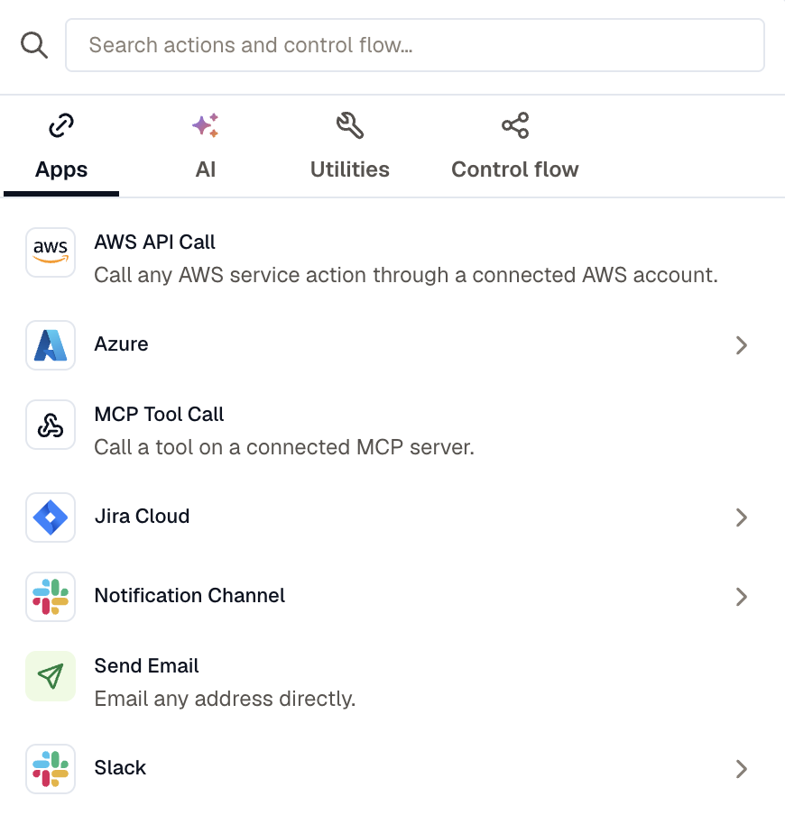
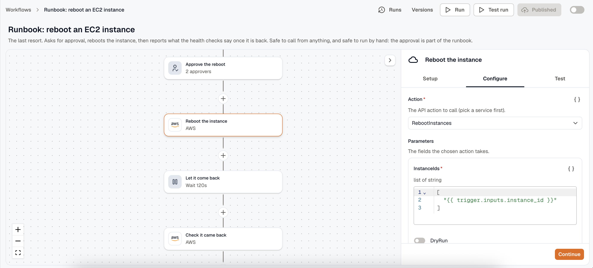
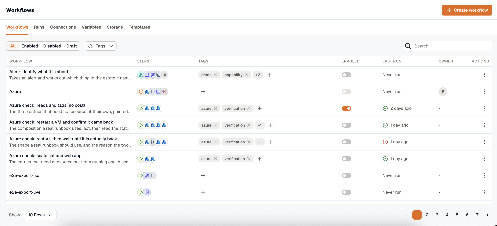

Build a workflow by picking a trigger, then adding steps under it. Everything you edit stays in a draft, and a trigger starts runs only from the published version.

## Create a workflow

Open **Workflows** and click **Create workflow**. Name it, then pick a trigger; nothing else is available until you do. See [Triggers](../triggers/).

You can also [start from a template](#start-from-a-template) or [import](#export-and-import) a workflow exported from another workspace.

Renaming a workflow or editing its description doesn't create unpublished changes.

## Start from a template

The **Templates** tab holds ready-made workflows that diagnose or fix common problems. Click **Use template** on a card to create a draft and open it in the builder. You need the **Developer** role.

| Template | Starts | What it does |
|---|---|---|
| Tell a down host from a down agent | When a host alert opens | Reports whether the machine is down, its collector stopped, or the machine is up and the alert is real. |
| Report disk usage and the largest directories | When a disk alert opens | Lists the mounts by usage, then the largest directories on the fullest mount. |
| Report the top processes by CPU and memory | When a host load alert opens | Lists the processes by CPU and by memory, with the owner and the PID. |
| Free disk space, with approval | When a disk alert opens | Shows what uses the space and waits for approval, then vacuums the journal, removes rotated logs, and reports the space it freed. |
| Report why a Step Function execution failed | When a state machine alert opens | Reports the most recent failed execution's error, its cause, and the states it ran. |
| Redrive a failed Step Function execution, with approval | When a state machine alert opens | Shows what failed and why, waits for approval, then restarts the execution from the state that failed. |
| Tell an EC2 instance fault from a host fault | When an EC2 status check fails | Says whether the fault is in the operating system or in the AWS host underneath. |
| Reboot an EC2 instance, with approval | When an EC2 instance check fails | Asks for approval, then reboots, and stops instead when the fault is in the AWS host underneath. |
| Report the state of an Azure VM | By hand | Reports what Azure holds for the machine, then what the machine reports about itself. |
| Restart an Azure VM, with approval | By hand | Asks for approval, restarts the machine, waits for it, then confirms with the machine itself. |
| Send alerts to your workflows | When an alert group opens or new alerts join it | Runs a workflow you choose for each resource in the group. See [Send alerts to your workflows](../alert-router/). |

Each card shows **Reads only** or **Changes a host**. A card also shows **Needs a host script grant** when the template runs commands on a host (see [Allow runbook scripts on a host](../actions/#allow-runbook-scripts-on-a-host)), and a missing-connection warning when the template calls AWS or Azure and the workspace has no connection for it.

The draft isn't published, and it isn't connected to any alerts. Before you publish it:

- **Fill in the blank fields.** Every template sends its result by email, so set the address on each **Send Email** step. Publishing fails on any field the template left blank, and names the field, for example `notify_email`.
- **Pick a connection** on each AWS or Azure step.
- **Name the approvers** on each **Approval** step.
- **Send alerts to it.** A template that starts on an alert needs its webhook URL on a notification channel that a routing rule uses. See [Start a workflow from an alert](../triggers/#start-a-workflow-from-an-alert).

The draft's description lists what you need to set up. The draft also comes with a sample alert payload, so the variable picker shows real field names before any alert arrives.

## Add steps

Click the **+** between any two nodes to open the palette. Actions are grouped under **Apps**, **AI**, and **Utilities**, with control flow on its own tab. Search spans all of them, so typing `reaction` finds the Slack action without opening Slack first.

Inside a control-flow block, the palette shows only the steps that block accepts. A **Wait until** check block takes actions, Branch, and Route steps only.

## Configure a step

The tabs in a step's panel depend on the step.

**Setup** appears when the step uses a connection, or when one field's value decides the options in another. On an AWS step, for example, pick the connection and the service on **Setup**, and **Configure** then shows that operation's parameters. A step with neither, such as Transform or Run Code, opens straight on Configure.

**Configure** holds the rest of the fields. They come from the action itself, so an MCP step shows the chosen tool's own arguments.

**Test** runs the step against real data. It's hidden in view mode, which is how a saved workflow opens from the list, so click **Edit** to show it. See [Test a workflow](../test-a-workflow/).

### Use a variable in a field

Text, JSON, and condition fields take `{{ }}` references directly, with a picker for the trigger payload, an earlier step's output, and workspace variables. To use a variable in a dropdown field, click the braces button beside it. See [Templating](../templating/).

### Rename a step

Edit the name at the top of the panel. That changes the display name only. The builder generates a step's id when you add it, and the id never changes, so existing `{{ steps.<id>.output }}` references keep resolving. Take references from the variable picker instead of typing them: it lists steps under their names and inserts the right id.

### Step settings

Action steps have a collapsible **Settings** section under their fields. Control-flow steps don't, because their timing and failure fields are ordinary inputs: a wait has a duration, an approval has a timeout.

| Setting | Default | What it does |
|---|---|---|
| **On failure** | Stop the workflow | **Go to the next step** records the error under `steps.<id>.error` and carries on. |
| **Retry attempts** | 3, or 1 for **AI Prompt** and **AI Extract** | At most 5. Not offered on an action that changes external state: those run once, so a failed write is never silently repeated. |
| **Timeout** | 60s, or 5m for **Ask KloudMate Assistant** | How long one attempt may run, up to 15m. **Ask KloudMate Assistant** stops at 5m even if you set it higher. |

**No retries** gives the same default as leaving **Retry attempts** alone, so you can't set a read-only action to zero retries from the builder.

## Publish and enable a workflow

Your edits change only the draft. **Discard changes** reverts the draft to the last published version.

The builder checks the workflow as soon as you open it. It marks each step that has a problem, with the message under the field that caused it. If problems remain when you click **Publish** or **Test run**, the builder lists them, and **Fix** on a row takes you to that step.

Publishing runs every check, including whether each connection, called workflow, and secret the workflow uses still exists. Then it writes an immutable version.

The first publish also switches the workflow on, so its trigger starts firing right away. A later publish never switches a workflow back on after someone turned it off. Turn the switch off to stop a scheduled, webhook, form, or app-event workflow from starting runs without deleting anything.

A run always uses the version it started on, so publishing while a run is in flight doesn't change it.

:::note
You can't enable a workflow before publishing it. You can't delete one while it's enabled, while it has runs in flight, or while another workflow calls it.
:::

## Versions

Click **Versions** to see every published version, who published it, and when.

- **Make live** points the workflow at an earlier version without touching your draft. If that version no longer passes the checks, for example because a connection it uses was deleted, the builder lists the reasons.
- **Restore to draft** copies an old version into the draft so you can edit it and publish again.

KloudMate deletes old versions after 30 days, but always keeps the newest 20 per workflow and the live one. See [Limits](../limits/#retention).

## Run a workflow by hand

A published workflow with a manual or form trigger has a **Run** button. Fill in the trigger's input parameters and it starts a real run of the published version, even while the workflow is switched off. Users with the **Developer** role can always do this; a **Viewer** can when the workflow is set to allow it.

**Test run** runs the draft instead of the published version. See [Test a workflow](../test-a-workflow/).

## Filter and tag workflows

Tag a workflow inline on its row. Filter the list by status (**Enabled**, **Disabled**, or **Draft** for a workflow that's never been published) or by tag, or search it.

## Export and import

**Export…** on a published workflow's row menu gives you its published version as YAML, ready to **Copy** or **Download**. Connections, notification channels, called workflows, and workspace variables appear as named inputs rather than as ids, so the same file can be imported into another workspace. Anything the export couldn't describe stays as a raw id, and the export flags it.

To import, click **Import** next to **Create workflow**, then paste the exported YAML or choose a `.yaml`, `.yml`, or `.json` file. An import always creates a draft, so nothing runs until you publish it.

The import matches each reference against the destination workspace:

- **A notification channel** matches by name and type.
- **A workspace variable** matches by name and kind, constant or secret.
- **A connection or a called workflow** matches only when it's the same one, for example when you import a file back into the workspace it came from. Connections usually don't match across workspaces, so expect to pick them again. Import a called workflow before the workflow that calls it.

The import leaves anything it couldn't match empty, and lists it when it finishes. Fill in the ones under **Set these before publishing**, because publishing refuses the workflow without them.

When you import the same file again, KloudMate updates the workflow the first import created instead of adding another one. The import replaces the draft, and the published version keeps running until you publish again. A file imported back into the workspace it came from works the same way, and replaces the original workflow's draft.

Export and import both need the **Developer** role.

## Related

- [Triggers](../triggers/)
- [Control flow](../control-flow/)
- [Test a workflow](../test-a-workflow/)
- [Run history](../run-history/)
