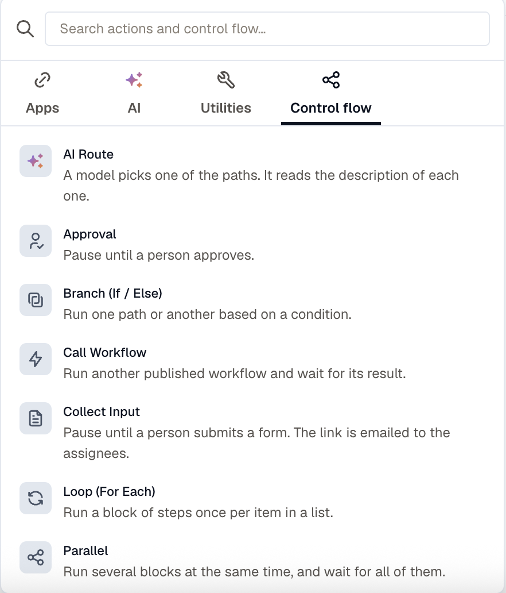

Control-flow steps decide what the rest of the workflow does: which path to take, how many times to repeat, when to wait, and when to hand off to another workflow. They call nothing outside KloudMate.

Each one records a row in the run timeline and puts a value in scope, so a later step can read what it decided.

## Branch (If / Else)

Runs one path or the other based on a condition. The condition builder is the same one you use on routing rules, reading paths such as `trigger.body.severity` or `steps.lookup.output.found`.

The **Else** block is optional. `{{ steps.<id>.output.taken }}` reads `then` or `else`.

## Loop (For Each)

Runs a block once per item in a list.

| Field | What it takes |
|---|---|
| **Items** | A path to the list, for example `{{ steps.query.output.rows }}`. |
| **Max iterations** | A safety cap, 100 at most. A longer list is cut off at this number. |
| **Run at once** | How many items to process at the same time, up to 10. |

Inside the block, `{{ item }}` is the current element and `{{ item_index }}` is its position. In a nested loop `{{ item }}` refers to the inner element, and the outer one is back in scope once the inner loop finishes.

Leave **Run at once** at 1 unless the work is genuinely independent. Above 1, each item runs on its own and ordering between items is no longer guaranteed.

`{{ steps.<id>.output.iterations }}` reads how many items the loop ran.

:::caution
A loop body can't hold another loop, an approval, a collect-input step, or a Wait until, including inside a parallel arm nested in the loop. Publishing rejects them.
:::

## Parallel

Runs between two and ten blocks at the same time and waits for all of them.

**If a branch fails** decides what happens next: fail the run, or carry on with the results the other branches produced. `{{ steps.<id>.output }}` carries `branches` and `failed` as counts.

## Wait / Delay

Pauses for a fixed time, up to 24h. A waiting run holds no capacity, so the length of the wait costs nothing.

## Wait until

Runs a block of steps repeatedly until a condition holds, then continues. Use it to confirm a change actually landed: restart an instance, then wait until it reports running before you post the all-clear.

| Field | What it takes |
|---|---|
| **Check, until the condition holds** | The block to run each time. Actions and branches only. |
| **Until** | The condition, read against the check block's own step outputs, for example `steps.vm.output.result.status` equals `running`. |
| **Timeout** | How long the step waits before it fails. Default `10m`, maximum `24h`. |

The timeout is the only timing field you set. How often it checks follows from it: every 60 seconds, or `timeout / 20`, whichever is longer, for at most 20 checks. A 10-minute timeout gives you 10 checks a minute apart, and a 24-hour timeout spreads 20 checks across the day.

Before you rely on a Wait until:

- **The first check runs immediately.** A condition that's already true costs one check and no delay.
- **A failed check doesn't end the wait.** The step keeps checking, because whatever you're waiting on is usually mid-change. A failure the action marks permanent stops it on the first check instead of at the timeout.
- **Running out of checks fails the step.** The step's **On failure** setting then decides whether the run stops or carries on.
- **The check block keeps one row per step** in the run timeline, showing the most recent check rather than one row per cycle.

`{{ steps.<id>.output }}` carries `checks`, `satisfied`, `failed`, and `last_error`. What each check saw stays addressable under the check step's own id.

:::caution
A Wait until can't go inside a loop, and its check block can't hold an approval, a collect-input step, or another Wait until.
:::

## Call Workflow

Runs another published workflow and waits for its result.

The called workflow receives **Inputs** as its trigger inputs and nothing else. The caller's trigger payload and step outputs don't cross over, so a called workflow has to declare the input parameters it needs.

`{{ steps.<id>.output.status }}` reads how the child run ended, and `{{ steps.<id>.output.steps }}` carries the child's step outputs keyed by its own step ids.

Calls can nest five deep.

## AI Route

A model picks one of the paths. Write the **Situation** it should read, then describe each route so the model can tell them apart.

Add between two and eight routes, each with its own label, description, and block of steps. **Fallback route** is taken when the model gives no usable answer. Leave it empty and the run fails rather than guessing.

`{{ steps.<id>.output }}` carries `route`, `reason`, and `confidence` of high, medium, or low.

The **Situation** text is treated as data rather than instructions, so a payload templated into it can't redirect the model's task. It can still influence which route looks right, so keep the route descriptions specific if the situation text carries anything a stranger wrote.

## When a step fails

Error handling is set per step. Open a step's settings and set **On failure**:

- **Stop the workflow** (the default) ends the run as failed.
- **Go to the next step** records the error under `{{ steps.<id>.error }}` and carries on, so a later branch can act on it.

The setting covers a bad template as well as a failed call, so a step whose inputs didn't resolve behaves the same way as one the provider rejected.

## Related

- [Approvals and collected input](../approvals-and-input/) for the steps that wait for a person.
- [The action catalog](../actions/) for the steps that do the work.
- [Limits](../limits/) for the caps on steps, loops, and nesting.
