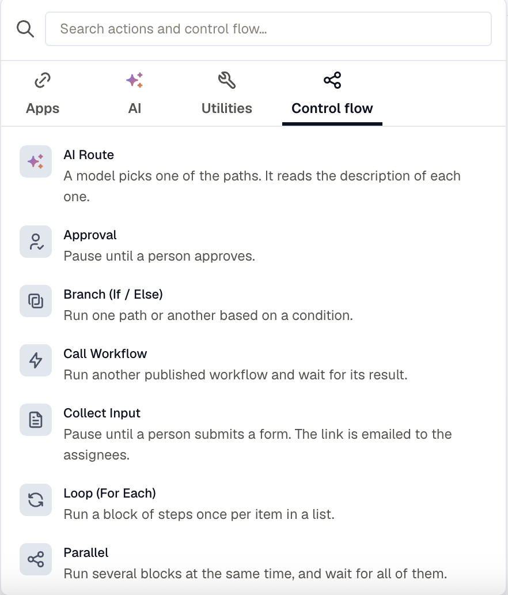

Control-flow steps decide what the rest of the workflow does: which path to take, how many times to repeat, when to wait, and when to call another workflow. They don't call any outside service.

Each one records a row in the run timeline and produces an output that later steps can read.

## Branch (If / Else)

Runs one of two paths, depending on a condition. The condition builder is the same one you use on routing rules, and a condition can check paths such as `trigger.body.severity` or `steps.lookup.output.found`.

The **Else** block is optional. `{{ steps.<id>.output.taken }}` is `then` or `else`.

## Route

Runs the first of several paths whose condition matches. Use it when a decision has more than two outcomes, such as calling one workflow for a host, another for a Kubernetes workload, and emailing a person about anything else. For a two-way decision, **Branch** is simpler.

Click **Add path** for each outcome. A path has a **Name**, a condition under **When to take it**, and its own steps. The condition builder is the same one Branch uses.

Route checks the paths from the top and runs only the first one whose condition matches, even when a later path matches too. The order works as a priority list, so move a path up or down to change which one wins.

**Otherwise** is optional and runs when no path matches. If nothing matches and there's no Otherwise, the Route runs nothing and the workflow continues with the next step.

`{{ steps.<id>.output.route }}` holds the name of the path that ran, or `else` when no path matched.

Publishing checks the paths against these rules:

- **A Route holds 1 to 10 paths.**
- **A name starts with a lowercase letter** and uses only lowercase letters, digits, hyphens, and underscores, up to 32 characters. Names must be unique within the step, and `else` is reserved.
- **Every path needs a condition.** For a catch-all, use **Otherwise**.

In run history, a Route step shows the path it took and whether each path's condition matched. If two paths both matched, the one higher in the list ran, so a wrong result usually means the order is wrong.

A Route can go anywhere a Branch can, including inside a loop, a parallel branch, and a **Wait until** check block.

## Loop (For Each)

Runs a block once per item in a list.

| Field | What it takes |
|---|---|
| **Items** | The list to loop over, for example `{{ steps.query.output.rows }}`. |
| **Max items** | The loop stops after this many items. The limit is 100, and a longer list is cut off without failing. |
| **Run at once** | How many items run at the same time, up to 10. |

If **Items** resolves to something other than a list, such as an object or a piece of text, the loop step fails. A value that's missing or empty runs the loop zero times.

Inside the block, `{{ item }}` is the current element and `{{ item_index }}` is its position.

Unless the items are independent of each other, leave **Run at once** at 1. With more than 1, items run in no guaranteed order, and an item can't read another item's step outputs.

At 1, a failed step stops the loop at that item, unless the step is set to **Go to the next step**. With more than 1, every item runs even if one of them fails, and then the loop fails with a count of the items that failed.

`{{ steps.<id>.output.iterations }}` is the number of items the loop ran.

:::caution
A loop body can't hold another loop, an approval, a collect-input step, or a Wait until, including inside a parallel branch nested in the loop. Publishing rejects them.
:::

## Parallel

Runs between two and ten branches at the same time and waits for all of them.

**If a branch fails** decides what happens next: fail the run, or continue with the other branches' results. `{{ steps.<id>.output }}` counts the branches that ran as `branches`, and the ones that failed as `failed`.

## Wait / Delay

Pauses for a fixed time, up to `24h`. A wait of 1 minute or longer doesn't count toward the [20 runs a workspace can have running at the same time](../limits/#run-limits). A shorter wait still counts.

## Wait until

Runs a block of steps repeatedly until a condition holds, then continues. Use it to confirm that a change took effect: restart an instance, then wait until it reports running before you post the all-clear.

| Field | What it takes |
|---|---|
| **Check until the condition is true** | The steps to run each time. Actions (except **Ask KloudMate Assistant**), Branch, and Route steps only. |
| **Until** | The condition, read against the check block's own step outputs, for example `steps.vm.output.result.status` equals `running`. |
| **Timeout** | How long the step waits before it fails. Default `10m`, maximum `24h`. |

The timeout is the only timing field you set. It also sets how often the step checks: every 60 seconds, or `timeout / 20`, whichever is longer, for at most 20 checks. A 10-minute timeout gives you 10 checks a minute apart, and a 24-hour timeout spreads 20 checks across the day.

Before you rely on a Wait until:

- **The first check runs immediately.** A condition that's already true costs one check and no delay.
- **A failed check doesn't end the wait.** The step keeps checking, because whatever you're waiting on is usually mid-change. If the action reports a permanent failure, the step stops at that check instead of waiting for the timeout.
- **Running out of checks fails the step.** The run stops there, unless the step was imported with `on_error: continue`, which the builder keeps but has no field for.
- **The check block keeps one row per step** in the run timeline, showing the most recent check.

`{{ steps.<id>.output }}` has `checks`, `satisfied`, `failed`, and `last_error`. To read what the last check returned, use the check step's own output.

:::caution
A Wait until can't go inside a loop. To wait on each item in a list, put the Wait until in a workflow of its own and call it from the loop with **Call Workflow**.
:::

## Call Workflow

Runs another published workflow and waits for its result.

The called workflow receives **Inputs** as `{{ trigger.inputs.* }}` and nothing else. It doesn't see the caller's trigger payload or step outputs. Declare the same names as input parameters on the called workflow's **Manual / API** trigger, so its variable picker offers them and a person can also run it by hand.

`{{ steps.<id>.output }}` is the output of the last step the called workflow ran, so end the called workflow with the step whose output the caller needs. The caller then reads its fields directly, for example `{{ steps.<id>.output.instance_id }}`. If the called workflow fails, the Call Workflow step fails too.

Calls can nest five deep.

## AI Route

A model picks one of the routes. Write the **Situation** for the model to read, then describe each route so the model can tell them apart. When you can write the rule as a condition, use [Route](#route) instead: it doesn't call a model, and the same data always takes the same path.

Add between two and eight routes, each with its own label, description, and block of steps. The run takes the **Fallback route** when the model gives no usable answer. If you leave it empty, the run fails instead.

`{{ steps.<id>.output }}` has `route`, `reason`, and `confidence` of high, medium, or low.

The model reads the **Situation** as data, not as instructions, so a payload templated into it can't redirect the model's task. It can still influence which route looks right. If the situation text includes anything an outsider wrote, keep the route descriptions specific.

For a complete example, see [Send requests to the right team with AI Route](/guides/workflows/route-requests-with-ai/).

## When a step fails

You set error handling per step. Open a step's settings and set **On failure**:

- **Stop the workflow** (the default) ends the run as failed.
- **Go to the next step** records the error under `{{ steps.<id>.error }}` and continues, so a later branch can act on it.

The setting covers a bad template as well as a failed call, so a step whose inputs didn't resolve behaves the same way as one the provider rejected.

## Related

- [Send alerts to your workflows](../alert-router/) for a Route that calls a different workflow for each kind of resource.
- [Approvals and collected input](../approvals-and-input/) for the steps that wait for a person.
- [The action catalog](../actions/) for the steps that do the work.
- [Limits](../limits/) for the caps on steps, loops, and nesting.
