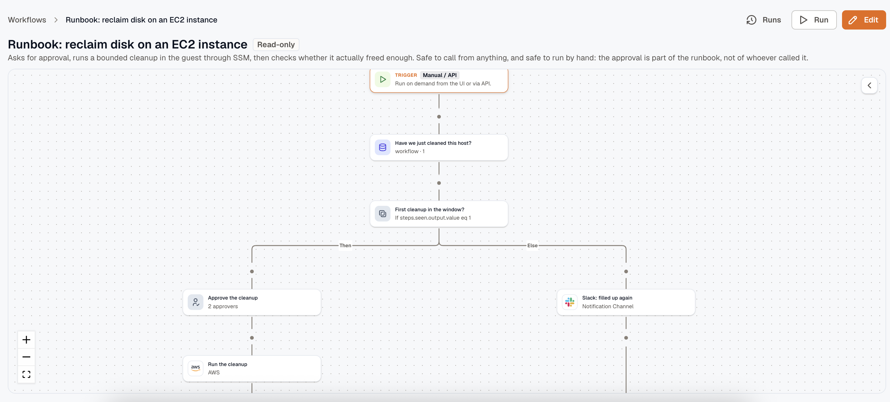

A workflow runs a series of steps when something happens. Steps query a system, decide from the answer, change a resource, or stop and ask a person.

A disk-space alert is a good first workflow. It reads the host out of the alert, runs `df -h` on it through the KloudMate agent, posts the output to Slack, asks the on-call engineer to approve a cleanup, runs the cleanup, then waits until free space recovers before reporting back.

## What a workflow can do

- **Act on cloud resources**: call any AWS service operation or Azure Resource Manager operation through a connected account, or run a script on an Azure VM.
- **Run a command on a host**: execute a shell command through the KloudMate agent, on any host where an admin has enabled runbook scripts.
- **Work in your tools**: post and edit Slack messages, create and transition Jira issues, call a tool on an MCP server, or send an HTTP request to anything else.
- **Notify**: send through an existing Slack, Teams, webhook, or SNS channel, or email an address directly.
- **Transform and decide**: extract a value with JSONPath, parse CSV and XML, run sandboxed JavaScript, or have a model pull structured fields out of a payload.
- **Wait for a person**: pause for an approval or a filled-in form. Both arrive by email, and an approval can carry Approve and Reject buttons in Slack.
- **Reuse configuration**: refer to a workspace constant or secret by name instead of pasting a channel id or a token into every workflow.
- **Remember**: write values that outlive one run, so a workflow can hold a cursor, a counter, or a marker that says this alert was already handled today.

Every action is listed in [the action catalog](./actions/).

## What starts one

| Trigger | Fires when |
|---|---|
| **Manual / API** | Someone clicks **Run**, or an API client starts a run. |
| **Schedule** | An interval or cron expression comes due, in the timezone you pick. |
| **Webhook** | Something calls the workflow's own URL. |
| **Form submission** | Someone submits the workflow's public form. |
| **App event** | Something happens in a connected app, such as a Slack mention or a new Jira issue. |

Alerts come in over the webhook trigger. Point a webhook [notification channel](../platform/settings/notification-channels/) at the workflow's URL and attach it to a routing rule, and each notification starts a run carrying the alert group payload. See [Triggers](./triggers/).

## Workflows, routing rules, and the assistant

A [routing rule](../alerts/routing-rules/) decides who hears about an alert. A workflow decides what happens next, and the routing rule starts it.

The [KloudMate Assistant](../kloudmate-assistant/) is for the investigation you're in the middle of, where you don't know what you'll ask next. Move something into a workflow once you've done it the same way twice.

## Before you start

- **Creating, editing, publishing, and deleting a workflow needs the workspace admin role.** Members can read workflows and run history, and can start a run by hand when the workflow permits it.
- **Any step or trigger that reaches another account binds a [connection](/platform/settings/connections/).** AWS, Azure, Slack, Jira, and MCP servers all need one. The **Connections** tab in Workflows lists the ones a workflow can use, so you don't have to go to Settings to add one.
- **Workflow automation is part of the Pro and Business plans.** See [Limits](./limits/).

## Build a workflow

1. Open **Workflows** and click **Create workflow**, then pick a trigger. Manual is a good place to start, because you control when it fires.
2. Add steps from the palette and configure each one. Click **Run test** on a step to see its real output, which the next step then maps against.
3. Click **Test run** to execute the whole draft end to end.
4. Click **Publish**, then turn on the enable switch.

A trigger starts a run only from the published version, and only while the workflow is enabled. Editing the draft afterward changes nothing until you publish again.

## In this section

- [Build a workflow](./build-a-workflow/)
- [Triggers](./triggers/)
- [Control flow](./control-flow/)
- [Approvals and collected input](./approvals-and-input/)
- [The action catalog](./actions/)
- [Templating and variables](./templating/)
- [Storage](./storage/)
- [Test a workflow](./test-a-workflow/)
- [Run history](./run-history/)
- [Limits](./limits/)

## Related

- [Connections](/platform/settings/connections/) for the credentials a workflow uses.
- [Routing rules](../alerts/routing-rules/) for how an alert reaches a workflow.
- [Notification channels](../platform/settings/notification-channels/) for the Slack, Teams, webhook, and SNS destinations that steps send through.
