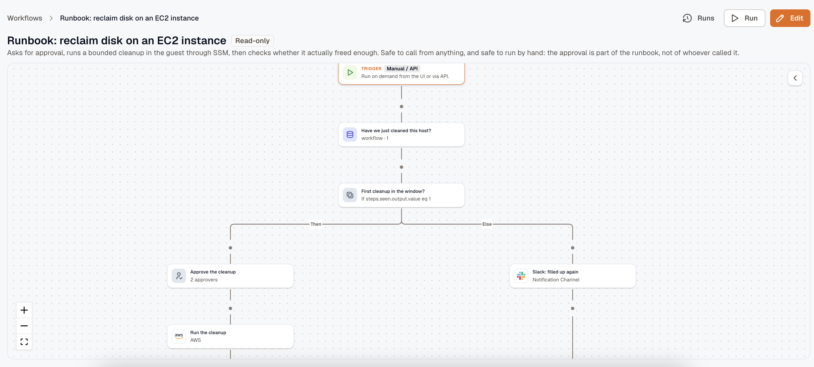

A workflow is a series of steps that runs when something happens, such as an alert, a schedule, or a webhook call. A step can query a system, branch on the result, change a resource, or wait for a person to approve.

A disk-space alert is a good first workflow. It reads the host from the alert and runs `df -h` on it through the KloudMate agent. Then it posts the output to Slack, asks the on-call engineer to approve a cleanup, runs the cleanup, and waits until free space recovers before it reports back.

## What a workflow can do

- **Act on cloud resources**: call an AWS API action, such as stopping an EC2 instance, or an Azure Resource Manager operation through a connected account, or run a script on an Azure VM.
- **Run a command on a host**: use the KloudMate agent to run shell commands on any Linux host where someone with the **Developer** role has [allowed runbook scripts](./actions/#allow-runbook-scripts-on-a-host).
- **Work in your tools**: post and edit Slack messages, create and transition Jira issues, call a tool on an MCP server, or send an HTTP request to anything else.
- **Notify**: send through an existing Slack, Teams, webhook, or SNS channel, or email an address directly.
- **Transform and decide**: extract a value with JSONPath, parse CSV and XML, run sandboxed JavaScript, choose between several paths by condition, or have a model pull structured fields out of a payload.
- **Ask the Assistant**: have the [KloudMate Assistant](./actions/#ask-kloudmate-assistant) look into an alert using your telemetry, then use its answer in later steps.
- **Wait for a person**: pause for an approval or a filled-in form. Both arrive by email, and each person gets their own link.
- **Reuse configuration**: refer to a workspace [constant or secret](./variables/) by name instead of pasting a channel id or a token into every workflow.
- **Store data between runs**: save a cursor, a counter, or a marker such as "this alert was already handled today" for later runs to read.

[The action catalog](./actions/) lists every action.

## What starts a workflow

| Trigger | Fires when |
|---|---|
| **Manual / API** | Someone clicks **Run**, or an API client starts a run. |
| **Schedule** | An interval or cron expression comes due, in the timezone you pick. |
| **Webhook** | Something calls the workflow's own URL. |
| **Form submission** | Someone submits the workflow's public form. |
| **App event** | Something happens in a connected app, such as a Slack mention or a new Jira issue. |

Alerts start workflows through the webhook trigger. Point a webhook [notification channel](../platform/settings/notification-channels/) at the workflow's URL, then attach the channel to a routing rule. Each notification then starts a run with the alert group payload. See [Triggers](./triggers/). To run a different workflow for each resource in an alert group, start from the [Send alerts to your workflows](./alert-router/) template.

## When to use a workflow

A [routing rule](../alerts/routing-rules/) decides who gets notified about an alert. A workflow decides what to do about it, and a routing rule can start it.

Use the [KloudMate Assistant](../kloudmate-assistant/) for an open-ended investigation, where you don't know what you'll ask next. Turn a task into a workflow after you've done it the same way twice.

## Before you start

- **You need the Developer role to create, edit, publish, or delete a workflow.** Anyone in the workspace can read workflows and run history, and can start a run by hand when the workflow permits it.
- **Steps and triggers that use an outside account need a [connection](/platform/settings/connections/).** That includes AWS, Azure, Slack, Jira, and MCP servers. The **Connections** tab in Workflows lists the ones a workflow can use, and a step's connection picker can connect a new account without leaving the builder.
- **Workflow automation is part of the Pro and Business plans.** See [Limits](./limits/).

## Build a workflow

1. Open **Workflows** and click **Create workflow**, then pick a trigger. Manual is a good place to start, because you control when it fires. To start from a ready-made workflow instead, pick one on the **Templates** tab.
2. Add steps from the palette and configure each one. Click **Run test** on a step to see its real output, so you can build the next step from real values.
3. Click **Test run** to run the whole draft end to end.
4. Click **Publish**. The first publish also switches the workflow on.

A trigger starts a run only from the published version, and only while the workflow is enabled. Editing the draft afterward changes nothing until you publish again.

## In this section

- [Build a workflow](./build-a-workflow/)
- [Triggers](./triggers/)
- [Control flow](./control-flow/)
- [Send alerts to your workflows](./alert-router/)
- [Approvals and collected input](./approvals-and-input/)
- [The action catalog](./actions/)
- [Templating](./templating/)
- [Variables](./variables/)
- [Storage](./storage/)
- [Test a workflow](./test-a-workflow/)
- [Run history](./run-history/)
- [Limits](./limits/)

## Related

- [Workflow guides](/guides/#workflow-guides) for complete workflows you can import, such as granting temporary SSH access with an approval, deploying from Slack, onboarding a new hire, and running an IT help desk in Slack.
- [Connections](/platform/settings/connections/) for the credentials a workflow uses.
- [Routing rules](../alerts/routing-rules/) for sending alerts to a workflow.
- [Notification channels](../platform/settings/notification-channels/) for the Slack, Teams, webhook, and SNS destinations that steps send through.
