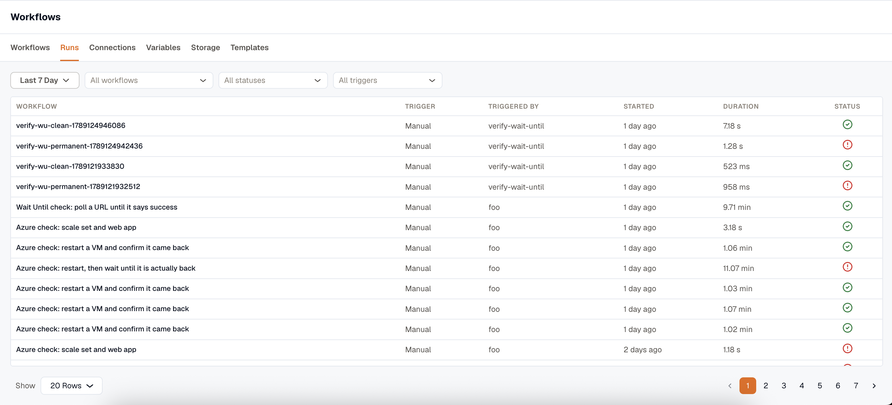
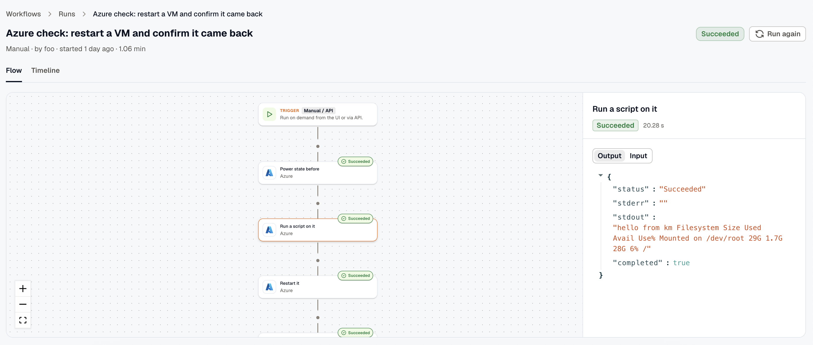
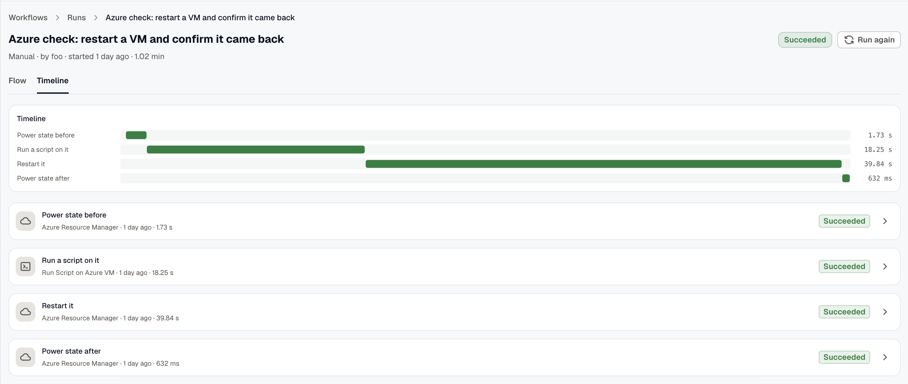

**Workflows → Runs** lists every execution across the workspace, newest first. Filter by workflow, status, or trigger. A run started from the builder is marked **Test**, so you can tell it from real traffic.

## Statuses

| Status | Meaning |
|---|---|
| **Queued** | Accepted, not yet picked up. |
| **Running** | In progress. |
| **Waiting approval** / **Waiting input** | Paused for a person. The run holds no capacity while it waits. |
| **Succeeded** | Every step finished. |
| **Failed** | A step failed and the run stopped. |
| **Rejected** | Someone declined an [approval](../approvals-and-input/). A deliberate outcome, not a fault: downstream steps are skipped and nothing is retried. |
| **Cancelled** | Someone stopped it. |

A run can also be skipped before it starts. A scheduled fire is skipped while the previous run is still going, and an app-event trigger is skipped once it passes its hourly ceiling. Both are recorded rather than dropped, so the gap is visible in the list.

## Read a run

Open a row for the detail. A run started by another workflow is marked **Child run**, which links to its parent.

The detail shows:

- **Flow** draws the same canvas as the builder, with each step showing how it went. Select one to see what it received and what it returned.
- **Timeline** lists every executed step in order as a waterfall, with duration and attempt count, nested the way the workflow nests.

Loop iterations appear as separate entries under the loop, and a step that retried shows its attempt number.

A large input or output is truncated to a preview and labeled as truncated. Paths that resolved to nothing are listed per step.

A step paused for a person shows who can respond and when the request expires.

## Cancel a run

**Cancel** stops a run that's still going, including one waiting on an approval. A run that already finished can't be cancelled.

## Run it again

**Run again** starts a new run with the original run's trigger data, pre-filled and editable, so you can change what should differ and leave the rest.

It runs the **current published version**, not the version the original ran, so a fix you published since is picked up.

A test run can't be re-run this way, because it executed a draft rather than a version.

## How long history is kept

Finished runs and their step detail are kept for 30 days. See [Limits](../limits/#retention) for how long published versions last.

## Related

- [Test a workflow](../test-a-workflow/) for checking a workflow before it reaches this list.
- [Build a workflow](../build-a-workflow/) for versions and enabling.
- [Limits](../limits/) for the caps that produce a skipped run.
