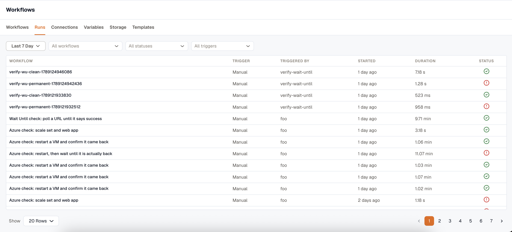
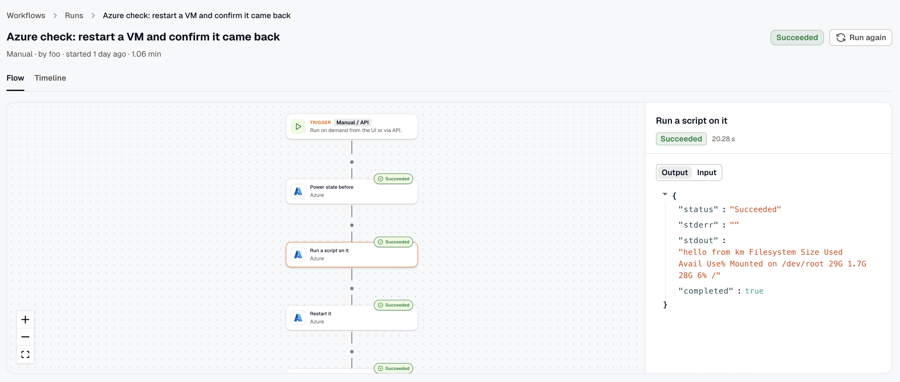
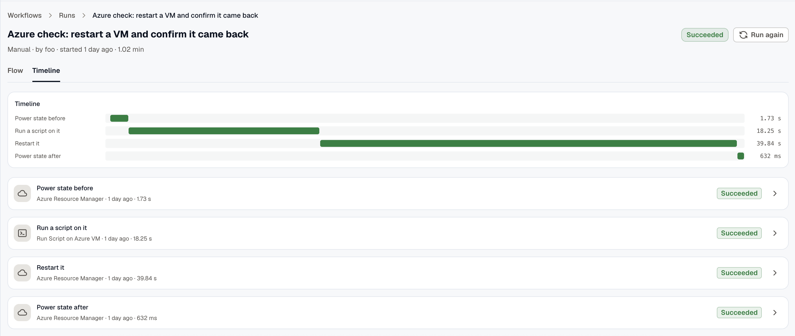

**Workflows → Runs** lists every run in the workspace, newest first, including the runs that **Call Workflow** steps start. Filter by time range, workflow, status, or trigger. The **Child** trigger shows the runs another workflow started. The list marks a **Test run** from the builder with **Test**, so you can tell it from real traffic.

The list doesn't show parallel branches, or loop items that run at the same time, on their own. They appear inside their parent run's timeline.

## Run statuses

| Status | Meaning |
|---|---|
| **Queued** | Accepted, not yet picked up. |
| **Running** | In progress. |
| **Waiting approval** / **Waiting input** | Paused for a person. The run doesn't count toward the limit on runs at the same time while it waits. |
| **Waiting** | Paused on a **Wait / Delay** of 1 minute or longer, or between the checks of a **Wait until**. It doesn't count toward the limit either. |
| **Waiting children** | Paused while a workflow it called, or one of its parallel branches, waits for a person. |
| **Succeeded** | Every step finished. |
| **Failed** | A step failed and the run stopped. |
| **Rejected** | Someone declined an [approval](../approvals-and-input/). It's a deliberate outcome, not a fault: the run skips the steps after the approval and retries nothing. |
| **Cancelled** | Someone stopped it. |

KloudMate can also skip a run before it starts: a scheduled fire while the previous run is still going, and an app-event trigger after it passes its hourly cap. The list records both, as **Skipped (concurrent)** and **Skipped (cap)**, so you can see why a run is missing.

## Read a run

Open a row to see the run's detail. A run that another workflow started carries a **Child run** link to its parent. In the parent's timeline, the called workflow's block has an **Open run** link to the child run.

The detail shows:

- **Flow** shows the workflow as it looks in the builder, with each step's result. Select one to see what it received and what it returned.
- **Timeline** lists every step that ran, in order, as a waterfall with duration and attempt count, nested like the workflow's steps.

Each loop item appears as its own entry under the loop, and a step that retried shows its attempt number.

KloudMate stores an input or output larger than 256 KB as a preview of its first 1,024 characters, marked `_truncated`. Each step also lists the paths that resolved to nothing.

A step paused for a person shows who can respond and when the request expires.

## Cancel a run

**Cancel** stops a run that's still going, including one waiting on an approval. Cancelling doesn't undo steps that already ran, and you can't cancel a run that already finished.

## Start a run again

**Run again** starts a new run with the original run's trigger data, pre-filled and editable, so you can change only what needs to differ.

It runs the **current published version**, not the version the original ran, so it picks up any fix you've published since.

You can't re-run a test run this way, because it ran a draft, not a published version.

## Check workflow usage

**Workflows → Usage** shows how workflows are doing across the workspace over the time range you pick, the last 7 days by default. Its tiles show the **Runs** that finished, the **Failed** runs, the **Success Rate %**, and the **Credits** used, above a chart of **Runs and Failures Over Time**. It doesn't count test runs from the builder.

Each run counts 1 credit. A workflow that a **Call Workflow** step starts counts as a run of its own. Loop items and parallel branches don't.

Workflow credits are separate from the [AI credits](../../kloudmate-assistant/usage/) that the KloudMate Assistant uses in chat. An **Ask KloudMate Assistant** step adds no workflow credits, and spends 1 AI credit each time it answers instead.

## Run retention

KloudMate keeps finished runs and their step detail for 30 days. See [Limits](../limits/#retention) for how long published versions last.

## Related

- [Test a workflow](../test-a-workflow/) for checking a workflow before it reaches this list.
- [Build a workflow](../build-a-workflow/) for versions and enabling.
- [Limits](../limits/) for the caps that produce a skipped run.
