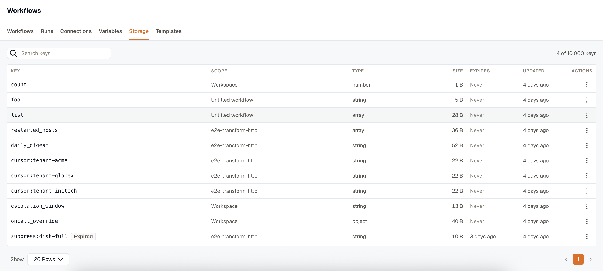

Every run starts blank. Storage gives a workflow somewhere to write that outlives the run, so it can dedupe, count, or pick up where the last run left off.

Use it to notify about something only once a day, process everything since the last item you handled, or collect the hosts you restarted this hour and report them at the end.

The actions are under **Utilities → Storage** and need no connection.

| Action | What it does | Output |
|---|---|---|
| **Storage: Get** | Read a stored value, with a default when the key isn't there. | `value`, `found` |
| **Storage: Put** | Store a value, replacing what was there. | `value` |
| **Storage: Increment** | Add to a stored number. A negative amount counts down, and a key that doesn't exist starts at 0. | `value` |
| **Storage: Add to List** | Add one item, or several at once. `added` is `false` when **Skip if already there** stopped it. | `value`, `length`, `added` |
| **Storage: Remove from List** | Take items out of a list. Removing something that isn't there isn't an error. | `value`, `length`, `removed` |
| **Storage: Remove** | Delete a key. | `removed` |

## Scope

Every action asks where the key lives:

- **This workflow**, the default, keeps the key private to the workflow that wrote it, so two workflows can both use `cursor` without colliding.
- **This workspace** shares the key with every workflow. Pick it deliberately, when two workflows need to read the same value.

## Keys and values

A key takes 1 to 200 characters from letters, digits, and `_ : . -`, and it's templatable, so `alerted:{{ trigger.body.group.id }}` builds a per-group marker.

Text is stored as text. For a list or an object, type valid JSON with quoted strings, like `["apple","banana"]`. A bare `[apple, banana]` isn't valid JSON, so it's stored as plain text.

A value is capped at 64 KB, a list at 10,000 items, and a workspace at 10,000 keys. Reaching the key ceiling fails the write. Nothing is ever evicted to make room.

## Expiry

**Expires after** takes a duration such as `24h` or `30m`. Leave it blank and the key lives until something deletes it. Nothing expires unless you ask it to.

Only the actions that can create a key offer it, and a blank value never clears an expiry an earlier write set.

An expired key reads as absent immediately, and stays listed as **Expired** until a daily sweep removes it.

## Notify only once a day

Use a marker key that expires on its own:

1. **Storage: Get** with key `alerted:{{ trigger.body.group.id }}`. Its `found` output is `false` the first time that group arrives.
2. A **Branch** whose condition matches that step's `found` against `false`. Take the path from the variable picker rather than typing it.
3. Inside the `then` block, do the notifying, then **Storage: Put** the same key with **Expires after** `24h`.

**Add to List** offers **Skip if already there**, which decides in a single statement whether this call changed anything. Its `added` output is `true` only for the caller that actually added the item, so use it instead of the read-then-write pattern above when two runs can race.

## Browse and clear what runs have written

**Workflows → Storage** lists every key in the workspace with its scope, type, size, expiry, and when it last changed. Values aren't loaded into the list, so open **View value** on a row to read one.

This is the only place a key can be removed by hand. A row menu deletes one key, or clears every key a given workflow wrote.

:::note
Storage is state a run produced, not configuration you set. It's never included in an export, and deleting a key isn't guarded against the workflows that use it. Both are the other way round for [workspace variables](../templating/#workspace-variables).
:::

## Related

- [Templating and variables](../templating/) for values you set rather than values a run writes.
- [The action catalog](../actions/) for the rest of the palette.
