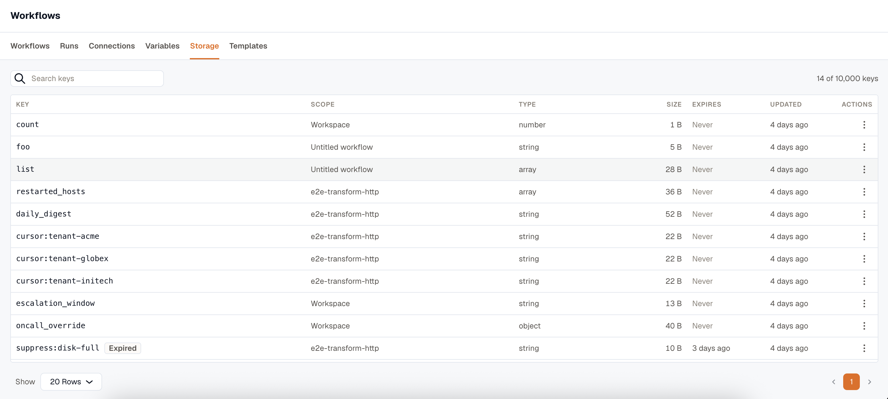

A run keeps nothing after it ends. Storage saves values that later runs can read, so a workflow can skip duplicates, keep a count, or continue from where the last run stopped.

Use it to notify about something only once a day, continue from where the last run stopped, stop repeating a fix that isn't working, or pause automation during maintenance. See [Examples](#examples).

The actions are under **Utilities → Storage** and need no connection.

| Action | What it does | Output |
|---|---|---|
| **Storage: Get** | Read a stored value, with a default when the key isn't there. | `value`, `found` |
| **Storage: Put** | Store a value, replacing what was there. | `value` |
| **Storage: Increment** | Add to a stored number. A negative amount counts down, and a key that doesn't exist starts at 0. | `value` |
| **Storage: Add to List** | Add one item, or several at once. `added` is `false` when **Skip if already there** stopped it. | `value`, `length`, `added` |
| **Storage: Remove from List** | Take items out of a list. Removing something that isn't there isn't an error. | `value`, `length`, `removed` |
| **Storage: Remove** | Delete a key. | `removed` |

## Scope

Every action has a **Scope** that decides where the key lives:

- **This workflow**, the default, keeps the key private to the workflow that wrote it, so two workflows can both use `cursor` without colliding.
- **This workspace** shares the key with every workflow. Pick it only when two workflows need to read the same value.

## Keys and values

A key is 1 to 200 characters of letters, digits, and `_ : . -`. It can include a template, so `alerted:{{ trigger.body.group.id }}` makes a separate key for each alert group.

A value you type is stored as text. For a list or an object, type valid JSON with quoted strings, like `["apple","banana"]`. A bare `[apple, banana]` isn't valid JSON, so it's stored as text too.

A value can be up to 64 KB and a list up to 10,000 items, and a workspace holds up to 10,000 keys. At the key limit, a write that adds a key fails, because KloudMate never evicts keys to make room.

## Expiry

**Expires after** takes a duration such as `24h` or `30m`. If you leave it blank, the key lives until something deletes it.

Publishing refuses a typed value that isn't a duration, such as `30 min`. KloudMate checks a value built from a template when the step runs, and the step fails if the value isn't a duration.

Only the actions that can create a key have this field. Leaving it blank never removes an expiry that an earlier write set.

An expired key counts as missing right away. The Storage tab lists it as **Expired** until a daily cleanup removes it.

## Examples

Each example uses readable step ids, such as `steps.cursor`, to show the shape. In the builder, pick references from the variable picker instead of typing them.

### Notify once a day per alert group

An alert group can start many runs while it's open. To notify about it only once a day, use a marker key that expires on its own:

1. Add a **Storage: Get** step with the key `alerted:{{ trigger.body.group.id }}`. Its `found` output is `false` the first time that group arrives.
2. Add a **Branch** whose condition checks that the step's `found` equals `false`.
3. In the **Then** block, send the notification. Then add a **Storage: Put** step for the same key, with **Expires after** set to `24h`.

**Storage: Add to List** has a **Skip if already there** option that checks for the item and adds it in one operation. Its `added` output is `true` only for the run that added the item. When two runs can race, use it instead of the read-then-write pattern above.

### Continue from where the last run stopped

A scheduled workflow that processes new items, such as events from an API, can keep a cursor so that each run handles only what's new:

1. Add a **Storage: Get** step, `cursor`, for the key `last_run`. Set its **Default** to a start time, such as `2026-01-01T00:00:00Z`, for the first run.
2. Fetch only the newer items, for example with an **HTTP Request** to `https://api.example.com/events?since={{ steps.cursor.output.value }}`.
3. Process the items.
4. Add a **Storage: Put** step for `last_run` with the value `{{ trigger.schedule.fired_at }}`, the time this run was scheduled.

If a run fails before the last step, the cursor doesn't move, so the next run picks up the same items again. For a complete example, see [Trigger a workflow when a new email is received in Gmail](/guides/workflows/trigger-on-new-gmail/).

### Stop repeating a fix that isn't working

A workflow that restarts a service can count its restarts, and hand over to a person when restarting doesn't help:

1. Add a **Storage: Increment** step, `restarts`, for the key `restarts:{{ trigger.inputs.host }}`, with **Expires after** set to `1h`.
2. Add a **Branch** whose condition checks that `steps.restarts.output.value` is greater than `3`.
3. In the **Then** block, ask a person to look, for example with an **Approval** or a Jira **Create Issue** step. In the **Else** block, restart the service with **Run Command on Host**.

Each increment restarts the expiry, so the count clears after an hour without a restart.

### Collect results and report them later

A workflow that fixes hosts can build a list for a daily report that another workflow sends:

1. In the workflow that fixes hosts, add a **Storage: Add to List** step with **Scope** set to **This workspace**, the key `fixed_hosts`, and the host as the **Item**.
2. In a second workflow on a daily **Schedule**, add a **Storage: Get** step for `fixed_hosts`, email the list, then clear it with **Storage: Remove**.

Both workflows use the key, so its **Scope** must be **This workspace**.

### Pause automation during maintenance

One workflow can switch the others off for a maintenance window:

1. Create a workflow with a **Manual / API** trigger and a **Storage: Put** step with **Scope** set to **This workspace**, the key `maintenance`, the value `true`, and **Expires after** set to the length of the window, such as `2h`.
2. Start each workflow you want to pause with a **Storage: Get** step for `maintenance`, followed by a **Branch** that checks whether `found` is `true`. Put the rest of the workflow in the **Else** block.

When the key expires, the workflows go back to normal on their own.

### Act on a resource only once in a while

The [Send alerts to your workflows](../alert-router/#how-the-cooldown-works) template uses **Storage: Increment** as a cooldown, so it acts on a resource once and then leaves it alone while it keeps alerting.

## View and delete stored keys

**Workflows → Storage** lists every key in the workspace with its scope, type, size, expiry, and when it last changed. The list doesn't show values. To read one, open **View value** on its row.

It's the only place to remove a key by hand. A row's menu deletes that key, or clears every key a given workflow wrote.

:::note
Storage holds data that runs wrote, not configuration you set. Exports never include it, and you can delete a key even while workflows use it. [Workspace variables](../variables/) work the other way on both counts.
:::

## Related

- [Variables](../variables/) for values you set rather than values a run writes.
- [The action catalog](../actions/) for the rest of the palette.
