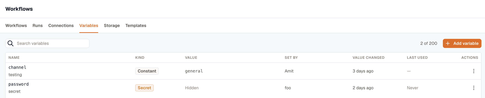

Most fields on a step accept `{{ }}` templates, and they all resolve against the same scope. Each templatable field offers a variable picker, and once a step has been tested the picker shows a real example value next to every path that step produces.

## What's in scope

| Reference | What it holds |
|---|---|
| `{{ trigger.* }}` | The trigger payload. Its shape depends on the trigger. See [Triggers](../triggers/). |
| `{{ steps.<id>.output.* }}` | What an earlier step returned. |
| `{{ steps.<id>.error }}` | The error message, when that step is set to continue on failure. |
| `{{ item }}` and `{{ item_index }}` | The current element inside a loop, and its position. |
| `{{ vars.<name> }}` | A workspace constant. |
| `{{ secrets.<name> }}` | A workspace secret. |

A step's id is generated when you add it, and renaming the step doesn't change it. You don't type these references: pick from the variable picker, which lists steps under the names you gave them and inserts the right id. Examples on these pages use readable ids such as `steps.lookup` to show the shape.

Templates compose, so this works as written:

```text
Bearer {{ secrets.stripe_key }}
```

Templates are Liquid, so filters work: a constant holding a comma-separated list becomes an array with `{{ vars.regions | split: "," }}`.

A template string is capped at 8192 characters.

## When a reference doesn't resolve

An unknown reference renders empty rather than failing. The Test panel lists every path that resolved to nothing under **Unresolved variables**, and the run timeline records the same list per step, so check both.

A reference to a step that doesn't exist is different: publishing rejects it by name.

## Workspace variables

Set a value once and refer to it from every workflow that needs it. Open **Workflows → Variables** and click **Add variable**.

Pick **Constant** or **Secret** when you create one. The kind decides how the value is referenced, stored, and read:

|  | Constant | Secret |
|---|---|---|
| Reference | `{{ vars.<name> }}` | `{{ secrets.<name> }}` |
| Shown in the list | Yes | No |
| In run history | The real value | `secret: <name>` |
| Read | Once per run, then frozen | Per step, so a rotation mid-run takes effect on the next step |

Names take letters, digits, and underscores, starting with a letter or underscore, up to 64 characters. `STRIPE_KEY` and `slack_channel` are both fine. A workspace holds up to 200 variables.

The list shows who set each one, when the **value** last changed, and, for secrets, when it was last used. Read the value-changed column to answer "has this been rotated since the incident?", because editing a description doesn't move it.



### What a secret protects against

A secret never enters a workflow definition and never enters run history. It's substituted into the step's inputs at the last moment, after everything has been recorded, so run detail shows `secret: stripe_key` where the value would be. If a step's output comes back carrying the secret, it's rewritten to `••••` before that output is recorded or read downstream, and the step still succeeds.

That protects against passive reading: run history, exports, and someone looking over your shoulder. It does not protect against the person writing the workflow, who can bind a secret to an HTTP step pointed at their own server. A [connection](/platform/settings/connections/) has the same boundary, which is why both are admin-only.

The output rewrite skips values under 8 characters, so don't rely on it for a short secret.

### Rotate, rename, delete

**Rotate** a secret by editing it and typing a new value. Leave the value blank to keep the stored secret.

**Rename** is refused the first time and lists the workflows that name the key; confirm to go ahead. The reference is the name, so renaming breaks every template using it, and a published version can't be rewritten.

**Delete** is refused outright while any workflow still names the key, with the workflows listed so you can fix them. Unlike a rename, there's no confirm to push past it.

**A variable can't be converted between kinds.** Flipping a constant to a secret moves the reference to a different namespace, so every `{{ vars.x }}` in the workspace would quietly start resolving empty. Delete it and create the other kind.

### Reveal a secret

**Reveal value** shows the plaintext to whoever created it, or to an organization owner. Any other workspace admin can't, even though they can rotate or delete it. Each reveal is recorded, along with who read it.

### Publishing checks the names

Publishing fails if a workflow names a secret the workspace doesn't have, and the message names the key. A constant that doesn't exist resolves empty like any other unknown reference, so check the Test panel's unresolved list.

## Related

- [Test a workflow](../test-a-workflow/) for getting real values into the variable picker.
- [Storage](../storage/) for values a run writes, rather than values you set.
- [The action catalog](../actions/) for which fields accept templates.
