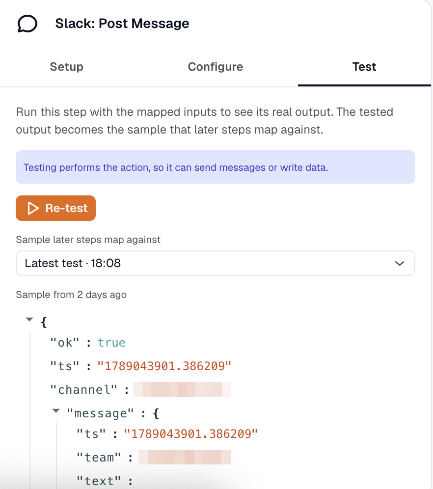
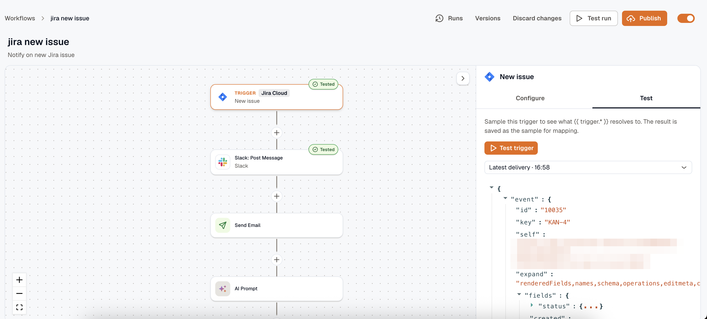

You can't map `{{ steps.lookup.output.instance_id }}` until you know what the lookup actually returns. Testing is how you find out: run a step, look at what came back, then build the next step against those real values.

## Test one step

Open a step's **Test** tab and click **Run test**. **Input** is the rendered, coerced payload the action actually received, so you can check whether a template resolved the way you expected. **Output** is what came back.

The result is one of these:

- **The step ran and returned.** Both panes fill in, and the output is saved as the sample.
- **The step ran and failed.** The provider's own error is shown inline.
- **The test couldn't run at all.** Nothing was executed and the step isn't marked failed. Try again.

If any template resolved to nothing, the panel lists the paths under **Unresolved variables**. Fix those before you publish; publishing won't catch them, because an empty render is legal.

:::caution
A test runs the real action. Posting a Slack message posts it, creating a Jira issue creates it, and running a command on a host runs it.
:::

Secrets never come back in the input. A bound connection is resolved server-side, and a credential-looking value you typed into a header is masked as `••••`.

### The sample later steps map against

A successful test saves its output automatically, and that saved output is what the next step's variable picker offers and what the next step's test resolves against. That's what stops an upstream step that sends or writes from re-firing every time you test something downstream.

The last three outputs per step are kept, and you can switch which one the picker resolves against.

A sample's timestamp is when that exact payload was first seen, not when you last pressed Test. Re-testing a step that returns the same bytes keeps the older time, and picking an earlier sample from the history keeps its own time and place.

A saved sample is builder state. A real run never reads one.

### Control-flow steps are previewed

A branch, loop, or wait has nothing to execute, so testing one resolves it against the saved samples instead: the loop's item list is resolved, the branch's condition is matched, the wait's duration is computed, and an approval's message is rendered through its template.

**AI Route** is the exception. It calls the model and shows which route it would take, and why.

**Parallel** and **Call Workflow** report the shape they'd produce without starting anything. A Call Workflow preview returns the called workflow's own last saved step output, so you see what the call will hand back, as long as that workflow has been tested once.

Testing an approval or collect-input step sends a clearly marked test email that carries no working link.

## Sample the trigger

Sample the trigger to get a real `{{ trigger.* }}` payload. The way you get one depends on the trigger:

| Trigger | How to get a sample |
|---|---|
| **Manual** and **Form** | Fill in **Test input values** and click **Test trigger**. |
| **Schedule** | Click **Test trigger**. You get the real next fire time and its timezone-local parts. |
| **Webhook** | Send a request to the webhook URL, then click **Reload**. |
| **App event**, polled | Click **Test trigger**. The newest five real items from the app are offered as **Result 1** onward, newest first. |
| **App event**, pushed | Click **Test trigger**. You get the last delivery this workflow ran on, or an offer to listen for one. |

### Webhook samples come from real traffic

There's no way to invent a webhook payload. Fire a request at the URL, then reload. Capture works on a draft as well as a live workflow, so you can sample before publishing anything.

An alert-driven workflow gets its sample the same way: point a webhook notification channel at the URL, attach it to a routing rule, and the next alert notification lands as a real payload under `trigger.body`.

### Listening for a pushed event

A pushed event can't be fetched on demand. Click **Test trigger** and KloudMate waits for the next delivery, telling you what to do in the app, for example mentioning the bot in a Slack channel. If nothing arrives before the window closes, click **Listen again**.

## Test the whole workflow

**Test run** executes the draft end to end through the real engine. Every step's input and output lands in the run timeline the same way a live run's does, so use it to see how the steps fit together rather than how a single step behaves.

`{{ trigger.* }}` resolves from the trigger sample you saved, so the usual flow is to capture a real payload once and then replay it as often as you like. When there's a history of captured payloads, you can choose which one to replay.

A test run is marked **Test** in run history, so it's distinguishable from real traffic. It executes real actions, exactly as a single step test does.

## Related

- [Build a workflow](../build-a-workflow/) for publishing once the tests pass.
- [Run history](../run-history/) for reading a run after it happened.
- [Templating and variables](../templating/) for what the picker offers.
