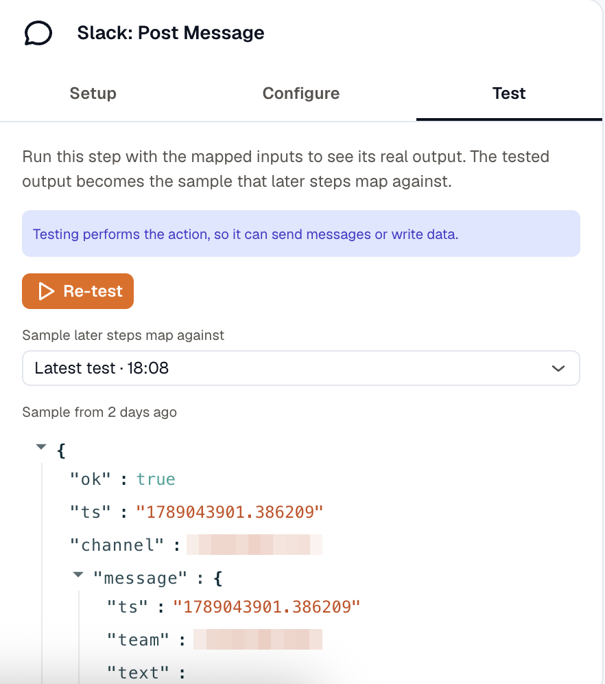
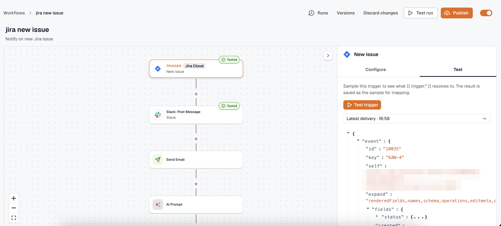

You can't build a step on `{{ steps.lookup.output.instance_id }}` until you know what the lookup returns. Run a step, check its output, then build the next step against those real values.

## Test one step

Open a step's **Test** tab and click **Run test**. **Input** shows the payload the action received after its templates rendered, so you can check whether a template resolved the way you expected. **Output** is what the step returned.

The result is one of these:

- **The step ran and returned.** Both panes fill in, and the output becomes the step's sample.
- **The step ran and failed.** The panel shows the provider's own error.
- **The step needs a real run.** **Run Command on Host** doesn't run its command from the Test tab. It shows the shape of its output with empty values instead, and saves that as the sample. Use [Test run](#test-the-whole-workflow) to run the command for real.
- **The test couldn't run at all.** Nothing ran, and the step isn't marked as failed. Try again.

If any template resolved to nothing, the panel lists the paths under **Unresolved variables**. Fix those before you publish. Publishing catches a reference to a step that doesn't exist, but not a wrong path under a step that does, because a template that renders empty is still valid.

:::caution
A test runs the real action. Posting a Slack message posts it, and creating a Jira issue creates it.
:::

Secrets never show in the input. A connection's credential stays on the server, and a credential-looking value you typed into a header shows as `••••`.

### Saved samples

A successful test saves its output automatically. The next step's variable picker offers that saved output, and the next step's test runs against it, so testing a later step doesn't re-run an earlier step that sends or writes something.

Each step keeps its last three outputs, and you can switch which one the picker uses.

A sample's timestamp shows when that exact payload was first seen, not when you last clicked Test. If a test returns the same bytes again, the sample keeps its older time.

To try a path your real data doesn't reach, click the pencil icon (**Edit sample**). Then change the saved output by hand. A sample must be a JSON object, up to 1024 KB.

Samples exist only for building. A real run never uses them.

### Test a control-flow step

A branch, loop, or wait has nothing to execute, so its test works from the saved samples instead. It resolves the loop's item list, matches the branch's condition, and computes the wait's duration. A **Wait until** shows when it would check and whether its condition holds now, without running the check block.

Testing a **Route** checks every path's condition against the samples, shows whether each one matched, and names the path that would run. It doesn't run that path's steps.

**AI Route** is the exception. It calls the model and shows which route it would take, and why.

**Parallel** and **Call Workflow** report the shape they'd produce without starting anything. A Call Workflow preview returns the sample of the called workflow's last step, so you see what the call returns. That sample exists after the called workflow has been tested, on its own or through a **Test run** of a workflow that calls it.

### Test an Approval or Collect Input step

Testing an **Approval** or **Collect Input** step renders its message and emails a clearly marked test to the people named on it, with no working link. If nobody is named yet, no email goes out.

- **An Approval test** returns `approved: true`, with `decidedBy` set to the first approver, or to you if nobody is named yet. To build the path for a rejection or a timeout, edit the sample.
- **A Collect Input test** opens the form itself, so you can type the values that later steps read, then click **Save sample**.

## Capture a trigger sample

A trigger sample gives `{{ trigger.* }}` a real payload to test against. How you capture one depends on the trigger:

| Trigger | How to get a sample |
|---|---|
| **Manual** and **Form** | Fill in **Test input values** and click **Test trigger**. |
| **Schedule** | Click **Test trigger**. You get the real next fire time and its timezone-local parts. |
| **Webhook** | Send a request to the webhook URL, then click **Reload**. |
| **App event**, polled | Click **Test trigger**. Pick from the app's five newest items, listed newest first as **Result 1** onward. |
| **App event**, pushed | Click **Test trigger**. You get the last delivery this workflow ran on, or KloudMate starts listening for the next one. |

### Capture a webhook sample

Send a request to the URL, then click **Reload**. You can capture a sample on a draft as well as a live workflow, so you don't need to publish first.

An alert-driven workflow gets its sample the same way. Point a webhook notification channel at the URL and attach the channel to a routing rule. The next alert notification then becomes the sample, under `trigger.body`.

### Capture a pushed app event

KloudMate can't fetch a pushed event on demand. When the workflow hasn't run on one yet, **Test trigger** waits for the next delivery and tells you what to do in the app, for example mentioning the bot in a Slack channel. If nothing arrives before the window closes, click **Listen again**.

## Test the whole workflow

**Test run** runs the draft end to end through the real engine. Every step's input and output shows in the run timeline, as in a live run, so use it to see how the steps fit together rather than how a single step behaves. The draft must pass the builder's structure checks before it can run.

`{{ trigger.* }}` comes from the trigger sample you saved, so capture a real payload once and replay it as often as you like. When there's a history of captured payloads, pick the one to replay under **Run against**. For a manual or form trigger, fill in the **Trigger inputs** instead.

A test run does everything a real run does. It runs **Run Command on Host**, waits for real approvals and form submissions, waits out delays, and calls the published version of any workflow it calls. Run history marks it **Test**, so you can tell it apart from real traffic.

A test run also saves each step's output as that step's sample, including the steps of the workflows it calls, so you don't have to test them one by one. The new samples appear the next time you open the builder.

## Related

- [Build a workflow](../build-a-workflow/) for publishing after the tests pass.
- [Run history](../run-history/) for reading a run after it happened.
- [Templating](../templating/) for what the picker offers.
