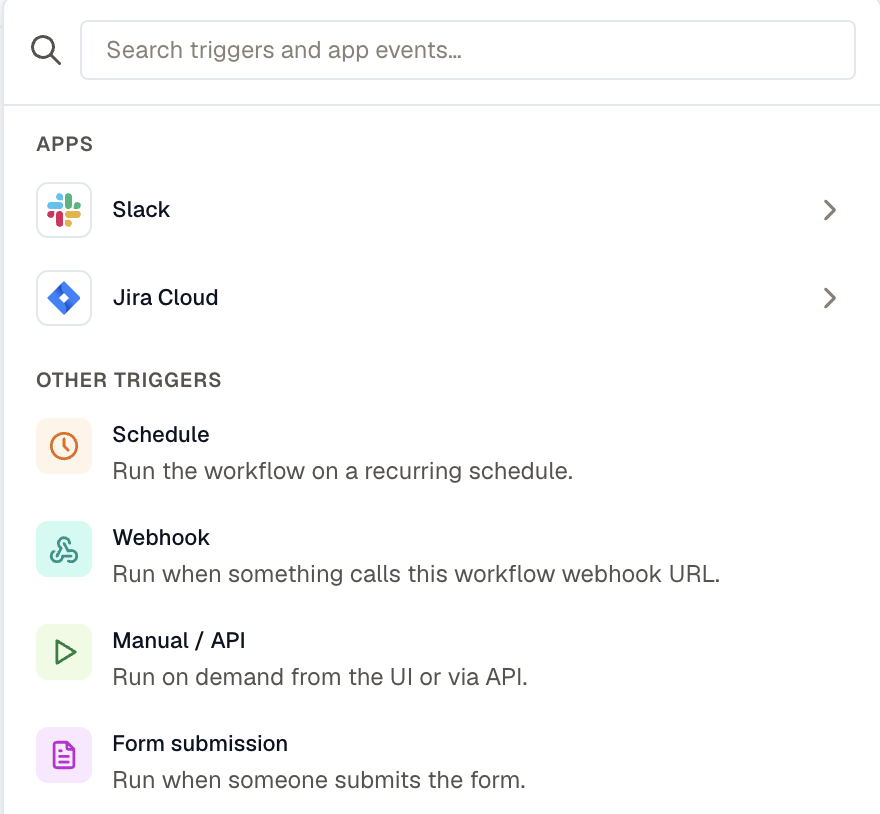

A trigger decides what makes a workflow run. Every workflow has exactly one, and it's part of the published version, so changing it is a draft edit like any other and the old trigger keeps working until you publish.



## Manual / API

Starts when someone clicks **Run**, or when an API client starts a run. Use it while you're building, for one-off remediations, and for anything a person decides to start.

Define the workflow's input parameters here. Each has a name, a type of string, number, boolean, or enum, and an optional default. Mark one required to refuse a run without it, and let an enum parameter accept more than one value.

Those parameters become the form someone fills in when they start the run, and steps read them as `{{ trigger.inputs.<name> }}`.

:::note
The **Run** button appears only for a manual or form trigger. To start a scheduled or webhook workflow by hand, open one of its past runs and click **Run again**, or call the API.
:::

## Schedule

Starts on a recurring schedule, in the timezone you pick. Use it for a nightly report, a weekly cleanup, or any check that has to happen whether or not anything alerted.

**Repeat** takes an interval in minutes, hourly, daily, weekly, monthly, or a raw cron expression. Turn off **Run on weekends** on a daily schedule to run Monday through Friday only.

The next few fire times are previewed as you edit, so you can check a cron expression against real dates before publishing.

Before you rely on a schedule:

- **A schedule can't fire faster than once a minute.** Publishing rejects an interval or a cron expression that asks for more.
- **A scheduled run is skipped while the previous one is still going.** The skip is recorded in run history as its own row, so a workflow that keeps overrunning its interval is visible rather than silent.
- **Missed ticks collapse into one catch-up run.** Disabling a workflow over a weekend doesn't produce a burst of runs when you enable it again.

Steps read the fire time from `{{ trigger.* }}`, including its timezone-local parts.

## Webhook

Starts when something calls the workflow's own URL. Open the trigger panel to copy it. Use it for anything that can send an HTTP request, including KloudMate alerts.

Both `POST` and `GET` deliver. A `POST` carries JSON in the body, up to 256 KB. A `GET` carries its data in the query string, which suits a sender that can only fire a URL.

Body, query, headers, and method stay separate:

```text
{{ trigger.method }}
{{ trigger.query.page }}
{{ trigger.body.event }}
{{ trigger.headers.x-github-event }}
```

Any authorization header the sender supplies is stripped before the delivery reaches templates or samples.

### Filter deliveries

**Conditions** matches on the delivery, reading paths such as `body.event`, `query.source`, `headers.x-github-event`, or `method`. A delivery that doesn't match is acknowledged and starts no run. Leave it empty to run on every delivery.

### Collapse a sender's retries

Point **Deduplication key** at an id the sender provides, such as `{{ body.id }}`. Two deliveries that render the same value produce one run, and the second is acknowledged as a success. Left empty, every delivery is its own run.

A key that renders to nothing counts as unset, so pointing it at a field the sender sometimes omits falls back to one run per delivery rather than folding unrelated events together.

### Rotate the URL

**Rotate** replaces the URL, and the old one stops working immediately. Update your senders first. Rotating also changes the public form URL.

### Start a workflow from an alert

There's no alert trigger. Alerts come in over the webhook URL:

1. Create a webhook [notification channel](../../platform/settings/notification-channels/) pointing at the workflow's URL.
2. Attach that channel to a [routing rule](../../alerts/routing-rules/), the same way you'd attach Slack or email.

The channel posts the alert group payload as the request body, so steps read `{{ trigger.body.group.title }}`, `{{ trigger.body.group.labels.* }}`, and the rest. `{{ trigger.body.event }}` carries the lifecycle event: `opened`, `appended`, `resolved`, or `rca_completed`.

Both of these catch people out:

- **Silences apply.** A silenced group never reaches the channel, so it never starts a run.
- **A group delivers more than once.** `appended` arrives every time an alert joins an active group. A routing rule can't filter by event type, so filter in the trigger: match on `body.event` equal to `opened` to take the group once.

## Form submission

Starts when someone submits the workflow's public page. Use it to let people outside KloudMate request something that runs under your control, such as a sandbox reset.

The fields are the workflow's own input parameters, so they work exactly as they do for a manual run. The trigger sets the title and the message shown after a successful submission.

A form page loads only when the workflow is published and enabled. A draft form returns a 404, unlike a draft webhook, which still accepts deliveries so you can capture a sample before publishing.

Rotating the webhook URL changes this one too.

## When something happens in an app

Starts on an event in a connected app. Pick the **Account**, then the **Event** that account offers.

The account is a [connection](/platform/settings/connections/) carrying the **Triggers** capability. A connection that only delivers notifications won't appear in the picker, and granting it that capability means reconnecting, so the app can grant the extra permissions.

| App | Events |
|---|---|
| Slack | Bot is mentioned, New message in a channel, New direct message to the bot, Reaction added |
| Jira Cloud | New issue, Issue updated, New comment, Status changed |

Slack events arrive by push. Jira events are polled, and the first poll only records where things stand, so pointing a workflow at a project full of existing issues doesn't fire a run for each one.

Events are deduplicated on the app's own item id, so a redelivery produces one run.

An app-event trigger stops in any of these cases, and run history names the reason:

- The connection was deleted, switched off, made private, or had the **Triggers** capability withdrawn.
- The app revoked the credential. Reconnect it.
- The workflow started more than 200 runs from this trigger within an hour. Each refusal is recorded as its own run, and after three the trigger stops until you publish or re-enable the workflow.

Steps read the event as `{{ trigger.event.* }}`, alongside `{{ trigger.provider }}` and `{{ trigger.trigger_key }}`. The payload shape is the app's own, so capture a real one before you map against it. See [Test a workflow](../test-a-workflow/).

## Related

- [Test a workflow](../test-a-workflow/) for capturing a real trigger payload.
- [Templating and variables](../templating/) for how `{{ trigger.* }}` is addressed.
- [Limits](../limits/) for the rate ceilings on the public URLs.
