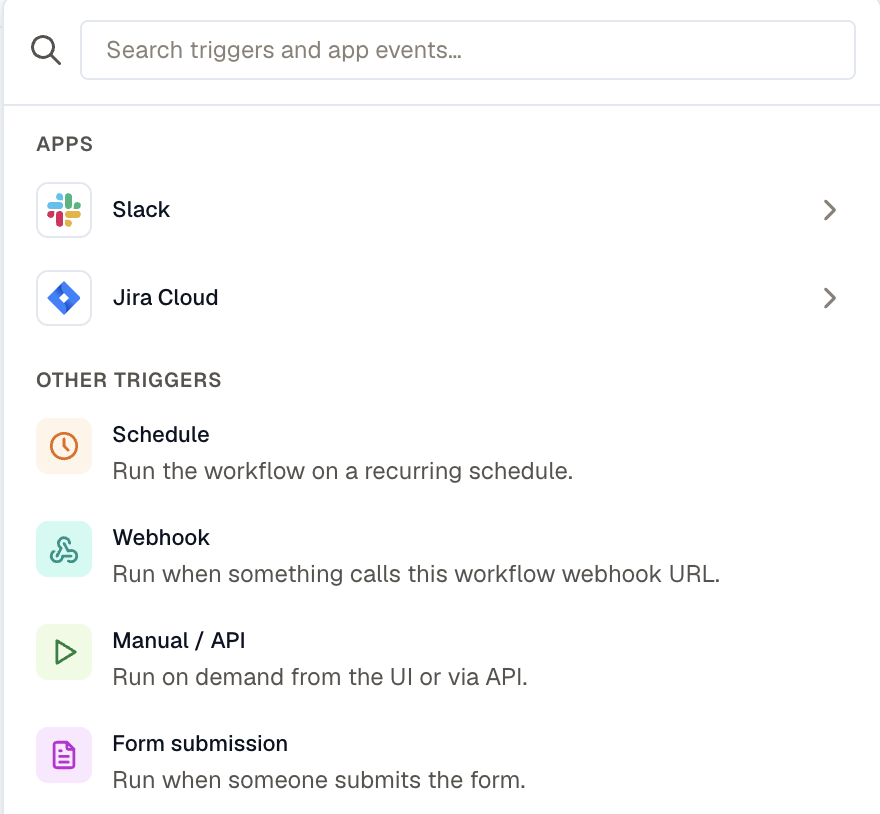

A trigger is the event that starts a workflow. Every workflow has exactly one, and it's part of the published version. Changing it is a draft edit like any other, so the old trigger keeps working until you publish.



## Manual / API

Starts when someone clicks **Run**, or when an API client starts a run. Use it while you're building, for one-off remediations, and for anything a person decides to start.

Define the workflow's **Input parameters** here. Each has a name, a type, and an optional default:

| Type | What it takes |
|---|---|
| **Text** | A single line of text. |
| **Long text** | Several lines of text. |
| **Email** | An email address, checked when the run starts. |
| **Number** | A number. |
| **Checkbox** | True or false. |
| **Choice** | One of a list of options you set. Turn on **Allow multiple selections** to accept several, which arrive as a list. |

Mark a parameter required to refuse any run that leaves it out. KloudMate also refuses a value of the wrong type, such as text in a **Number** or an option that isn't on a **Choice** list.

Those parameters become the form someone fills in when they start the run, and steps read them as `{{ trigger.inputs.<name> }}`.

:::note
The **Run** button appears only for a manual or form trigger. To start a scheduled or webhook workflow by hand, open one of its past runs and click **Run again**, or call the API.
:::

## Schedule

Starts on a recurring schedule, in the timezone you pick. Use it for a nightly report, a weekly cleanup, or any check that has to happen whether or not anything alerted.

**Repeat** takes an interval in minutes, hourly, daily, weekly, monthly, or a raw cron expression. Turn off **Run on weekends** on a daily schedule to run Monday through Friday only.

As you edit, the panel previews the next few fire times, so you can check a cron expression against real dates before you publish.

Before you rely on a schedule:

- **A schedule can't fire faster than once a minute.** Publishing rejects an interval or a cron expression that asks for more.
- **A scheduled run is skipped while the previous one is still going.** Run history records the skip as its own row, so you can see a workflow that keeps overrunning its interval.
- **Missed fire times become one catch-up run.** If you disable a workflow over a weekend, enabling it again doesn't produce a burst of runs.

Steps read the fire time as `{{ trigger.schedule.fired_at }}`, and its parts in your timezone as `{{ trigger.schedule.date }}`, `{{ trigger.schedule.hour }}`, `{{ trigger.schedule.weekday }}`, and so on.

## Webhook

Starts when something calls the workflow's own URL. Open the trigger panel to copy it. Use it for anything that can send an HTTP request, including KloudMate alerts.

The URL accepts both `POST` and `GET`. A `POST` carries JSON in the body, up to 256 KB. A `GET` passes its data in the query string, for a sender that can only open a URL.

Steps read the body, query, headers, and method separately:

```text
{{ trigger.method }}
{{ trigger.query.page }}
{{ trigger.body.event }}
{{ trigger.headers.x-github-event }}
```

KloudMate strips any authorization header the sender supplies before the delivery reaches templates or samples.

### Filter webhook deliveries

**Conditions** checks each delivery against paths such as `body.event`, `query.source`, `headers.x-github-event`, or `method`. A delivery that doesn't match is acknowledged but starts no run. Leave it empty to run on every delivery.

### Ignore duplicate deliveries

Point **Deduplication key** at an id the sender provides, such as `{{ body.id }}`. Two deliveries with the same key value start only one run, and the second gets a success response. If you leave the key empty, every delivery starts its own run.

A key that comes out empty counts as unset. If you point it at a field the sender sometimes leaves out, those deliveries each start their own run instead of counting as duplicates.

### Rotate the webhook URL

**Rotate** replaces the URL, and the old one stops working immediately. Update your senders first. Afterwards the panel lists any notification channel that still holds the old URL, so you can point each one at the new URL. Rotating also changes the public form URL.

### Start a workflow from an alert

There's no separate alert trigger. Alerts arrive at the webhook URL:

1. Create a webhook [notification channel](../../platform/settings/notification-channels/) pointing at the workflow's URL.
2. Attach that channel to a [routing rule](../../alerts/routing-rules/), the same way you'd attach Slack or email.

The trigger panel names the notification channel that sends alerts to this URL, and warns when a channel still points at an older URL. When no channel does yet, **Run this workflow when an alert fires** links to both steps.

The channel posts the alert group payload as the request body, so steps read `{{ trigger.body.group.title }}`, `{{ trigger.body.group.labels.* }}`, and the rest. `{{ trigger.body.event }}` holds the event type: `opened`, `appended`, `repeat`, `resolved`, or `rca_completed`.

Watch for both of these:

- **Silences apply.** A silenced group never reaches the channel, so it never starts a run.
- **A group can start more than one run.** `appended` arrives every time an alert joins an active group, and `repeat` arrives as a reminder on the routing rule's [repeat interval](../../alerts/routing-rules/#repeat-interval) while the group stays open. A routing rule can't filter by event type, so filter in the trigger: match on `body.event` equal to `opened` to take the group once.

To act on the resources in an alert group, start from the [Send alerts to your workflows](../alert-router/) template.

## Form submission

Starts when someone submits the workflow's public form. Use it to let people request something that runs under your control, such as a sandbox reset. Copy the page's address from **Public form URL**.

The fields are the workflow's own input parameters, so they work exactly as they do for a manual run. The trigger also sets the **Form title**, a **Description** shown under it, and the **Success message** shown after a submission. Each submission starts its own run.

Turn on **Sign-in required** to limit the form to members of this workspace. A signed-out visitor signs in first, through SSO if your organization uses it, and then lands back on the form. The form refuses anyone signed in who isn't a member. Steps then read who submitted it from `{{ trigger.submitted_by }}`, with `id`, `name`, and `email`. On an open form, that field isn't set.

A form page loads only when the workflow is published and enabled. A draft form returns a 404, unlike a draft webhook, which still accepts deliveries so you can capture a sample before publishing.

Rotating the webhook URL also changes the form's URL.

## App event

Starts on an event in a connected app. Pick the app's event in the trigger menu, for example **Bot is mentioned** under Slack, then pick the **Account** the events come from.

The account has to be a [connection](/platform/settings/connections/) with the **Workflows** capability. The picker lists every connection for the app and flags one without it as **Not enabled for workflows**, and publishing refuses a trigger that uses one. To fix it, add **Workflows** to the connection under **Settings → Connections**. If the connection is then marked **Needs reconnect**, reconnect it.

| App | Events |
|---|---|
| Slack | Bot is mentioned, New message in a channel, New direct message to the bot, Reaction added |
| Jira Cloud | New issue, Issue updated, New comment, Status changed |

Slack pushes its events. KloudMate polls Jira for new ones, and the first poll only records the current state, so a project full of existing issues doesn't fire a run for each one.

KloudMate deduplicates events on the app's own item id, so a redelivery starts one run.

An app-event trigger stops in any of these cases:

- **The connection stopped working for workflows.** It was switched off, lost the **Workflows** capability, or shows **Revoked** or **Degraded** under **Settings → Connections**. Fix the connection there.
- **The app refused the credential**, for example because the access was revoked. Reconnect the connection.
- **The trigger hit its hourly cap.** The workflow started more than 200 runs from this trigger within an hour. Run history records each refused event as a skipped run, and after three the trigger stops.

After you fix the cause, switch the workflow off and on again to restart a stopped trigger.

Steps read the event as `{{ trigger.event.* }}`, alongside `{{ trigger.provider }}` and `{{ trigger.trigger_key }}`. The payload has the app's own format, so capture a real one before you build steps on it. See [Test a workflow](../test-a-workflow/).

## Related

- [Test a workflow](../test-a-workflow/) for capturing a real trigger payload.
- [Templating](../templating/) for using `{{ trigger.* }}` in a field.
- [Limits](../limits/) for the rate limits on the webhook and form URLs.
