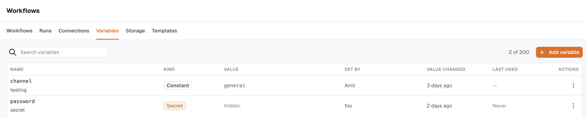

Variables hold configuration you set once and reuse across workflows, such as a channel id, a list of regions, or an API token. Open **Workflows → Variables** and click **Add variable**.

Pick **Constant** or **Secret** when you create one. The kind decides how you reference the value, and how KloudMate stores and reads it:

|  | Constant | Secret |
|---|---|---|
| Reference | `{{ vars.<name> }}` | `{{ secrets.<name> }}` |
| Shown in the list | Yes | No |
| In run history | The real value | `secret: <name>` |
| Read | Once per run, then frozen | Per step, so a rotation mid-run takes effect on the next step |

A name uses letters, digits, and underscores, starts with a letter or an underscore, and is up to 64 characters long. `STRIPE_KEY` and `slack_channel` are both fine. A workspace holds up to 200 variables.

Reference a variable from any field that accepts a template, for example `Bearer {{ secrets.stripe_key }}` in an HTTP header. See [Templating](../templating/).



The list shows who set each variable, when its **value** last changed, and, for a secret, when a run last used it. To check whether a secret was rotated after an incident, read the value-changed column. Editing a description doesn't change it.

A variable holds a value you set. If a run needs to write a value for later runs, use [Storage](../storage/) instead.

## Examples

### Reuse an address in every workflow

Store the on-call team's email address as a constant named `oncall_email`, and set **To** to `{{ vars.oncall_email }}` on every **Send Email** step. When the address changes, you update the variable instead of every workflow. The same works for any value you type into many workflows.

### Call an API with a token

For a service that has no provider of its own in KloudMate, store its API token as a secret, for example `inventory_api_token`. Then set an **HTTP Request** step's **Authentication** to **Bearer token**, with the token set to `{{ secrets.inventory_api_token }}`. The token never appears in the workflow definition or in run history.

If the service supports OAuth 2.0, use an [OAuth 2.0 connection](/platform/settings/connections/providers/#tools-and-custom-endpoints) instead, so KloudMate refreshes the token for you.

### Run the same workflow in staging and production

Create the same variable names in each workspace, with each workspace's own values, and use them in steps instead of typing the values in. For example, an **HTTP Request** step can call:

```liquid
{{ vars.api_base_url }}/hosts/{{ trigger.inputs.host }}
```

When you [export a workflow](../build-a-workflow/#export-and-import) from staging and import it into production, it uses production's `api_base_url`, because the import matches variables by name and kind.

### Tune a value in one place

Keep a number you might adjust in a constant, and use it in every workflow that needs it. For example, a **Run Command on Host** step can list the largest directories under `/var`, with `report_top_n` deciding how many:

```liquid
du -xh --max-depth=2 /var | sort -rh | head -{{ vars.report_top_n }}
```

## What a secret protects against

A secret never enters a workflow definition or run history. KloudMate substitutes it into the step's inputs at the last moment, after everything has been recorded, so run detail shows `secret: stripe_key` where the value would be. If a step's output comes back carrying the secret, KloudMate rewrites it to `••••` before the output is recorded or read downstream, and the step still succeeds.

This keeps the value out of run history and exports, and away from someone looking over your shoulder. It doesn't protect against someone who can edit workflows, because they can send a secret to their own server with an HTTP step. A [connection](/platform/settings/connections/) has the same limit, which is why both need the **Developer** role.

KloudMate doesn't mask values shorter than 8 characters in step output, so don't rely on the masking for a short secret.

## Rotate, rename, or delete a variable

**Rotate** a secret by editing it and typing a new value. To keep the stored secret, leave the value blank.

The first time you **Rename** a variable, KloudMate refuses and lists the workflows that use it. Confirm to go ahead. A template refers to a variable by name, so renaming it breaks every template that uses the old name, including the ones in published versions, which can't be rewritten.

KloudMate refuses to **Delete** a variable while any workflow still uses it, and lists those workflows so you can fix them. There's no confirmation to override it.

**You can't convert a variable to the other kind.** Turning a constant into a secret would move its reference from `vars` to `secrets`, so every `{{ vars.x }}` in the workspace would start resolving empty. Delete it and create the other kind.

## Reveal a secret

**Reveal value** shows the plaintext to whoever created the secret, or to an organization **Owner**. Other users with the **Developer** role can't reveal it, even though they can rotate or delete it. KloudMate records each reveal and who made it.

## Missing variables

Publishing fails if a workflow uses a secret the workspace doesn't have, and the error names the key. A constant that doesn't exist resolves empty, like any other unknown reference, so check **Unresolved variables** in the Test panel.

When you [import a workflow](../build-a-workflow/#export-and-import), the import matches each variable it uses by name and kind in the destination workspace.

## Related

- [Templating](../templating/) for using a variable in a field.
- [Storage](../storage/) for values a run writes, rather than values you set.
- [Connections](/platform/settings/connections/) for account credentials, such as an AWS role or a Slack install.
