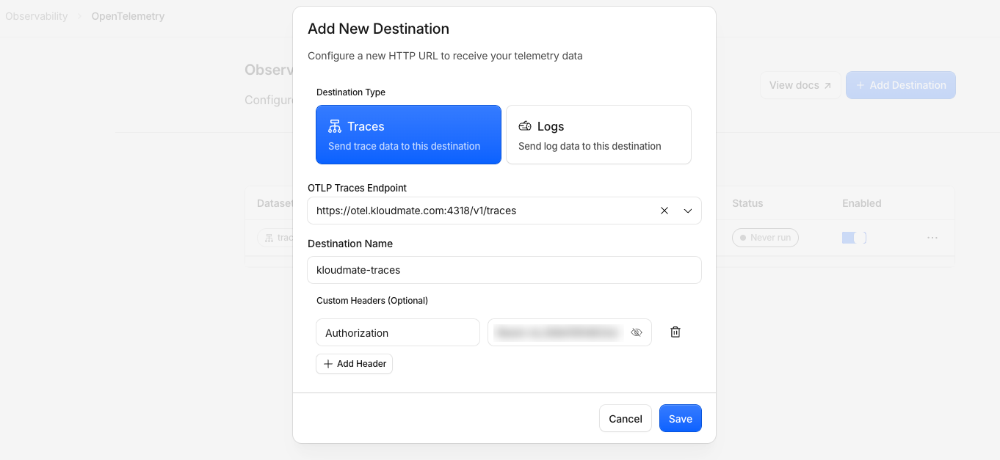
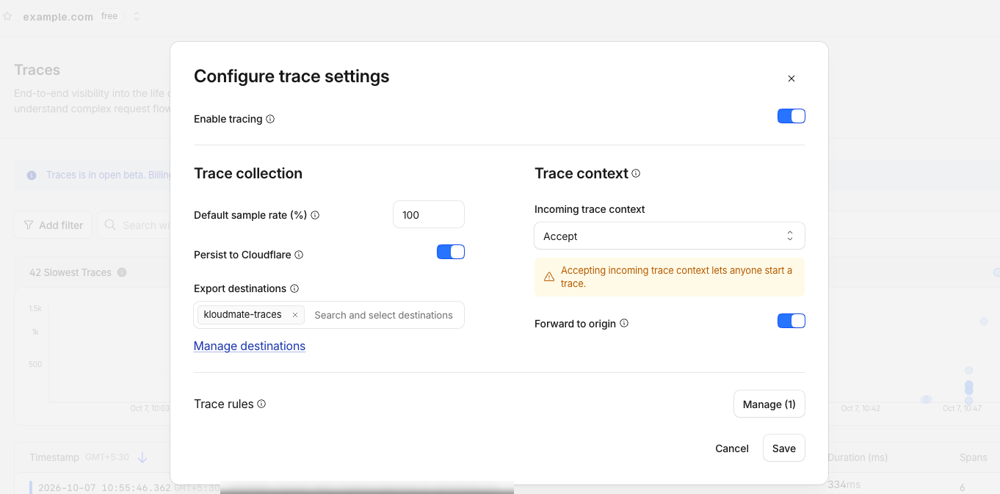
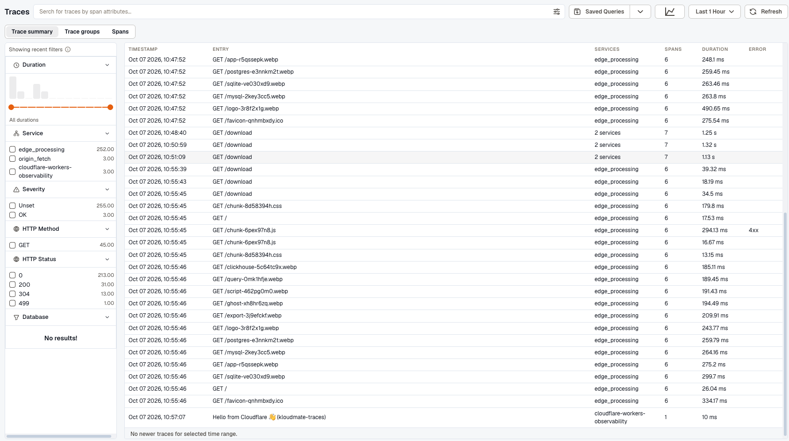

Export production request traces from Cloudflare to KloudMate with the OpenTelemetry Protocol (OTLP) over HTTP.

Cloudflare creates the traces from requests that pass through the configured domain. KloudMate receives those traces and displays them in Trace Explorer.

## Prerequisites

- A KloudMate workspace.
- Permission to create an **Ingest Key — Backend** in that workspace.
- A Cloudflare account with the target domain configured for Cloudflare Traces.
- The domain traffic proxied through Cloudflare.
- Permission to create an OpenTelemetry destination in Cloudflare.

For Cloudflare's own prerequisites and domain configuration, see the [Cloudflare Traces documentation](https://developers.cloudflare.com/observability/traces/).

## Step 1: Create a KloudMate backend ingest key

In KloudMate, open the workspace that should receive the traces.

1. Go to **Settings → Ingest Keys**.
2. Select **Add New**.
3. Choose **Ingest Key — Backend**.
4. Add a note, for example `cloudflare-traces`.
5. Create the key and copy it.

The key is shown only once. Store it securely, and keep it out of source control and screenshots.

Backend ingest keys authenticate telemetry sent by servers, collectors, and integrations. A frontend ingest key won't work for Cloudflare trace export. See [API Keys](/platform/settings/api-keys/).

## Step 2: Create a Cloudflare OpenTelemetry destination

In the Cloudflare dashboard, go to **Observability → OpenTelemetry → Add Destination** and configure it as follows.

| Field | Value |
| --- | --- |
| Destination type | `Traces` |
| OTLP Traces Endpoint | `https://otel.kloudmate.com:4318/v1/traces` |
| Destination name | `kloudmate-traces` |
| Header name | `Authorization` |
| Header value | `Bearer <YOUR_KLOUDMATE_BACKEND_INGEST_KEY>` |

The destination name can be anything, as long as it is easy to identify when you assign it to a domain.



:::note
Port `4318` is the OTLP/HTTP endpoint. Don't use the OTLP/gRPC endpoint on port `4317` for Cloudflare's OpenTelemetry export. If your account uses a different regional endpoint, use the one KloudMate gives you for that account.
:::

Select **Save**, then confirm that the destination is enabled.

## Step 3: Assign the destination to a domain

Cloudflare destinations are account-level resources, so creating one doesn't export traces from a domain on its own.

Assign `kloudmate-traces` to the target domain in Cloudflare's trace settings, turn on tracing for the domain, and set the sampling and export options you want. A typical configuration is:

- **Tracing:** enabled
- **Export destination:** `kloudmate-traces`
- **Default sample rate:** whatever suits your traffic volume



Cloudflare owns the domain-level collection, sampling, persistence, and routing settings. KloudMate receives the OTLP payload after Cloudflare exports it. For the current dashboard steps, see [Configure Cloudflare Traces](https://developers.cloudflare.com/observability/traces/configuration/).

## Step 4: Generate traffic through the domain

Send a request to the proxied domain:

```bash
curl -i https://your-domain.example/
```

To generate several test requests:

```bash
for i in $(seq 1 10); do
  curl -sS -o /dev/null "https://your-domain.example/?trace_test=$i"
done
```

An ordinary request is enough to trigger trace collection once the domain is enabled and sampling selects the request. There is no separate trace payload to send from the client.

The request has to reach Cloudflare. DNS-only records, traffic that bypasses Cloudflare, and requests excluded by sampling rules produce no exported trace.

## Step 5: Verify delivery in Cloudflare

Return to the Cloudflare destination list and confirm that `kloudmate-traces` is enabled and reporting delivery activity.

## Step 6: Find the traces in KloudMate

1. Open **Traces**, or **APM & Services → Traces**.
2. Select the workspace where you created the backend ingest key.
3. Set the time range to cover the test request.
4. Search for the request path, such as `GET /`.
5. Where available, use the Cloudflare Ray ID or the request timestamp to pick out a specific request.

Cloudflare traces arrive with an edge-processing service and HTTP entries such as `GET /`. One trace can hold several Cloudflare spans for the same request.



## Troubleshooting

- **Cloudflare reports `Error`:** check that the endpoint is `https://otel.kloudmate.com:4318/v1/traces` and that the `Authorization` header carries `Bearer <backend-ingest-key>` from the right workspace.
- **No traces in KloudMate:** check that Trace Explorer is on the workspace and time range that go with that ingest key.
- **Only a test trace appears:** search again after real traffic has reached the domain. Sampling and domain-side settings are covered in [Configure Cloudflare Traces](https://developers.cloudflare.com/observability/traces/configuration/).
