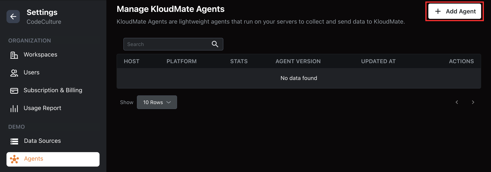
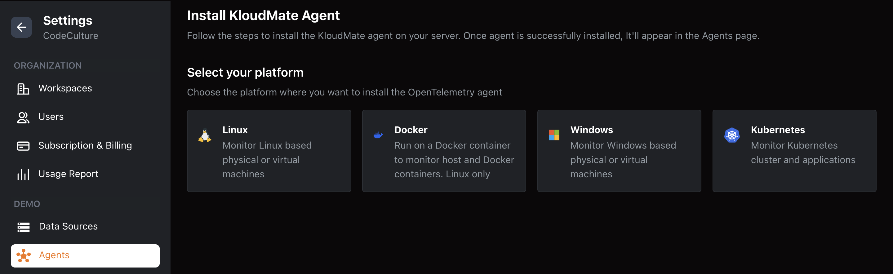
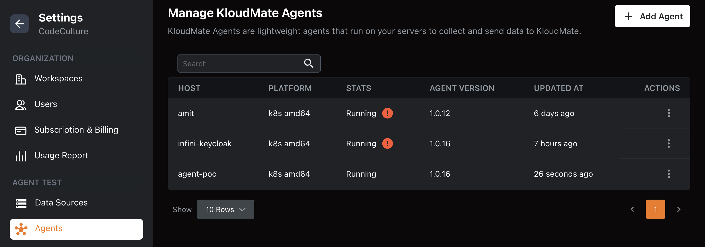
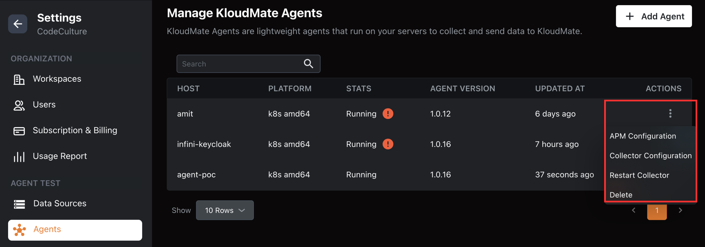

The KloudMate agent's landing page allows you to add new agents, delete existing ones, and update configurations easily.

## Adding a New Agent

1\.  Click the **Add Agent** button located at the top right corner of the page. 

2\.  Select an agent from the available integrations list.  

<hint type="info">
  After selecting an agent, refer to the corresponding agent documentation for detailed installation and configuration instructions:

  [Linux Agent](/km-agent/Installation/Installation/Linux Agent/) | [Docker Agent](/km-agent/Installation/Installation/Docker Agent/) | [Windows Agent](/km-agent/Installation/Installation/Windows Agent/) | [Kubernetes Agent](/km-agent/Installation/Installation/Kubernetes Agent/)
</hint>

## Agents Overview

Once an agent is integrated, you can view the following details about it:

- **Hostname:** The agent's host machine name.
- **Platform:** The operating system or environment of the agent.
- **Status:** Current running status of the agent.
- **Agent Version:** Version of the KM agent used during integration.
- **Updated At:** The last time the collector configuration was updated.

## Updating the Configuration

From the KloudMate platform, you can update or restart the collector associated with the KM agent:

- **APM Configuration:** Configure the applications running on your Kubernetes cluster (applicable only for Kubernetes agents).
- **Collector Configuration:** Make changes to the collector settings and apply updates automatically where the agent is installed.
- **Restart Collector:** Restart the collector service when needed.
- **Delete:** Removes the agent from the list on the KM Agent landing page only. To completely remove the collector, uninstall it from the source environment where it's installed.

## **Best Practices**- Use filters and search on the Agents landing page to quickly locate agents by**host**,**platform**, or**status**.
- For clusters with multiple agents, consider **bulk restarting**or**updating collectors** where supported.
- Always confirm that agent configurations have applied successfully by checking **Kubernetes Monitoring**,**Infrastructure Monitoring**, or other relevant dashboards.

