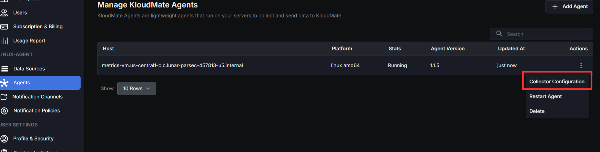

This guide provides instructions on gathering Linux and Windows Server metrics using the **Host** **Metrics** **Receiver**through**KloudMate Agents**.

The Host Metrics Receiver generates metrics about the host system from various sources. It can also collect per-process metrics for applications running on Amazon EC2, Azure VMs, or on-premise servers.

KloudMate Agents use this receiver to ingest these host metrics and send them directly to KloudMate.

### **Prerequisites:**

**Install the KloudMate Agents**on the server where metric monitoring is required. Refer to the [KloudMate Agents](/metrics/infrastructure/KloudMate Agents/) guide for detailed setup instructions.**Step 1: Access Agents and OpenTelemetry Collector Configuration**

- Navigate to the KloudMate platform and log into your account.
- Go to **Settings**>**Agents** section.
- Here you can:
  - View all installed agents.
  - Access configuration settings for each agent.
  - Review default configurations provided by KloudMate.
- To edit an agent's collector configuration:
  - Select the desired agent.
  - Click the **Actions** menu (or Agent action tab).
  - Choose **Collector Configuration**.
- A text editor UI will open where you can edit the agent’s YAML configuration directly within the platform.



1\. In this configuration file, ensure the host metrics receiver is set up to collect and send metrics according to your specific requirements. 

```yaml
receivers:
  hostmetrics:
    collection_interval: 60s
    scrapers:
      cpu:
        metrics:
          system.cpu.utilization:
            enabled: true
      load:
        cpu_average: true
      memory:
        metrics:
          system.memory.utilization:
            enabled: true
      filesystem:
       # The below file system type only useful with AWS EC2 metrics
       # include_fs_types:  
       #   match_type: strict
       #   fs_types: [ext3, ext4] 
        metrics:
          system.filesystem.usage:
            enabled: true
          system.filesystem.utilization:
            enabled: true
      disk: {}
      network: {}
      #processes: {}    #applicable only on a linux server
      # process metrics are optional, please enable if needed
      #process:
        #metrics:
          #process.cpu.utilization:
            #enabled: true
          #process.memory.utilization:
            #enabled: true
        # Mute various errors reading process metrics running locally in docker.
        #mute_process_all_errors: true
```

<hint type="info">
  Please ensure that the configuration includes `processes: {}` for Linux systems, as this setting is not applicable or required for Windows.
</hint>

2\. Configure the processor part to detect resource information from the host and append or override the resource value in telemetry data with this information.

<hint type="info">
  Please choose one of the following options for configuration based on your provider (AWS EC2, Azure VM, or on-premises server)
</hint>

- **Server**(Can be on-premise, non-cloud, or cloud)

```yaml
processors:
  batch:
    send_batch_size: 10000
    timeout: 30s
  resourcedetection:
    detectors: [system]
    system:
      resource_attributes:
        host.name:
          enabled: true
        host.id:
          enabled: true
        os.type:
          enabled: false
  resource:
    attributes:
      - key: service.name
        action: insert
        from_attribute: host.name
```

- **AWS EC2:**

<hint type="info">
  Optional: To retrieve AWS EC2 instance tags along with logs and metrics, you must associate an IAM role with the EC2 instance that includes the `EC2:DescribeTags `policy. The processor below needs to be added:
</hint>

```yaml
processors:
  batch:
    send_batch_size: 10000
    timeout: 30s

  resourcedetection/ec2:
    detectors:  ["ec2"]
    ec2:
      tags:
        - ^tag1$
        - ^tag2$
        - ^label.*$ 
        - ^Name$

  resource:
    attributes:
      - key: service.name
        action: insert
        from_attribute: ec2.tag.Name
      - key: service.instance.id
        action: insert
        from_attribute: host.id
```

- **Azure Virtual Machines:**

```yaml
processors:
  batch:
    send_batch_size: 10000
    timeout: 30s

  resourcedetection/azure:
    detectors: ["azure"]
    azure:
      tags:
        - ^tag1$
        - ^tag2$
        - ^label.*$
        - ^Name$

  resource:
    attributes:
      - key: service.name
        action: insert
        from_attribute: azure.vm.name
      - key: service.instance.id
        action: insert
        from_attribute: host.id
```

3\. Set up the KloudMate Backend on the exporter part of the KloudMate agent configuration file and configure the pipeline.

```yaml
exporters:
  debug:
    verbosity: detailed
  otlphttp:
    endpoint: 'https://otel.kloudmate.com:4318'
    headers:
      Authorization: xxxxxxxx  # Use the auth key

service:
  pipelines:
    metrics:
      receivers: [hostmetrics]
      processors: [batch, resourcedetection, resource] # Apply the correct resourcedetection
      exporters: [debug, otlphttp]
```

**Step 2:  Save Configuration and Restart Agent**After updating the configuration, click “**Save Configuration**” in the UI 


or, from your server’s console, run:

**For Linux:**

1. Execute the following commands:

```none
systemctl restart kmagent
systemctl status kmagent
```

These commands will restart the KloudMate agent and display its current status.

**For Windows:**

1. Open the Services window:
   - Press Win + R, type `services.msc`, and press OK.
   - Alternatively, search for "`Services`" in the Windows Start menu.
2. In the Services window, locate the "`KloudMate Agent`" service.
3. Right-click the service and select "`Restart`."

Subsequently, monitor the metrics on the KloudMate dashboard and set up an alarm to receive notifications if the potential metrics for a specific application rise. 

### **Default Hostmetrics**|**Metric**|**Description**|**Unit**  |
| --------------------------------- | ----------------------------------------------------------------------------------- | --------- |
| **cpu**                           |                                                                                     |           |
| system\_cpu\_time                 | Total seconds each logical CPU spent on each mode.                                  | Seconds   |
| **disk**                          |                                                                                     |           |
| system\_disk\_io                  | Disk bytes transferred.                                                             | Bytes     |
| system\_disk\_io\_time            | Time disk spent activated.                                                          | Seconds   |
| system\_disk\_merged              | The number of disk reads/writes merged into single physical disk access operations. | Count     |
| system\_disk\_operation\_time     | Time spent in disk operations.                                                      | Seconds   |
| system\_disk\_operations          | Disk operations count.                                                              | Count     |
| system\_disk\_pending\_operations | The queue size of pending I/O operations.                                           | Count     |
| system\_disk\_weighted\_io\_time  | Time disk spent activated multiplied by the queue length.                           | Seconds   |
| **Load**                          |                                                                                     |           |
| system\_cpu\_load\_average\_15m   | Average CPU Load over 15 minutes.<br />&#xA;                                        | \{thread} |
| system\_cpu\_load\_average\_5m    | Average CPU Load over 5 minutes.                                                    | \{thread} |
| system\_cpu\_load\_average\_1m    | Average CPU Load over 1 minute.                                                     | \{thread} |
| **File system**                   |                                                                                     |           |
| system\_filesystem\_inodes\_usage | FileSystem inodes used.                                                             | Count     |
| system\_filesystem\_usage         | Filesystem bytes used.                                                              | Bytes     |
| **Memory**                        |                                                                                     |           |
| system\_memory\_usage             | Bytes of memory in use.                                                             | Bytes     |
| **Network**                       |                                                                                     |           |
| system\_network\_connections      | The number of connections.                                                          | Count     |
| system\_network\_dropped          | The number of packets dropped.                                                      | Count     |
| system\_network\_errors           | The number of errors encountered.                                                   | Count     |
| system\_network\_io               | The number of bytes transmitted and received.                                       | Bytes     |
| system\_network\_packets          | The number of packets transferred.                                                  | Count     |
| **Paging**                        |                                                                                     |           |
| system\_paging\_faults            | The number of page faults.                                                          | Count     |
| system\_paging\_operations        | The number of paging operations.                                                    | Count     |
| system\_paging\_usage             | Swap (unix) or pagefile (windows) usage.                                            | Bytes     |
| **Processes**                     |                                                                                     |           |
| system\_processes\_count          | Total number of processes in each state.                                            | Count     |
| system\_processes\_created        | Total number of created processes.                                                  | Count     |
| **Process**                       |                                                                                     |           |
| process\_cpu\_time                | Total CPU seconds broken down by different states.                                  | Seconds   |
| process\_disk\_io                 | Disk bytes transferred.                                                             | Bytes     |
| process\_memory\_usage            | The amount of physical memory in use.                                               | Bytes     |
| process\_memory\_virtual          | Virtual memory size.                                                                | Bytes     |

For full details on metrics, click [here](https://github.com/open-telemetry/opentelemetry-collector-contrib/tree/main/receiver/hostmetricsreceiver).

## **Additional Resources**

For a deeper understanding of server metrics collection and alternative implementation approaches, refer to the following detailed guides:

- [Server Metrics to KloudMate – Complete Host Metrics Receiver Guide](https://blog.kloudmate.com/server-metrics-to-kloudmate-complete-host-metrics-receiver-guide-1a925dd61d12)
- [Server Metrics to KloudMate Using Prometheus Node Exporter](https://blog.kloudmate.com/server-metrics-to-kloudmate-using-prometheus-node-exporter-012d739df25e)

