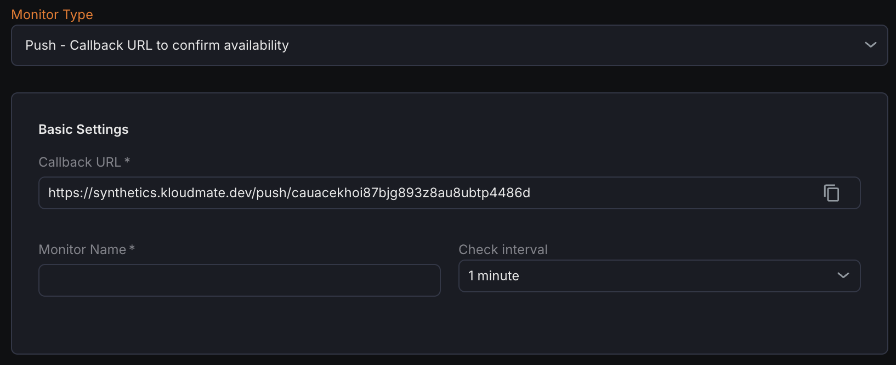

A push monitor exposes a special callback URL provided by the monitoring service. Your application or job calls this URL (usually on success or at the end of a run). If the monitoring service does not receive a call within the expected interval, it marks the monitor as down and can trigger alerts.

Push monitor is used for monitoring a service that is not publicly accessible. In that case, this monitor can be used to receive heartbeat calls to confirm availability.

The service or job periodically calls the provided callback URL; if the monitoring system does not receive this call within the expected interval, it marks the monitor as down and can raise alerts.

## Basic Settings

- **Callback URL**  
  A unique link generated by the tool that your system must call to report that it is running correctly. 
- **Monitor Name**  
  A descriptive name for the push monitor (for example, “nightly backup job heartbeat”).
- **Check Interval**
  The expected frequency at which the callback URL should be called. If no call is received within this interval, the monitor is considered failed.

## Notification Settings

Configure one or more notification channels (such as email, chat, or incident tooling) to receive alerts when the push monitor does not receive callbacks within the configured interval, indicating the job or service may be down.

***

## Related Resources

[Incidents](/metrics/synthetic/synthetic-incidents/)
