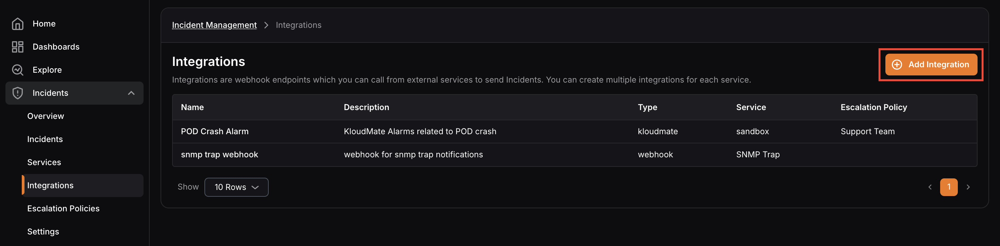
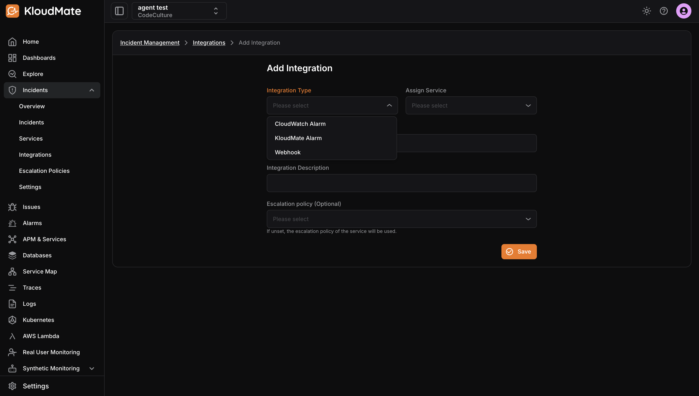
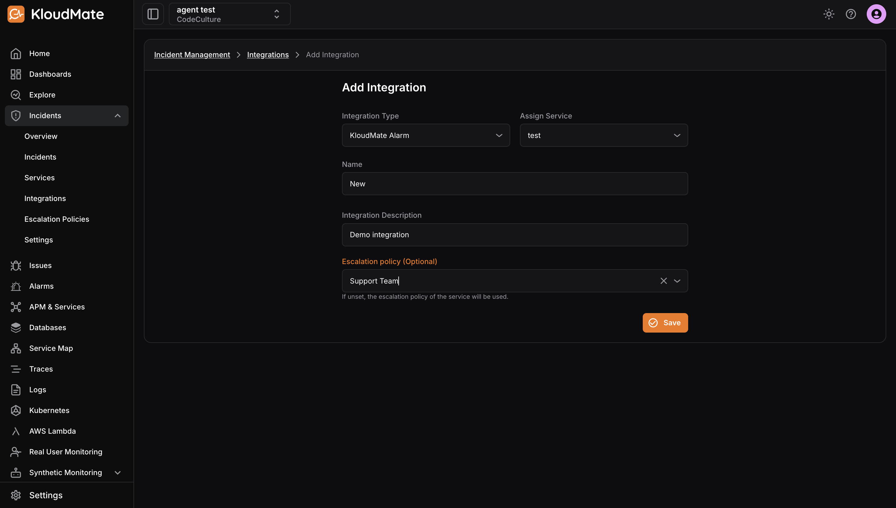

Use the following steps to add a new integration.

**Step 1:**Click the**Add Integration** button at the top-right corner of the screen.

**Step 2:**On the Add Integration page, select an**Integration Type** from the dropdown. 

Available types are:

- **KloudMate Alarm**-**CloudWatch Alarm**-**Webhook**

<hint type="info">
  KloudMate and CloudWatch integrations have pre-defined templates. If you want to use any third-party integrations through Webhook, you can use templates to configure incident content, grouping logic, and auto-resolution for incidents.
</hint>

**Step 3:**If your integration type is**KloudMate Alarm**or**CloudWatch Alarm**, assign a**service**, enter a**Name**, add a**Description**, and optionally select an**Escalation Policy**. Click**Save** and skip the remaining steps.

<hint type="info">
  If no escalation policy is selected, the default escalation policy of the assigned service will be applied automatically.
</hint>

**Step 4:**If your integration type is**Webhook**, assign a service, enter a Name, and add a Description. You will also see the**Title Template**,**Grouping Template**, and**Auto Resolve Template**fields.**Step 5:**Click the**Edit**icon in the**Title Template**field. Paste your payload in the Payload (JSON) editor and write your template. Use the**Test**button to preview how the incident will appear in KloudMate. Click**Save** when done.

**Step 6:**Click the**Edit**icon in the**Grouping Template**field to configure grouping logic, which consolidates related incidents into a single notification. Click **Save**when done.**Step 7:**Click the**Edit**icon in the**Auto Resolve Template**field to configure conditions for automatic incident resolution. Click**Save**when done.**Step 8:**Select an**Escalation Policy**for your webhook integration and click**Save**.

<hint type="info">
  If no escalation policy is selected, the default escalation policy of the assigned service will be applied automatically.
</hint>

Once the integration is created successfully, you will be directed to the Integration Details screen where you can copy the **integration URL**or use the settings icon to**edit**or**archive** the integration.

***

Refer to [Integrating with KloudMate Alarms](/platform/incident-management/integrations/Integrating with KloudMate Alarms/) to learn how to use the integration URL with KloudMate Alarms.

